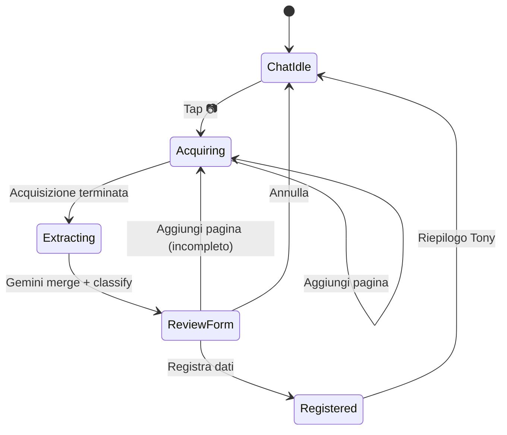
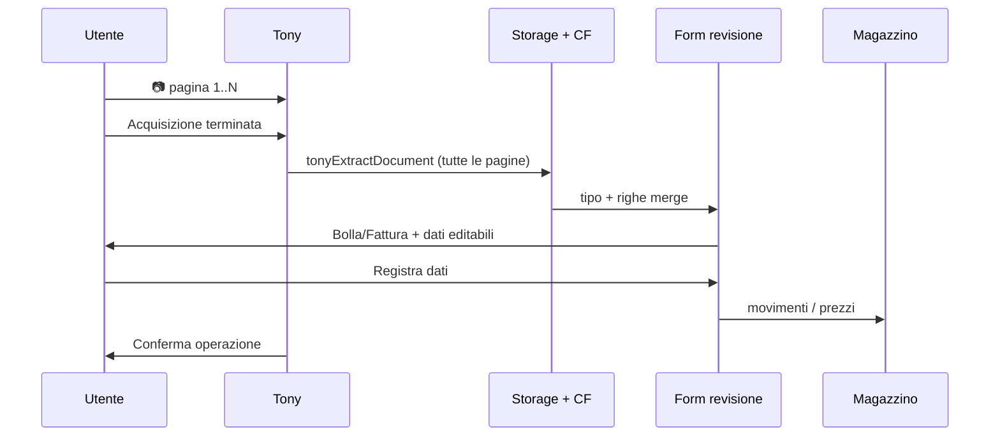
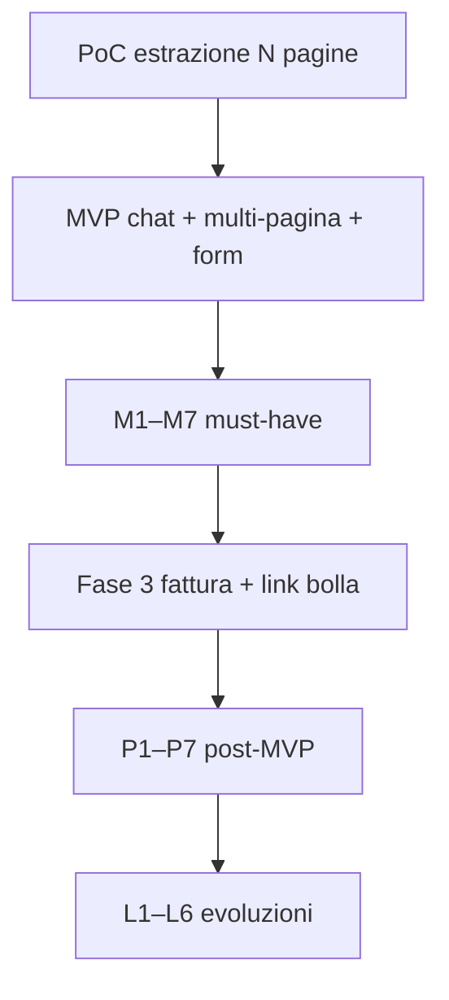

# Tony Occhi — acquisizione documenti (bolla, fattura) e magazzino

**Tipo**: design pronto per sviluppo — **non è ancora implementato nel codice**.  
**Data prima stesura**: 2026-04-04  
**Ultimo aggiornamento**: 2026-07-10 — UX form revisione, acquisizione multipla, layout fornitore-agnostic; chat-first, routing automatico  
**Riferimento modulo**: `docs-sviluppo/ANALISI_MODULO_MAGAZZINO.md`, `docs-sviluppo/MAGAZZINO_APPENDICE_TRACCIABILITA_DASHBOARD_E_SCARICO.md`  
**Decisioni correlate**: `docs-sviluppo/TONY_DECISIONI_E_REQUISITI.md` §20

---

## 1. Obiettivo di prodotto

**Tony Occhi** estende l’assistente con capacità di **leggere documenti** (foto, PDF, screenshot) e **registrarne i dati** nel gestionale, con meno digitazione manuale.

Casi d’uso prioritari (modulo **Prodotti e Magazzino**):

- **Bolle di consegna / DDT** → entrate a quantità (prezzo spesso assente)
- **Fatture** → prezzi, IVA, totali; spesso in un **secondo momento** rispetto alla bolla

Principio Master Plan: l’utente **non deve navigare menù e sottomenù** per acquisire un documento. L’ingresso principale è **Tony in chat** (icona fotocamera accanto al microfono), non una pagina dedicata nascosta nel modulo magazzino.

---

## 2. Decisioni di prodotto (2026-07-10)

| # | Decisione | Motivazione |
|---|-----------|-------------|
| D1 | **Ingresso unico in chat Tony** — icona 📷 nella riga input (`ui.js`, accanto a 🎤) | Coerente con Tony come interfaccia principale; zero navigazione |
| D2 | **Un componente upload** — `<input type="file" accept="image/*,application/pdf">` (+ `capture="environment"` opzionale) | Su mobile: scatta o galleria; su desktop: PDF e immagini; MVP senza camera live custom |
| D3 | **L’utente non sceglie il tipo documento prima dello scatto** | Classificazione automatica (bolla / fattura / sconosciuto) + conferma Tony |
| D4 | **Il sistema instrada** in base a tipo rilevato, modulo attivo e permessi | Router intent (estensione pattern `tony-intent-router.js`), non patch per pagina |
| D5 | **Sempre conferma umana** prima di scrivere su Firestore | Preview righe in chat; mai auto-save silenzioso su qty/prezzi |
| D6 | **Pagina magazzino** per storico/audit/correzioni, **non** per acquisire al volo | Chat = acquisizione; lista documenti = consultazione |
| D7 | **Flusso bolla → fattura in due passi** (quantità prima, prezzi dopo) | Vincolo business reale (§3) |
| D8 | **Vision-first con Gemini 2.5 Flash** (già in stack Tony) | PDF e immagini nativi; OCR separato solo se costi/latency lo richiedono in seguito |
| D9 | **Config centralizzata** — schema JSON, routing, mapping prodotti in config/servizi | No `if (paginaMagazzino)` nel core; allineamento `tony-form-mapping.js` |
| D10 | **Gate modulo `magazzino`** + ruoli manager/admin | Come resto del modulo magazzino |
| D11 | **Form di revisione** (pannello/modal dedicato) — non solo testo in chat | Tipo rilevato (bolla/fattura), dati estratti editabili, conferma registrazione |
| D12 | **Estrazione layout-agnostic** — schema **in uscita** normalizzato, non template per fornitore | Gemini legge layout variabile; stesso JSON interno GFV |
| D13 | **Acquisizione multipla** — più foto/PDF per lo stesso documento (fatture lunghe, più fogli) | Utente aggiunge pagine finché non dichiara fine acquisizione |
| D14 | **Conferma «Acquisizione terminata»** prima dell’estrazione unificata | Merge pagine → una sola estrazione → form revisione |
| D15 | **Due conferme distinte**: (1) fine acquisizione pagine (2) dati corretti per registrare | Evita estrazione parziale e save errati |
| D16 | **Animazione scanner** (linea luminosa su anteprima / form) durante estrazione e popolamento campi | Feedback visivo «Tony sta leggendo/inserendo»; CSS riusabile, non dipende dal fornitore |

### Cosa non usare come ingresso principale

- Navigazione **Menù → Magazzino → … → Fotocamera** (troppa frizione)
- **Solo** camera live in-app (`getUserMedia`) in MVP — fragile su PWA iOS; il file picker copre camera + galleria
- **Solo** PDF — esclude bolle cartacee in magazzino
- **Screenshot** come canale dedicato — trattati come immagine, stesso pipeline (qualità spesso media)

---

## 3. Vincolo reale: bolla vs fattura

Spesso:

- la **bolla** riporta **merce e quantità** (a volte lotti), **non sempre i prezzi**;
- la **fattura** riporta **prezzi, IVA, totali** e può arrivare **in un secondo momento**.

Non è un bug del flusso utente: è il modo in cui molti acquisti sono documentati. Il gestionale non deve pretendere che **un solo scatto** risolva quantità e prezzi se i due documenti sono separati nel mondo reale.

---

## 4. Compatibilità con il magazzino attuale

**Sì, è compatibile in linea di principio**, previo chiarimento delle regole di business:

| Concetto attuale | Ruolo nel flusso bolla → fattura |
|------------------|----------------------------------|
| Movimento in **unità base** (L, kg, …) | La **quantità** può essere registrata alla **bolla** (entrata “a quantità certa”). |
| **Prezzo unitario** sul movimento (entrata) | Può restare **assente o provvisorio** fino alla **fattura**, poi **aggiornato** quando si collegano i documenti. |
| **Giacenza** | Di norma si aggiorna sulla **quantità** del movimento; policy esplicita: conferma giacenza alla bolla (default proposto) vs solo a fattura — da fissare in implementazione. |
| **Confezione** (testo libero sul movimento) | Opzionale: nota su come è stata consegnata la merce; non sostituisce l’unità base. |
| **Un solo registro movimenti** | Resta valido: niente “secondo magazzino” per il solo OCR. |

**Aggiustamenti probabili (implementazione):**

- consentire **entrata con prezzo opzionale** / stato **“prezzo in attesa”** dove oggi la UI o la validazione potrebbero essere troppo rigide;
- introdurre un **collegamento** tra documento bolla e documento fattura (ID, riferimento fornitore, righe) per **aggiornare in blocco** i prezzi sui movimenti già creati;
- regole di **fallback** (ultimo prezzo d’acquisto, listino) solo come **proposta** con conferma utente.

---

## 5. Flusso utente (chat-first + form di revisione)

### 5.1 Avvio da chat

```
[ 🎤 ] [ 📷 ] [ Scrivi un messaggio... ] [ Invia ]
```

1. Tap **📷** → file picker (foto / galleria / PDF)
2. Messaggio Tony breve: «Aggiungi pagine o termina acquisizione»
3. Upload pagine su **Firebase Storage** (sessione acquisizione in corso)

### 5.2 Acquisizione singola o multipla

| Caso | Comportamento |
|------|----------------|
| **Bolla / DDT** (1 pagina) | Una foto → **Acquisizione terminata** |
| **Fattura corta** | Una foto o un PDF → **Acquisizione terminata** |
| **Fattura lunga / più fogli** | Più scatti o file → **Aggiungi pagina** finché serve, poi **Acquisizione terminata** |

**Pulsanti durante l’acquisizione** (pannello sopra/sotto la chat o overlay Tony):

- **Aggiungi pagina** — riapre 📷 / file picker (stessa sessione)
- **Anteprima pagine** — miniature 1, 2, 3… (rimuovi pagina errata)
- **Acquisizione terminata** — passa all’estrazione (obbligatorio se ≥1 pagina)

Finché l’utente non preme **Acquisizione terminata**, **non** si chiama Gemini sull’intero documento (solo upload Storage). Evita costi e estrazioni parziali.

### 5.3 Estrazione (dopo «Acquisizione terminata»)

1. CF **`tonyExtractDocument`** riceve tutte le pagine della sessione
2. Gemini vision — **layout fornitore-agnostic**: nessun template fisso per azienda; prompt per **tipo** (bolla vs fattura), schema **in uscita** normalizzato
3. Merge righe da più pagine (stesso documento logico)
4. Classificazione: **bolla** | **fattura** | **sconosciuto** (+ confidence)

### 5.4 Form di revisione (ciò che vede l’utente)

Dopo l’estrazione si apre un **form di revisione** (modal o pannello espanso nel widget Tony — non solo messaggio chat):

**Intestazione**

- Badge: **Bolla di consegna** oppure **Fattura** (tipo rilevato; editabile se «sconosciuto»)
- Fornitore, P.IVA, numero documento, data (campi editabili)
- Link anteprima: miniature pagine acquisite

**Corpo — tabella righe estratte**

| Prodotto / descrizione | Qty | Unità | Prezzo | Prodotto GFV | Note |
|------------------------|-----|-------|--------|--------------|------|
| … | … | L/kg | … (vuoto ok su bolla) | match suggerito | confidence bassa → evidenziata |

- Righe **editabili** (correzione prima del save)
- Match prodotto anagrafica: suggerimento + dropdown se ambiguo
- Su **fattura**: opzione collegamento bolla esistente (fornitore + data + righe)

**Azioni**

- **Registra dati** — conferma finale → movimenti entrata o aggiornamento prezzi
- **Annulla** — scarta sessione (Storage opzionale cleanup)
- **Aggiungi pagina** (solo se estrazione incompleta) — torna a §5.2 con sessione riaperta

Messaggio Tony in chat (riassunto): «Ho preparato il riepilogo: controlla il form e conferma.»

**Animazione scanner (D16)** — stesso componente CSS riusabile, bassa complessità:

| Fase | Dove | Cosa vede l’utente |
|------|------|-------------------|
| Dopo **Acquisizione terminata** | Anteprima pagine / area estrazione | Linea che scorre sulle miniature + «Sto leggendo…» |
| Popolamento **form revisione** | Overlay semi-trasparente sul form | Scanner + campi che si riempiono in sequenza (intestazione → righe) |
| Fine popolamento | — | Overlay sparisce; form editabile; focus su righe a bassa confidence |

Implementazione suggerita: classe `.tony-doc-scanner` + `@keyframes` (translateY sulla linea verde/teal, coerente con GFV); nessuna libreria; ~40–60 righe CSS. Se l’estrazione CF è più lenta del riempimento animato, mantenere lo scanner finché `stato !== review`.

### 5.5 Registrazione (dopo conferma form)

| Tipo confermato | Azione |
|-----------------|--------|
| **Bolla** | Crea movimenti **entrata** (qty); `prezzoUnitario` null o «in attesa» |
| **Fattura** | Match bolla → **aggiorna** `prezzoUnitario` sui movimenti collegati |
| **Tipo corretto dall’utente** | Usa scelta utente sul form, non solo classificazione automatica |

Integrazione **mani**: batch movimenti via canone save locale / servizio magazzino; riuso mapping dove possibile.

### 5.6 Diagramma flusso completo





---

## 6. Canali di ingresso (tecnico)

| Canale | MVP | Note |
|--------|-----|------|
| **File picker** (immagine + PDF) | ✅ Sì | Componente unico; `capture="environment"` suggerisce camera su mobile |
| **Foto galleria** | ✅ Sì | Stesso input |
| **PDF** | ✅ Sì | Prioritario per fatture da ufficio |
| **Screenshot** | ⚠️ Fallback | Stesso pipeline; qualità variabile |
| **Camera live in-app** | ❌ Fase 2 | Solo se il picker non basta; overlay inquadratura |
| **Multi-pagina (stesso documento)** | ✅ Sì (MVP) | Acquisizione multipla + **Acquisizione terminata** → merge ed estrazione unica |
| **Email inoltrata** | ❌ Fase 3 | Automazione ufficio |

**Validazione client** (prima di Gemini): MIME ammessi, max ~10 MB, dimensioni minime consigliate; opzionale messaggio «rifai la foto» se troppo scura/piccola.

**Qualità immagine** (indipendente da camera vs galleria): testo leggibile, pagina intera, luce uniforme, documento piatto.

---

## 7. Architettura software (target)

| Pezzo | Path / nome proposto | Ruolo |
|-------|----------------------|--------|
| Icona 📷 + file picker | `core/js/tony/ui.js` | Trigger acquisizione |
| **Sessione acquisizione multipla** | `core/js/tony/document-capture.js` (nuovo) | Pagine in coda, anteprima, «Acquisizione terminata» |
| **Form di revisione** | `core/js/tony/document-review-form.js` (nuovo) o pannello in widget | Tipo bolla/fattura, righe editabili, Registra / Annulla |
| **Animazione scanner** | `core/styles/tony-document-scanner.css` (nuovo) o sezione in CSS widget Tony | Overlay estrazione + popolamento form |
| Upload + metadati | servizio condiviso (pattern Storage logo in `impostazioni-standalone.html`) | `tenants/{tid}/documentiAcquisiti/{sessionId}/page-N` |
| Estrazione + classify | CF **`tonyExtractDocument`** | Gemini 2.5 Flash; **input**: N pagine; **output**: schema normalizzato |
| Schema righe documento | `core/config/tony-document-schemas.js` (o sotto `functions/config/`) | Bolla, fattura, righe |
| Router post-estrazione | estensione `functions/tony-intent-router.js` o handler dedicato | Destinazione per tipo + modulo |
| Match prodotti tenant | Context Builder / lookup `prodotti` | Disambiguazione + sinonimi categoria |
| Creazione movimenti | `tony-form-mapping.js` + save locale movimento | Canone esistente |
| Storico / audit | pagina magazzino (secondaria) | Lista `documentiAcquisiti`, re-download |
| Context Builder (futuro) | `buildContextAzienda` | Es. `entratePrezzoInAttesa`, count documenti pending |

**Comandi Tony (bozza):**

- `PROCESS_DOCUMENT` — avvia estrazione su sessione chiusa («Acquisizione terminata»)
- **Form revisione** — UI principale conferma (non sostituibile da solo testo chat)
- Post-conferma form: batch movimenti / aggiornamento prezzi

**Gate:** `tony-module-gate.js` — modulo **`magazzino`** richiesto; ruoli manager/admin.

---

## 8. Modello dati (bozza Firestore)

Collection proposta: `tenants/{tenantId}/documentiAcquisiti/{sessionId}`

```json
{
  "stato": "acquiring | extracting | review | confirmed | rejected | error",
  "tipoDocumento": "bolla | fattura | sconosciuto",
  "tipoDocumentoConfermato": "bolla | fattura",
  "pagine": [
    {
      "indice": 1,
      "storagePath": "tenants/.../documentiAcquisiti/{sessionId}/page-1.jpg",
      "mimeType": "image/jpeg",
      "caricatoIl": "timestamp"
    }
  ],
  "acquisizioneTerminataIl": null,
  "fornitore": { "nome": "", "piva": "", "confidence": 0.9 },
  "numeroDocumento": "",
  "dataDocumento": "2026-07-10",
  "righe": [
    {
      "descrizione": "",
      "codiceFornitore": "",
      "quantita": 0,
      "unita": "L",
      "prezzoUnitario": null,
      "prodottoIdSuggerito": null,
      "prodottoIdConfermato": null,
      "movimentoId": null,
      "confidence": 0.85,
      "paginaOrigine": 1
    }
  ],
  "documentoCollegatoId": null,
  "movimentoIds": [],
  "estrattoIl": null,
  "confermatoIl": null,
  "confermatoDa": "uid",
  "estrazioneGeminiRaw": null,
  "righeConfermate": null,
  "duplicatoDiSessionId": null,
  "validazioneTotali": { "sommaRighe": null, "totaleDocumento": null, "coerente": null }
}
```

Su **movimento** (entrata): opzionali `documentoAcquisitoId`, `prezzoInAttesa: true`.

- **`acquiring`**: utente può aggiungere pagine; estrazione non avviata
- **`review`**: form revisione aperto; dati editabili
- **`confirmed`**: dopo **Registra dati** sul form

Movimenti collegati: flag opzionale `prezzoInAttesa: true` su entrata da bolla finché non arriva fattura.

---

## 9. Schema estrazione (output normalizzato)

**Non** è un template di layout per fornitore: ogni azienda può avere DDT/fatture diverse. Gemini legge la posizione dei campi in modo flessibile; GFV standardizza solo **l’output**.

Prompt distinti per **tipo documento** (bolla vs fattura), non per fornitore.

Campi minimi v1 (schema JSON in uscita):

- intestazione: fornitore, P.IVA, numero documento, data
- righe: descrizione, codice, quantità, unità, prezzo (nullable su bolla)
- totali fattura (opzionale v1)
- `tipoDocumento` + `confidence` a livello documento
- `paginaOrigine` per riga (debug / correzione multi-pagina)

---

## 10. Stati UI (MVP)

| Stato | Comportamento |
|-------|----------------|
| `idle` | 📷 abilitata se modulo magazzino + ruolo ok |
| `acquiring` | Una o più pagine; pulsanti **Aggiungi pagina** / **Acquisizione terminata** |
| `uploading` | Progress upload singola pagina |
| `extracting` | «Sto leggendo N pagine…» (dopo acquisizione terminata) |
| `review` | **Form revisione**: badge bolla/fattura, tabella righe editabile, **Registra dati** |
| `disambiguation` | Match prodotti o collegamento bolla (dentro o sopra il form) |
| `registered` | Riepilogo in chat + chiusura form |
| `error` | Messaggio + riprova / aggiungi pagina |

---

## 11. Cosa resta fuori dalla v1

- Scheda fitofarmaco / etichette prodotti (evoluzione multimodale Master Plan §11 — solo con requisito esplicito)
- Conteggio oggetti da foto scaffale (vision inventory — diverso da documenti)
- OCR on-device / pipeline Paddle self-hosted
- Email automatica / IMAP
- Auto-classificazione documenti non magazzino (altri moduli)

---

## 12. Riferimenti open source (solo pattern, non fork)

Progetti utili per **ispirazione**, non sostituzione di Tony:

| Progetto | Cosa prendere |
|----------|----------------|
| [getomni-ai/zerox](https://github.com/getomni-ai/zerox) | Estrazione schema-driven + Gemini/Google provider |
| [sanjay-kumar001/idp](https://github.com/sanjay-kumar001/idp) | UX conferma + delivery note + reconcile anagrafica |
| [mshojaei77/invoice-to-pay-agent](https://github.com/mshojaei77/invoice-to-pay-agent) | Stati workflow, match bolla/fattura, audit |
| [paulxiep/invoice-parse](https://github.com/paulxiep/invoice-parse) | Trade-off OCR vs vision, pipeline deterministica |
| [oci-ai-architects/invoice-oci](https://github.com/oci-ai-architects/invoice-oci) | Gemini 2.5 Flash su PDF nativo |

---

## 13. Fasi di implementazione suggerite

| Fase | Scope | Done quando |
|------|--------|-------------|
| **0 — PoC** | CF `tonyExtractDocument` su 1–N pagine; schema output; 3 documenti campione | JSON merge affidabile |
| **1 — MVP chat + acquisizione multipla** | 📷, sessione pagine, **Acquisizione terminata**, estrazione | Foto multipla fattura lunga |
| **2 — Form revisione + registrazione** | Form bolla/fattura editabile, **Registra dati**, movimenti entrata | E2E bolla → movimenti |
| **3 — Fattura** | Collegamento bolla, aggiorna prezzi | Flusso due passi completo |
| **4 — Magazzino UI + Context Builder** | Storico sessioni, entrate prezzo in attesa | Audit e proattività Tony |

---

## 14. Confezione e “stesso prodotto, più formati”

Restano valide le scelte in **ANALISI_MODULO_MAGAZZINO.md** (§5):

- giacenza in **unità continua** (L, kg);
- **confezione** sul movimento come **nota**, non doppia anagrafica obbligata;
- dettaglio «2×1 L + 1×5 L» in **nota** o evoluzione lotti.

L’estrazione può precompilare **confezione** se esplicita in bolla; non requisito v1.

---

## 15. Integrazione Tony / Gemini (regole)

- Comandi e form **restano** allineati al principio: **configurazione** (`tony-form-mapping.js`, schemi documento, servizi), non patch per singola pagina.
- Il Context Builder potrà esporre **stato documenti in attesa** se modellato in Firestore (§8).
- **Non implementare** visione/upload finché non esistono flusso utente, persistenza e voce in questo documento + `TONY_DECISIONI_E_REQUISITI.md` §20 — **requisito soddisfatto per avvio sviluppo** (2026-07-10).

---

## 16. Backlog miglioramenti (priorità)

Complemento alle decisioni D1–D16: cosa aggiungere **senza** gonfiare il MVP, ma evitando refactor a metà implementazione.

### 16.1 Must-have (con MVP o subito dopo PoC)

| # | Miglioramento | Descrizione | Impatto |
|---|---------------|-------------|---------|
| M1 | **Controllo duplicati** | Stesso documento già registrato (fornitore + numero + data, opz. hash pagine) → avviso bloccante o conferma esplicita | Evita doppi carichi / doppi movimenti |
| M2 | **Validazione totali** (fattura) | Confronto somma righe vs totale documento estratto; evidenzia scostamento nel form | Errori prezzo/qty prima del save |
| M3 | **Normalizzazione unità** | Map `kg`/`litri`/`pz`/… → unità base GFV; chiedi se ambiguo | Coerenza giacenza e movimenti |
| M4 | **Evidenza confidence** | Righe con confidence sotto soglia (es. &lt; 0,7) evidenziate; scroll o ack esplicito prima di **Registra dati** | Forza revisione dove Gemini è incerto |
| M5 | **Audit estratto vs confermato** | Persistere JSON estrazione Gemini + snapshot campi **dopo** edit utente (diff opzionale) | Debug, fiducia, supporto |
| M6 | **Link documento ↔ movimento** | Su movimento: `documentoAcquisitoId`; su sessione: `movimentoIds[]`; link Storage per riaprire foto/PDF | Tracciabilità contabile e operativa |
| M7 | **Policy giacenza bolla** | Decisione esplicita: giacenza aggiornata **alla bolla** (default proposto) vs solo a fattura — documentata e applicata in save | Evita ambiguità business (§4) |

**Campi modello dati (estensioni §8):**

- `estrazioneGeminiRaw` (JSON, opz. solo CF / admin)
- `righeConfermate` (snapshot post-edit)
- `duplicatoDiSessionId` (se rilevato duplicato confermato dall’utente)
- su movimento: `documentoAcquisitoId`, `prezzoInAttesa`

### 16.2 Post-MVP (alto valore, implementazione incrementale)

| # | Miglioramento | Descrizione | Fase suggerita |
|---|---------------|-------------|----------------|
| P1 | **Check qualità foto pre-upload** | Euristica client (dimensioni, luminosità opz.) → «rifai la foto» prima di Gemini | Dopo fase 1 |
| P2 | **Ripresa sessione** | Sessione `acquiring` recuperabile se widget chiuso (Firestore + TTL es. 24 h) | Dopo fase 1 |
| P3 | **Fornitore nuovo** | P.IVA/nome assente in anagrafica → flusso «salva testo libero» / «crea fornitore» (se esiste anagrafica) | Fase 3 |
| P4 | **Prodotto non in catalogo** | Per riga senza match: associa manualmente / salta / «crea prodotto» (non bloccare intero documento) | Fase 2 |
| P5 | **Lista «In attesa»** (pagina magazzino) | Entrate prezzo in attesa; bolle senza fattura collegata | Fase 4 |
| P6 | **Tony proattivo** | Context Builder: count entrate senza prezzo; messaggio tipo «Hai N documenti in attesa» | Fase 4 |
| P7 | **Regole Storage / retention** | Permessi Storage, retention foto (es. N anni), nota privacy documenti fiscali | Fase 3–4 |

### 16.3 Fase 2+ (non bloccare il lancio)

| # | Miglioramento | Note |
|---|---------------|------|
| L1 | Comando vocale + 📷 («registra questa bolla») | Estensione voce esistente |
| L2 | Nota di credito | Nuovo tipo documento + prompt |
| L3 | Email inoltrata al tenant | Infrastruttura separata |
| L4 | Etichette fitofarmaco / scheda prodotto | Master Plan §11 — solo su requisito esplicito |
| L5 | Cost cap / quota Gemini per tenant | Billing / abuse prevention |
| L6 | Golden set regression | PDF/foto DDT/fatture IT per test estrazione |

### 16.4 Esplicitamente fuori scope v1

- Template layout per fornitore (contrario a D12)
- Camera live custom (`getUserMedia`) come unico ingresso
- Pipeline OCR parallela obbligatoria oltre Gemini
- Save automatico senza form revisione
- Tipi documento oltre **bolla** e **fattura**

### 16.5 Ordine di implementazione consigliato



---

## 17. Changelog documento

| Data | Modifica |
|------|----------|
| 2026-04-04 | Prima stesura: ipotesi bolla/fattura, compatibilità magazzino, due passi, Tony, confezione. |
| 2026-07-10 | Design chat-first (icona 📷 Tony), ingresso unificato file picker, classificazione e routing automatici, conferma umana, architettura CF/schema Firestore, stati UI, fasi MVP, riferimenti GitHub, gate modulo/ruoli. |
| 2026-07-10 (b) | **Form revisione** (bolla/fattura + righe editabili + Registra dati); **acquisizione multipla** + **Acquisizione terminata**; estrazione **layout-agnostic** (schema solo in uscita); stati `acquiring` / `review`; modello `pagine[]` e sessionId. |
| 2026-07-10 (c) | **Animazione scanner** (D16) su estrazione e popolamento form. |
| 2026-07-10 (d) | **§16 Backlog miglioramenti** — must-have M1–M7, post-MVP P1–P7, fase 2+ L1–L6, estensioni modello dati audit/duplicati. |

---

## 18. Dove è collegato questo file

- `docs-sviluppo/tony/MASTER_PLAN.md` (§10 Limitazioni, §11 Riferimenti)
- `docs-sviluppo/tony/STATO_ATTUALE.md` (§ Tony Occhi — pianificato)
- `docs-sviluppo/tony/README.md` (tabella “Dove trovare cosa”)
- `docs-sviluppo/TONY_DECISIONI_E_REQUISITI.md` (§20)
- `docs-sviluppo/ANALISI_MODULO_MAGAZZINO.md` (puntatore in coda)
- `.cursor/rules/project-guardian-tony.mdc` (riferimento modulo magazzino / evoluzioni)
