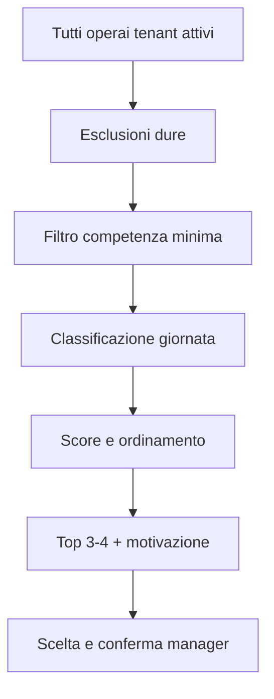
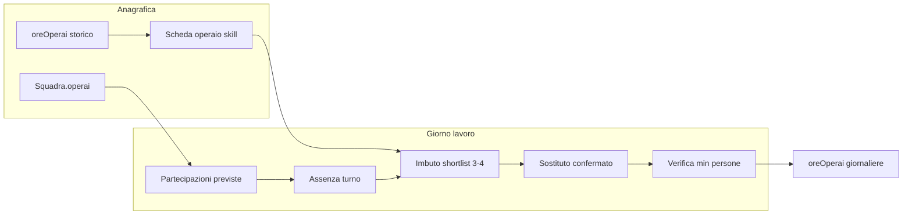

# Piano (design): sostituzione manodopera / equipaggio squadre

**Stato:** design — da implementare.  
**Ultimo aggiornamento design:** 2026-05-16 (catalogo skill tenant pilota: tutte le sottocategorie lavoro, carro=frutta, trattamenti unificati, vendemmia→trattorista per trasporto).  
**Per chi:** ogni agente o sviluppatore che lavora su **manodopera, squadre, assenze, shortlist sostituti, equipaggio minimo, profilo competenze, policy tenant**, integrazione Tony sul flusso.

**Percorsi:** la copia **canonica nel repository** è questo file (`docs-sviluppo/tony/PIANO_SOSTITUZIONE_MANODOPERA_SQUADRE.md`), così resta disponibile dopo `git clone`. In Cursor può esistere anche un piano omonimo sotto la cartella piani dell’utente (es. `.cursor/plans/`); in caso di dubbio, **prevalere il contenuto in repo** se è stato aggiornato lì.

Riferimento rapido onboarding: [`README.md`](README.md) (tabella documenti) e [`.cursor/rules/tony-agent-onboarding.mdc`](../../.cursor/rules/tony-agent-onboarding.mdc).

---

# Sostituzione operai in squadra e lavori assegnati

**Analisi coerenza Master Plan (Fase 2–3)** — La modifica è scalabile se modelliamo **sostituzione e equipaggio** come dati strutturati (config + eventuali sotto-collezioni), non come eccezioni per pagina: così Tony e il manager usano gli stessi fatti (chi è previsto, chi è assente, chi sostituisce) senza logica duplicata.

---

## Situazione attuale nel codice

- **Lavoro** (`core/models/Lavoro.js`): assegnazione **o** `caposquadraId` (lavoro di squadra) **o** `operaioId` (autonomo). Non c’è elenco di operai “sul lavoro” nel documento lavoro.
- **Squadra** (documentazione in `docs-sviluppo/GESTIONE_SQUADRE_PROCESSO.md`): `operai: [userId, ...]` in Firestore. Modificare la squadra qui cambia la composizione **globale**, non una copertura solo per oggi o per un singolo lavoro.
- **Ore** (`core/services/ore-service.js`): sotto-collezione `tenants/.../lavori/{lavoroId}/oreOperai` con `operaioId` — utile per **chi ha effettivamente lavorato** e per costi, ma non risolve da solo la pianificazione “mancano 4 persone sul carro” prima che le ore vengano registrate.

**Gap di prodotto:** assenza = problema operativo **giornaliero**; il modello attuale ottimizza **chi è responsabile** (caposquadra/squadra), non **chi copre il turno** con vincolo di numero di persone.

---

## App + database vs solo Tony

- **Solo Tony (suggerimenti senza persistenza):** prototipo rapido, ma nessuna fonte di verità condivisa: caposquadra e manager non vedono lo stesso stato nell’UI, niente audit (previsto vs sostituto), niente validazione equipaggio minimo lato app, rischio di proposte incoerenti con i vincoli reali se i dati non sono strutturati.
- **App + database (modello dati + UI + regole):** più lavoro iniziale, ma comportamento ripetibile: stesso dato in lista lavori, dettaglio, ore e (dopo) Tony; Firestore rules e validazioni possono regolare chi registra assenze o sostituzioni.

**Raccomandazione:** usare Tony come **conversazione e ranking** sopra dati già salvati (partecipazioni, assenze, soglie minime), non come unico posto in cui “esiste” la sostituzione. Allinea al Master Plan: contesto strutturato lato cloud, configurazione centralizzata, evitare eccezioni per singola pagina nel core.

**Ordine di lavoro (rivisto 2026-05-16):** (1) **skillId** + scheda operaio (dichiarate + calcolate), (2) vista impegni giorno + assenze, (3) partecipazioni/roster giornaliero + shortlist UI, (4) equipaggio minimo + policy prestito, (5) Context Builder e Tony sopra gli stessi dati.

---

## Decisioni di prodotto consolidate (2026-05-16)

Queste voci integrano le discussioni di design; prevalgono su bozze precedenti in caso di contrasto.

| Tema | Decisione |
|------|-----------|
| **Obiettivo UX** | **Scremare** tutti gli operai del tenant fino a **3–4 candidati** con motivazione leggibile; il manager **sceglie sempre** (nessuna auto-sostituzione). |
| **Contesto agricolo** | In azienda agricola **quasi nessuno è “libero”**: tutti hanno un’occupazione. La shortlist sarà spesso composta da candidati **“Spostabile con conferma”**, non da “liberi”. Il sistema deve essere onesto su questo, non simulare disponibilità inesistente. |
| **Scheda operaio** | **Scheda dedicata per ogni operaio** come fonte di verità per le competenze: skill **dichiarate all’assunzione** (manager) + skill **evolute dallo storico** in azienda (ore). Stessa scheda per UI manager, motore shortlist e Tony. |
| **Stelline (1–5)** | Sintesi **spiegabile** della competenza per `skillId`, derivata principalmente dalle **ore** su lavori/attrezzi mappati; soglie configurabili per tenant. Opzionale override manager sulla scheda. |
| **Catalogo skill** | **Tutte le sottocategorie lavoro** del sistema (`sottocategoriaCodice`) come `skillId`, per specializzazioni fine; eccezioni concordate sotto (trattamenti unificati, carro frutta, vendemmia). |
| **Disponibilità** | Calcolo **automatico** da impegni del giorno + assenze formali (ferie/permesso/malattia); **nessun** toggle manuale “segna come libero”. |
| **Lavoro sospendibile** | Candidato “spostabile” solo se **policy tenant** lo consente: priorità lavoro richiedente vs lavoro attuale, soglia minima squadra/lavoro di provenienza, flag opzionale `sospendibile`/`ritardabile` su tipo lavoro o singolo lavoro. |
| **Prelievo da altro lavoro** | Conferma esplicita + **due movimenti** tracciati (sostituzione su destinazione + buco/riassegnazione su origine). |
| **Tony** | Legge **shortlist e profilo già materializzati**; non ricalcola ore né inventa candidati. Stesso JSON per chat/voice e UI. |
| **UX rapida** | MVP: tap su card in shortlist + conferma; **drag & drop** opzionale in fase 2 (slot equipaggio ↔ pool candidati), sempre con modale se candidato già impegnato. |

---

## Scheda operaio — profilo competenze (fulcro del sistema)

**Perché:** oggi esistono pezzi sparsi (`tipoOperaio` su `User`, ore in `oreOperai`, statistiche manodopera) ma non una **vista unica** “chi è questo operaio per l’azienda”. Senza scheda, ogni shortlist dovrebbe riaggregare migliaia di ore → lento e difficile da spiegare a manager e Tony.

### Due strati sulla stessa skill (sempre distinguibili in UI)

1. **Dichiarate (manager, assunzione / aggiornamenti)**  
   - Lista `skillId` scelta dal manager (+ nota opzionale, es. esperienza pregressa fuori azienda).  
   - Opzionale: livello dichiarato o flag “certificato manager” su una skill.

2. **Calcolate (storico in azienda)**  
   - Aggregato ore per `skillId` (periodo configurabile, es. ultimi 12 mesi o stagione).  
   - **Stelle 1–5** + ore mostrate (es. “★★★★ — 312 h”).  
   - `aggiornatoIl` dell’ultimo batch/trigger.

**Visualizzazione:** mostrare una riga skill se è **dichiarata** oppure ha ore sopra soglia minima. Per il **ranking** shortlist: usare score effettivo = combinazione dichiarato + calcolato secondo regole tenant (es. `max` con cap, o “promosso dallo storico” se le ore superano la stella dichiarata).

**Caposquadra:** stessa scheda se serve profilo completo (coordinamento + competenze operative); utile anche fuori dal flusso sostituzioni (formazione, deleghe).

### Contenuto scheda (oltre alle skill)

- Anagrafica sintetica (nome, ruoli, `tipoOperaio` legacy se presente).  
- **Presenza oggi** / assenza formale (ferie, permesso, malattia) — quando modulo assenze attivo.  
- **Impegno corrente** (lavoro X, badge Libero / Impegnato / Spostabile).  
- Azioni manager: modifica skill dichiarate, nota, override stelle (con audit).

### Persistenza (bozza schema — da confermare in implementazione)

Path suggerito (multi-tenant): `tenants/{tenantId}/profiliManodopera/{userId}` oppure campi su documento utente scoped al tenant.

```javascript
{
  userId: "...",
  skillDichiarate: [
    { skillId: "potatura", livelloDichiarato: 3, nota: "...", impostatoDa, impostatoIl }
  ],
  skillCalcolate: [
    { skillId: "potatura", orePeriodo: 312, oreTotali: 890, stelle: 4, periodoDa, periodoA, aggiornatoIl }
  ],
  overrideSkill: [ /* opzionale: skillId, stelle, motivo, da */ ]
}
```

**Calcolo `skillCalcolate`:** job batch o trigger post-validazione ore; legge `oreOperai` + `tipoLavoro` / `attrezzoId` / `macchinaId` del lavoro → mapping **config tenant** `tipoLavoro|attrezzo → skillId`. Non ricalcolare tutto a ogni click sulla shortlist.

### Config tenant — skill e mapping

- **`skillId` = `sottocategoriaCodice`** dove esiste (allineamento 1:1 con `core/services/categorie-service.js` e `tipi-lavoro-service.js`), più skill trasversali sotto.  
- Mapping primario: ogni tipo lavoro / attività → `sottocategoriaCodice` del tipo → una o più skill (vedi catalogo).  
- Regole **attrezzo** aggiuntive (es. carro raccolta frutta) oltre alla skill da tipo lavoro.  
- Soglie stelle in ore per skill (calibrazione per azienda).  
- Soglia minima shortlist: es. ≥ ★★ sulla skill richiesta, oppure skill dichiarata dal manager, oppure `tipoOperaio` compatibile, oppure override.

**Allineamento codice esistente:** `tipoOperaio` resta ponte per skill dichiarate in assunzione; le stelline per `skillId` sono la fonte principale nel tempo.

---

## Catalogo skill — decisioni tenant pilota (2026-05-16)

**Principio:** mantenere **tutte le specializzazioni** per sottocategoria lavoro (non un catalogo ridotto a poche macro-skill), così la scheda operaio e la shortlist riflettono il dettaglio reale in azienda.

**Eccezioni di prodotto concordate:**

| # | Decisione |
|---|-----------|
| 1 | **Tutte le sottocategorie** lavoro del tenant sono skill attive (tabella sotto). |
| 2 | **Carro raccolta** → quasi sempre **raccolta frutta** (`raccolta_meccanica` + regola attrezzo/equipaggio minimo). **Non** usato per vendemmia. In vendemmia: contenitori/rimorchi per uva e trasporto in cantina → basta skill **`guida_trattore`** (allineata a `tipoOperaio: trattorista` + ore con trattore), non `raccolta_meccanica` “carro”. |
| 3 | **Trattamenti:** una sola skill **`trattamenti`** per manuale e meccanico (in campo quasi tutto a macchina; manuale raro). Ore da `trattamenti_manuale` e `trattamenti_meccanico` **sommano** sulla stessa skill. |

### Elenco `skillId` (catalogo v1)

*Skill da sottocategoria (19) — `skillId` = `codice` sottocategoria, salvo dove indicato:*

| `skillId` | Etichetta UI | Note |
|-----------|--------------|------|
| `lavorazione_terreno_generale` | Lavorazione terreno — Generale | |
| `lavorazione_terreno_tra_file` | Lavorazione terreno — Tra le file | |
| `lavorazione_terreno_sulla_fila` | Lavorazione terreno — Sulla fila | |
| `trattamenti` | Trattamenti | Unifica `trattamenti_manuale` + `trattamenti_meccanico` |
| `concimazione_manuale` | Concimazione — Manuale | |
| `concimazione_meccanico` | Concimazione — Meccanica | |
| `potatura_manuale` | Potatura — Manuale | |
| `potatura_meccanico` | Potatura — Meccanica | |
| `raccolta_manuale` | Raccolta — Manuale | Include **vendemmia manuale** e raccolta a mano frutta/orto |
| `raccolta_meccanica` | Raccolta — Meccanica / carro | **Carro raccolta frutta**; non vendemmia |
| `gestione_verde_manuale` | Gestione verde — Manuale | |
| `gestione_verde_meccanico` | Gestione verde — Meccanica | |
| `semina_piantagione_manuale` | Semina e piantagione — Manuale | |
| `semina_piantagione_meccanico` | Semina e piantagione — Meccanica | |
| `semina_piantagione_impianto` | Semina e piantagione — Impianto | |
| `diserbo_manuale` | Diserbo — Manuale | |
| `diserbo_meccanico` | Diserbo — Meccanico | |
| `manutenzione` | Manutenzione | Categoria principale `manutenzione` (lavori officina/impianti) |
| `altro` | Altro | Fallback |

*Skill trasversale (1) — non è sottocategoria tipo lavoro:*

| `skillId` | Etichetta UI | Note |
|-----------|--------------|------|
| `guida_trattore` | Guida trattore / trasporto | Vendemmia: rimorchi/carri uva, cantina; lavori con `macchinaId`; default da `tipoOperaio: trattorista` |

**Totale catalogo v1: 20 skill** (19 da sottocategorie + `guida_trattore`). Categoria piattaforma **`trasporto`** resta per catalogo **attrezzi** (rimorchi, carri); non è skill separata: il trasporto in vendemmia rientra in `guida_trattore`.

### Mapping ore / tipo lavoro → `skillId`

| Origine dati | Regola |
|--------------|--------|
| Tipo lavoro con `sottocategoriaCodice` | Mapping 1:1, **tranne** `trattamenti_*` → skill `trattamenti` |
| Nome tipo lavoro contiene **Vendemmia** + sottocategoria `raccolta_manuale` | Skill `raccolta_manuale` (raccolta uva a mano) |
| Nome tipo lavoro **Vendemmia Meccanica** | Non mappare a `raccolta_meccanica`/carro; ore operative → `raccolta_manuale` se raccolta; ore guida/trasporto → `guida_trattore` se presente trattore |
| Lavoro con attrezzo **carro raccolta** (frutteto) | Richiede `raccolta_meccanica` + regola **`minPersone`** su attrezzo/tipo (es. 4 postazioni) |
| `tipoOperaio: trattorista` | Skill dichiarata default `guida_trattore` (manager può aggiungere altre) |
| `tipoOperaio: meccanico` / `elettricista` | Skill dichiarata default `manutenzione` |

### Regola attrezzo — carro raccolta frutta (equipaggio)

Separata dalla skill, ma obbligatoria per il flusso sostituzioni:

- **Attrezzo:** tipo/categoria carro raccolta (config parco macchine, es. legato a categoria `trasporto` o tag dedicato `carro_raccolta`).  
- **Skill richiesta:** `raccolta_meccanica`.  
- **Vincolo:** `minPersone` (es. 4) per slot equipaggio giornaliero — **non** confondere con vendemmia.

### Soglie stelle (da calibrare su dati reali)

Bozza unica per tutte le skill (modificabile per skill in config):

| Stelle | Ore ultimi 12 mesi (esempio) |
|--------|------------------------------|
| ★ | 0–20 |
| ★★ | 21–80 |
| ★★★ | 81–200 |
| ★★★★ | 201–400 |
| ★★★★★ | 400+ |

Shortlist sostituti: soglia indicativa **≥ ★★** sulla skill richiesta dal lavoro (da confermare in pilota).

### Implementazione config (codice)

- **File:** `core/config/manodopera-skills-config.js` — catalogo, mapping sottocategoria → skillId, regole carro/vendemmia, soglie stelline, helper per lavoro/ore/tipoOperaio.  
- **Test:** `tests/config/manodopera-skills-config.test.js`

### Prossimo passo implementativo

1. ~~File config~~ (fatto).  
2. ~~Scheda operaio UI~~ (fatto): `gestione-operai-standalone.html` + `profilo-manodopera-service.js` + Firestore `profiliManodopera`.  
3. Batch ore: aggregazione per `skillId` secondo mapping (`resolveSkillIdsForOreAggregation`).  
4. UI sostituzione: richiesta skill da lavoro + attrezzo (`resolveRequiredSkillsForLavoro`).

---

## Motore di scrematura (imbuto a più stadi)

Il manager **non** vede l’elenco completo degli operai (salvo link opzionale “vedi tutti i qualificati”). Pipeline unica per **UI** e **Tony**:



| Stadio | Azione | Esempi esclusione / penalità |
|--------|--------|------------------------------|
| **1 – Esclusioni dure** | Via subito | Ferie/permesso/malattia; non raggiunge soglia skill minima; assente altrove se applicabile |
| **2 – Competenza** | Da scheda: `skillCalcolate` + `skillDichiarate` | Lavoro carro richiede `vendemmia` + `carro`; soglia stelle configurabile |
| **3 – Giornata** | Libero / Impegnato / **Spostabile** | Da vista impegni + policy priorità e minimo equipaggio origine |
| **4 – Score** | Ordinamento | Pesi es.: stelle su skill richiesta, bonus libero, bonus spostabile, penalità se origine sotto soglia dopo prestito |
| **5 – Taglio** | Max **3–4** card | Ogni card: nome, stelle+ore, badge disponibilità, lavoro attuale, **una riga di motivo** |

**Formula score (indicativa, pesi in config tenant):**

```
score = w1 * stelle(skillRichiesta)
      + w2 * bonusLibero
      + w3 * bonusSpostabileConfermabile
      - w4 * penalitaOrigineSottoSoglia
```

Tony riceve il **risultato dello stadio 5** (array strutturato), non ricalcola.

---

## Flusso UX target (shortlist + decisione manager + Tony)

Allineato a quanto concordato: **il manager decide sempre se e chi integrare**; il sistema **non** sostituisce da solo. Il ruolo dell’app è **ridurre l’elenco** (es. da 30 operai a **3–4 candidati**) con motivazione leggibile; **Tony** riusa gli stessi risultati strutturati (voice/chat assist), non una logica parallela.

**Passi logici (calcolabili lato backend/app, stessi dati per UI e Tony):**

1. **Contesto lavoro:** tipo lavoro, attrezzo/macchina se presente, equipaggio minimo, data (o turno).
2. **Filtro “può fare il lavoro”:** competenze / `tipoOperaio` / abilitazioni / storico attività simili — configurabile per tenant (evitare magia non spiegabile).
3. **Classificazione disponibilità (stessa giornata) — sempre automatica:** il manager **non** deve selezionare a mano “impegnato / libero”. Il sistema deriva lo stato da dati già in piattaforma: lavori a cui la persona risulta assegnata (operaio autonomo o membro di squadra con lavoro attivo quel giorno), stati **`assegnato` / `in_corso`** (e altri stati che contano come impegno a definire), più eventuale **equipaggio giornaliero** quando presente. Output: etichette **Libero** / **Impegnato (lavoro X)** / **Spostabile con conferma** secondo policy.
   - **Liberi:** nessun impegno che copre quella data (o finestra oraria, se un giorno avete granularità oraria).
   - **Impegnati ma potenzialmente spostabili:** impegno presente, ma il lavoro corrente ha **priorità inferiore** alla policy, oppure la squadra di provenienza resta **sopra soglia** dopo il prestito — sempre con **etichetta esplicita** (“già su lavoro X, spostabile solo con conferma”).
   - **Esclusi o in fondo lista:** non qualificati, o conflitto non risolvibile senza override.
4. **Shortlist:** ordinare (es. prima liberi qualificati, poi spostabili secondo policy) e **tagliare a 3–4** per non sommergere il manager; opzionale: mostrare “vedi tutti i qualificati” se serve.
5. **Scelta manager** su uno della shortlist (o ricerca manuale con gli stessi badge di stato).
6. **Conferma e persistenza:** registrazione assenza/sostituzione + eventuale **secondo movimento** se si è prelevato da un altro lavoro (tracciabilità).

**Tony:** propone la stessa shortlist con motivazioni brevi (“libero”, “su lavoro Y a priorità bassa”) e può guidare i passi, ma **non** inventa candidati fuori dai dati.

### Disponibilità: nessun passaggio manuale “è libero?”

Requisito di prodotto: **zero toggle** del tipo “segna come libero” da parte del manager per alimentare la shortlist. Se il calcolo è incompleto (dati mancanti), meglio mostrare **“disponibilità non determinabile”** o assenza di quell’operaio dal grafo impegni, piuttosto che scaricare la responsabilità sul manager. Eccezioni eventuali solo dove serve davvero (es. **ferie/permessi** se un giorno li modellate: possono restare flussi dedicati o integrazione esterna).

### Competenze — riferimento scheda operaio

Il dettaglio del modello **dichiarate + calcolate + stelline** è nella sezione [Scheda operaio](#scheda-operaio--profilo-competenze-fulcro-del-sistema). Il filtro “può fare questo lavoro” usa **scheda + config mapping**, non `if` per pagina.

**MVP competenze (prima delle stelline materializzate):** `tipoOperaio` + ore aggregate sullo stesso `tipoLavoro` negli ultimi N mesi; poi sostituire/affiancare con `skillCalcolate` e stelle.

### UX manager — flusso rapido (MVP)

1. Scheda lavoro o vista giorno → equipaggio previsto (es. 4 slot carro).  
2. **“Segna assente”** su slot/persona.  
3. Pannello **3–4 card** (tap; drag & drop opzionale in fase 2).  
4. Se candidato **spostabile** → modale **“Togliere da Lavoro Y?”** → conferma.  
5. Banner finché `attivi < minPersone`.  
6. Collegamento ore: il sostituto è chi comparirà in `oreOperai` per quel giorno.

---

## Punti ancora da chiarire (prossime sessioni)

- **Granularità tempo:** solo **giornata intera** al primo MVP, oppure subito **fasce orarie** (due lavori nello stesso giorno ma non sovrapposti). *Indicazione design:* partire da **giornata intera**.  
- **Stati lavoro** che contano come “impegno” oltre `assegnato` / `in_corso` (es. `da_pianificare`?).  
- **Assenze:** modulo dedicato in app (ferie/permesso/malattia per data) vs integrazione esterna — **necessario** per esclusioni dure in shortlist; finché assente, mostrare “presenza non verificata” senza fingere accuratezza.  
- **Priorità lavori:** scala suggerita **3 livelli** (critico / normale / scalabile); default per `tipoLavoro`, override per singolo lavoro; chi può modificarla.  
- **Caposquadra** può proporre sostituzioni o solo il manager (permessi).  
- **Path Firestore** definitivo: `profiliManodopera` vs campi su `users`/membership.  
- **Pesi** esatti della formula score e soglie stelle per skill (calibrazione pilota con un tenant).

---

## Idee di soluzione (dal più leggero al più strutturato)

### 1) MVP “Sostituzione rapida” (impatto alto, complessità contenuta)

- **Concetto:** separare **roster organizzativo** (squadra anagrafica) da **equipaggio effettivo per data** (o per intervallo date del lavoro).
- **UI:** dalla scheda lavoro (o dalla vista giornaliera manager): “Segna assente” su un operaio previsto → shortlist con **impegno calcolato automaticamente** da lavori (non selezione manuale libero/impegnato); ricerca estesa opzionale con stessi badge di stato.
- **Dati minimi:** una struttura tipo `partecipazioni` (sotto-collezione del lavoro o mappa per data) con: `data`, `operaioId`, `ruoloSlot` opzionale (es. lato sinistro carro), `stato` (previsto / assente / sostituito), `sostitutoDaOperaioId` per tracciabilità.
- **Perché funziona:** non obbliga a cambiare la squadra permanente; il caposquadra vede chi va in campo quel giorno.

### 2) Regole di **equipaggio minimo** (il caso “4 fissi sul carro”)

- **Concetto:** vincolo numerico (e opzionale per ruolo/slot) legato a **tipo di lavoro** e/o **attrezzo/macchina** (es. carro raccolta collegato a `Lavoro` tramite `attrezzoId` / `macchinaId` dove già presenti).
- **Comportamento:** se i partecipanti previsti attivi < soglia → banner **bloccante o warning** in UI (“manca 1 operaio: equipaggio incompleto”) finché non si assegna un sostituto o si riduce lo scope (con conferma esplicita).
- **Configurazione centralizzata:** tabella o config tenant (es. “tipo lavoro / attrezzo → `minPersone`, opzionale `slots`”) per evitare `if` sparsi nel codice, in linea con l’architettura “config > codice hardcoded” del progetto.

### 3) Supporto al manager (regole + scheda skill, non AI opaca)

Ordine di **ranking** dopo filtri duri (allineato al [motore di scrematura](#motore-di-scrematura-imbuto-a-piu-stadi)):

1. **Stelle** sulla `skillId` richiesta dal lavoro (da scheda `skillCalcolate`, con fallback dichiarate / `tipoOperaio`).  
2. **Disponibilità:** prima liberi, poi spostabili secondo policy.  
3. **Stessa squadra** (se non assenti e utili come tie-break).  
4. **Pool riserve** (personale non a lavoro full-day: magazzino, manutenzione leggera, turnazione) se configurato.  
5. Tie-break opzionali: ore recenti su stesso attrezzo, prossimità terreno (se dato disponibile).

Tony **presenta** il risultato del motore (stadio 5), con motivazioni brevi; in fase 2 espone `profiliManodopera` e shortlist nel Context Builder (`docs-sviluppo/CONTEXT_BUILDER_SPECIFICHE_SVILUPPO.md`).

### 3b) Caso realistico: tutti già assegnati (Squadra A, B, Marco/Gaia/Fabio autonomi)

**Problema:** se serve un sostituto per la Squadra A (carro, 4 persone fisse) ma **tutti** gli operai risultano già assegnati ad altri lavori, **nessun algoritmo** può scegliere “il giusto” senza **regole aziendali** e **dati di impegno** sulla giornata (o sul turno). Altrimenti la scelta tra Fabio, Gaia o un membro della B sarebbe arbitraria o sbagliata.

**Cosa serve prima del ranking:**

- **Vista unica degli impegni** per data (e idealmente fascia oraria): chi è coperto da quale lavoro (squadra o autonomo). Senza questo, l’app non sa che Fabio e Gaia sono “occupati” e non può segnalare **conflitti**.
- **Policy configurabile dal tenant** (non hardcoded), esempi tipici:
  - **Priorità del lavoro** (es. raccolta carro = critica; altri lavori scalabili o rinviabili): consente di proporre solo candidati il cui lavoro attuale ha priorità **inferiore**, oppure di mostrare “spostabile solo con conferma manager”.
  - **Regole di prestito tra squadre** (es. “non toccare Squadra B se sotto minimo”; “prestito ammesso solo se B sopra soglia”).
  - **Pool riserve / personale non assegnato** a lavori full-day (turnazione, magazzino, manutenzione leggera): spesso l’unico modo realistico per avere **sempre** una leva senza rubare ad altri lavori.
  - **Override esplicito**: il manager sceglie di **sottrarre** qualcuno da un altro lavoro; il sistema registra **due movimenti** (sostituzione su A + riassegnazione o buco su B/Gaia/Fabio), così resta tracciabilità.

**Perché non “Fabio invece di Gaia” senza policy:** la differenza può essere solo:

- **skill/attrezzo** (compatibilità carro);
- **priorità** del lavoro da cui si “preleva”;
- **prossimità** (stesso terreno, meno spostamento) se avete il dato;
- **regola interna** (es. rotazione, anzianità) che voi definite.

In assenza di priorità e impegni strutturati, il sistema può al massimo elencare **tutti** gli operai con **avviso di conflitto** (“già su lavoro X”) e lasciare la **decisione al manager** — che è comunque un MVP onesto.

**Raccomandazione di prodotto:** non promettere auto-assegnazione ottimale al primo rilascio; promettere **trasparenza** (chi è libero, chi è occupato e dove), **vincoli** (minimo equipaggio), **suggerimenti ordinati** secondo policy, **conferma** prima di “rubare” qualcuno a un altro lavoro.

### 4) Processi e audit

- Log evento: `assenza` + `sostituzione` con timestamp e utente manager (utile in contesti sindacali/contabili).
- Collegamento alle **ore**: il sostituto è quello che apparirà nelle registrazioni ore del giorno (coerenza con `oreOperai` esistente).

---

## Todo di design (tracking)

**Scheda operaio e skill**

- [x] Elenco `skillId` pilota + regole vendemmia/carro/trattamenti — **§ Catalogo skill (2026-05-16)**.  
- [x] File config `core/config/manodopera-skills-config.js` + test Vitest.  
- [x] Scheda operaio MVP: servizio + UI gestione operai + regole Firestore `profiliManodopera`.  
- [ ] Schema Firestore `profiliManodopera` (o alternativa) + UI scheda (lettura + edit skill dichiarate).  
- [ ] Batch/trigger calcolo `skillCalcolate` da `oreOperai` + soglie stelle in config.  
- [ ] Override manager con audit (opzionale MVP+).

**Sostituzioni e giornata**

- [ ] Roster/partecipazioni: per **data** vs intero lavoro; path sub-coll. lavoro.  
- [ ] Vista **impegni giornalieri** (autonomo + squadra + partecipazioni).  
- [ ] Modulo o tabella **assenze** (ferie/permesso/malattia).  
- [ ] Policy tenant: priorità lavori (3 livelli), prestito tra squadre, pool riserve, pesi score.  
- [ ] Regole `minPersone` (tipo lavoro / attrezzo) + banner UI.  
- [ ] Flusso: assenza → shortlist 3–4 → conferma (e doppio movimento se spostabile).  
- [ ] Context Builder + comandi Tony generici (post-dati).

**Da decidere**

- [ ] Permessi caposquadra vs solo manager.  
- [ ] Granularità oraria vs giornata intera al go-live.

---

## Flusso concettuale



---

## Cosa **non** fare come unica soluzione

- **Solo** modificare la squadra in “Gestione squadre” per coprire un’assenza: sposta persone in modo permanente e non documenta il “perché oggi”.

---

## Prossimi passi se vorrete implementare

**Milestone suggerite (ordine):**

1. **Config:** `skillId` + mapping tipo lavoro/attrezzo + soglie stelle (tenant).  
2. **Scheda operaio:** persistenza + UI (skill dichiarate; visualizzazione calcolate quando batch pronto).  
3. **Batch skill:** aggregazione ore → `skillCalcolate` / stelle.  
4. **Impegni giorno + assenze:** grafo occupazione + esclusioni ferie/malattia.  
5. **Partecipazioni** per data + equipaggio minimo + policy priorità/prestito.  
6. **UI sostituzione:** assenza → shortlist 3–4 (tap + conferma spostabile) in gestione lavori / vista giorno.  
7. **Tony / Context Builder:** esporre shortlist e snippet scheda; comandi generici.

**Ancoraggio UI esistente:** `core/admin/gestione-lavori-standalone.html` (o dettaglio lavoro); regole in `firestore.rules`.  
**Non fare come unica leva:** modificare solo `Gestione squadre` per un’assenza del giorno (vedi sotto).
