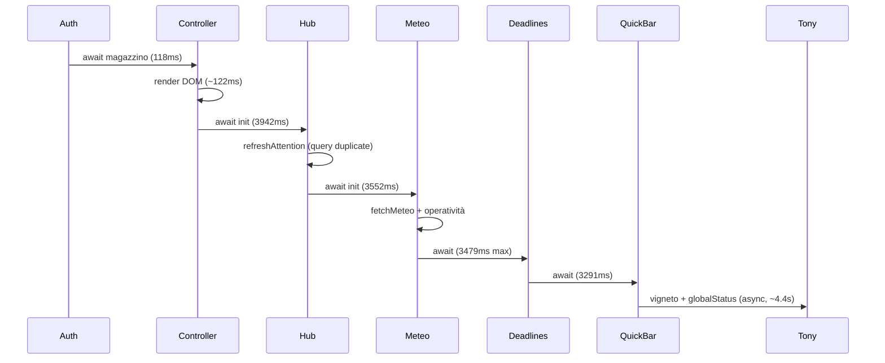
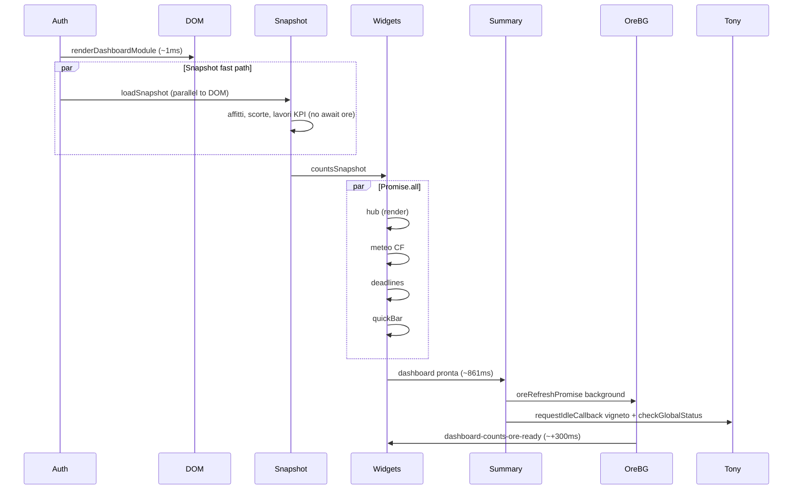
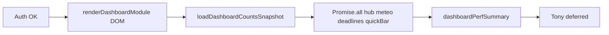

# Piano performance — Dashboard standalone

**Creato:** 2026-06-06  
**Ultimo aggiornamento:** 2026-06-06  
**Stato:** Fase 0 ✅ · Fase 1 ✅ · Fase 2 ✅ · Fase 3 ✅ · Fase 4 ✅ · **Fase 5 ✅**  
**Baseline canary:** tenant **Sabbie Gialle**, `http://localhost:8000/core/dashboard-standalone.html?dashboardPerf=1`  
**Canary attuale (post Fase 4):** `dashboard pronta` **~861 ms** (baseline ~18,4 s)  
**Strumentazione:** `core/js/dashboard-perf.js` — **off in produzione** di default; on su localhost o `?dashboardPerf=1` / `localStorage gfv_dashboard_perf=1`

---

## 1. Obiettivo

Ridurre il tempo **percepito** e **misurato** fino a «dashboard utilizzabile» (layout visibile + widget principali popolati), eliminando:

- attese **sequenziali** tra widget indipendenti;
- **query Firestore duplicate** (stesso conteggio letto 3–5 volte);
- **N+1** su ore da validare (`countOreDaValidareManager`);
- **blocco DOM** per conteggi magazzino prima del render.

**Target di prodotto (manager/admin con Manodopera + moduli attivi):**

| Milestone | Totale `dashboardPerfSummary` | Layout visibile (skeleton) | Esito canary |
|-----------|-------------------------------|----------------------------|--------------|
| Baseline (canary 2026-06-06) | **~18,4 s** | ~0,7 s (dopo auth) | — |
| Dopo Fase 1 | **≤ 10 s** | **≤ 0,2 s** (subito post-auth) | ✅ **~9,5 s** |
| Dopo Fase 2 | **≤ 6 s** (path widget) | ≤ 0,2 s | ✅ widget **~5,2 s**; summary **~8,3 s** (Tony in coda) |
| Dopo Fase 3 | **≤ 4 s** | ≤ 0,2 s | ✅ ore defer + parallel **~313 ms** background |
| Dopo Fase 4 | **≤ 3 s** (Tony fuori path critico) | ≤ 0,2 s | ✅ summary **~861 ms** |
| Fase 5 (polish) | cross-visit / resilienza | ≤ 0,2 s | ✅ implementata 2026-06-06 |

---

## 2. Baseline canary (2026-06-06)

Misura reale su ambiente locale autenticato (10 moduli, Manodopera, meteo, magazzino, parco macchine, vigneto, ecc.).

| Fase | ms | % del totale | Note |
|------|-----:|-------------:|------|
| `auth.*` (userDoc → tenantSwitch) | ~540 | 3% | Accettabile |
| `controller.magazzino_pre_menu_manodopera` | 118 | 1% | **Blocca** costruzione DOM |
| `widgets.renderDashboardModule` | 122 | 1% | Solo HTML |
| `hub.refreshAttention` | **3 939** | **21%** | 🔴 |
| `meteo.fetchAndRender` | **3 552** | **19%** | CF meteo + KPI ops |
| `deadlines.inArrivo` | **3 478** | **19%** | Include `countOreDaValidareManager` |
| `widgets.quickBar` | **3 291** | **18%** | Badge + render catalogo |
| `tony.vignetoContext` | 3 354 | 18% | 3× `getStatisticheVigneto` |
| `tony.checkGlobalStatus` | 1 079 | 6% | Duplica scorte/scadenze/guasti |
| `deadlines.scadenze` | 61 | — | Parallelo con inArrivo |
| **Totale** | **~18 385** | 100% | |

### 2.1 Flusso baseline (sequenziale — superato)

> Storico pre-Fase 1. Il flusso attuale è in §2.5.



**Somma widget in serie (baseline):** ~14,3 s — eliminata con Fase 1+2.

### 2.5 Flusso attuale (post Fase 4)



### 2.2 Duplicazioni rilevate (baseline — risolte in Fase 2)

| Dato | Letture attuali (stima per load) | File coinvolti |
|------|----------------------------------|----------------|
| Sotto scorta magazzino | **≥ 3** | `dashboard-controller.js`, `dashboard-hub.js`, `dashboard-quick-bar.js`, `checkGlobalStatus` |
| Ore da validare | **≥ 4** | `dashboard-hub.js`, `dashboard-meteo.js` (KPI), `dashboard-deadlines.js`, `dashboard-quick-bar.js` |
| Guasti aperti | **≥ 3** | hub, quick bar, `checkGlobalStatus` |
| Scadenze urgenti mezzi | **≥ 2** | hub, `checkGlobalStatus` |
| Lavori da pianificare | **≥ 2** | hub, quick bar, deadlines | ✅ 1× snapshot (`daPianificare` da docs lavori) |

**Stato:** consumer migrati a `core/js/dashboard-counts-snapshot.js`; `checkGlobalStatus` legge snapshot (no refetch scorte/scadenze/guasti).

### 2.3 Collo di bottiglia strutturale: `countOreDaValidareManager`

File: `core/js/dashboard-data.js` (~742).

Pattern attuale:

1. `getDocs` su **tutti** i lavori del tenant;
2. per ogni lavoro, `getDocs` su sottocollezione `oreOperai` con `stato == da_validare`.

Con decine di lavori → **N+1 query**; nel canary baseline ~3,5 s **per singola invocazione**, invocata più volte nello stesso load.

**Mitigazione implementata (Fase 3, 2026-06-06):**

- `countOreDaValidareFromLavoriDocs` — query `oreOperai` **in parallelo** (riuso docs lavori già letti dallo snapshot).
- Conteggio ore **fuori path critico**: `oreDaValidarePending` + `oreRefreshPromise` + evento `dashboard-counts-ore-ready`.
- Canary post-Fase 3: `counts.oreDaValidare` **~313 ms** in background (summary già a ~861 ms).

**Backlog strutturale (Fase 5 / medio termine):** collection group + `tenantId` su `oreOperai` (3.A) o contatore denormalizzato (3.B).

### 2.4 Canary post-implementazione (2026-06-06, Sabbie Gialle)

| Fase perf | ms (totale_ms) | Note |
|-----------|----------------|------|
| `auth.*` | ~430 | invariato |
| `widgets.renderDashboardModule` | **1** (~432) | DOM immediato |
| `counts.loadSnapshot` | **111** (~542) | senza await ore nel path critico |
| `hub.refreshAttention` | **1** (~544) | solo render da snapshot |
| `widgets.parallelBatch` | **319** (~861) | hub + meteo + deadlines + quickBar |
| `meteo.fetchAndRender` | **281** | CF meteo (cache) |
| `deadlines.inArrivo` | **310** | lista mezzi + count da snapshot |
| `dashboard pronta` (summary) | — | **~861 ms** |
| `counts.oreDaValidare` | **313** (~852) | **dopo** summary |
| `tony.checkGlobalStatus` | **595** (~1473) | deferred (`requestIdleCallback`) |
| `tony.vignetoContext` | **3316** (~4193) | deferred, non blocca UI |

---

## 3. Principi di design

1. **Layout prima, dati dopo** — skeleton e menu moduli subito; badge numerici in secondo piano.
2. **Un fetch, molti consumer** — snapshot condiviso in memoria per la sessione di pagina (Fase 2).
3. **Parallelismo sicuro** — hub, meteo, scadenze, quick bar non dipendono l'uno dall'altro per il primo render.
4. **Tony fuori path critico** — contesto vigneto e briefing globali dopo `dashboardPerfSummary` o in `requestIdleCallback`.
5. **Misura ad ogni fase** — stesso canary, stesso tenant, confronto tabella `[Dashboard Perf]`.
6. **No patch per pagina** — cache/conteggi centralizzati in `dashboard-data.js` (o modulo dedicato), non `if` sparsi.

---

## 4. Fasi di implementazione

### Fase 0 — Strumentazione ✅

**Stato:** completata 2026-06-06.

| Task | File |
|------|------|
| Modulo perf | `core/js/dashboard-perf.js` |
| Hook auth + widget | `core/dashboard-standalone.html` |
| Fasi controller / hub / meteo / deadlines | rispettivi moduli `dashboard-*.js` |

**Verifica:** aprire dashboard → console con tabella fasi e `window.__gfvDashboardPerf.totalMs`.

---

### Fase 1 — Layout immediato + widget in parallelo ✅

**Stato:** completata 2026-06-06. Canary **~9,5 s** (Tony ancora in summary).

**Obiettivo:** togliere il blocco pre-DOM e tagliare ~8–10 s di attesa seriale.

**Target:** totale **≤ 10 s**; skeleton visibile entro **200 ms** dopo auth.

#### 1.1 Magazzino non blocca il menu moduli

| # | Task | Dettaglio | File |
|---|------|-----------|------|
| 1.1a | Render menu **senza** await magazzino | `sottoScortaMagazzino: 0` o placeholder `—`; badge aggiornato dopo fetch | `dashboard-controller.js` |
| 1.1b | Badge async post-render | Callback o evento `dashboard-counts-ready` aggiorna voce menu / tile magazzino | `dashboard-controller.js`, `dashboard-sections.js` |

#### 1.2 `Promise.all` sui widget indipendenti

| # | Task | Dettaglio | File |
|---|------|-----------|------|
| 1.2a | Parallelizzare init widget | Sostituire catena `await hub → meteo → deadlines → quickBar` con `Promise.all([...])` | `core/dashboard-standalone.html` (`renderDashboard`) |
| 1.2b | `resolveCurrentTenantId` una sola volta | Già risolto in auth; evitare secondo `widgets.resolveTenant` se `userData.tenantId` presente | `dashboard-standalone.html` |
| 1.2c | Fase perf dedicata | `widgets.parallelBatch` che avvolge l'`Promise.all` | `dashboard-standalone.html` |

**Stima dopo Fase 1:** tempo widget ≈ `max(hub, meteo, deadlines, quickBar)` ≈ **4–4,5 s** + auth ~0,6 s + Tony ~4 s se ancora awaited → **~9 s** totale se Tony resta in coda; **~5 s** se Tony differito (vedi Fase 4).

#### 1.3 Skeleton UX (opzionale ma consigliato)

| # | Task | Dettaglio |
|---|------|-----------|
| 1.3a | Placeholder hub alert | «Verifica in corso…» invece di lista vuota |
| 1.3b | Meteo | già presente «Caricamento meteo…» |
| 1.3c | Deadlines | già presente «Caricamento…» su in arrivo |

**Criteri di accettazione Fase 1**

- [x] Menu moduli e layout panoramica visibili **senza** attendere Firestore magazzino.
- [x] Log perf: `widgets.hub`, `widgets.meteo`, `widgets.deadlines`, `widgets.quickBar` con **totalMs simile** (finiscono nello stesso range, non a scalare).
- [x] Nessuna regressione funzionale su alert hub, meteo, scadenze, quick bar.
- [x] Canary: totale **≤ 10 s** (Tony può restare sequenziale in questa fase).

---

### Fase 2 — Snapshot conteggi condiviso (`dashboardCountsSnapshot`) ✅

**Stato:** completata 2026-06-06. `hub.refreshAttention` **2 ms**; path widget **~5,2 s**.

**Obiettivo:** una sola lettura per conteggio per sessione di pagina; eliminare duplicati.

**Target:** totale **≤ 6 s** (con Fase 1 già attiva).

#### 2.1 Modulo implementato

File: `core/js/dashboard-counts-snapshot.js`

```javascript
export async function loadDashboardCountsSnapshot(tenantId, ctx, dependencies) { /* … */ }
export function getDashboardCountsSnapshot() { /* cache in-memory pagina */ }
export function applyDashboardCountsToDom(snapshot) { /* badge magazzino + evento */ }
export const ORE_READY_EVENT = 'dashboard-counts-ore-ready';
```

#### 2.2 Consumer da migrare

| Consumer | Conteggi usati | Modifica |
|----------|----------------|----------|
| `dashboard-controller.js` | sottoScorta (menu) | Legge snapshot dopo `loadDashboardCountsSnapshot` |
| `dashboard-hub.js` `refreshAttention` | scorte, guasti, scadenze, affitti, da pianificare, ore | **Solo** snapshot, niente fetch propri |
| `dashboard-meteo.js` KPI laterali | programmati, in corso, ore | Snapshot o sotto-oggetto `operativitaOggi` |
| `dashboard-deadlines.js` | in arrivo (parziale) | Ri usa numeri snapshot dove basta il count; lista dettaglio resta fetch dedicato |
| `dashboard-quick-bar.js` `refreshBadges` | ore, guasti, scorta, da pianificare | Snapshot |
| `checkGlobalStatus` (Tony) | scorte, scadenze, guasti | Snapshot + meteo briefing |

#### 2.3 Ordine di boot proposto (post Fase 1+2)



Avviare `loadDashboardCountsSnapshot` **in parallelo** al render DOM (non await prima del DOM), poi passare lo snapshot ai widget quando risolve.

**Criteri di accettazione Fase 2**

- [x] Una sola chiamata Firestore per tipo conteggio per reload pagina (snapshot centralizzato).
- [x] Numeri coerenti tra hub, KPI meteo, menu magazzino, Tony briefing.
- [x] Canary: `hub.refreshAttention` **≤ 500 ms** (solo render, no query) — misurato **1–2 ms**.
- [x] Path widget **≤ 6 s** (summary ancora ~8,3 s con Tony + ore bloccanti — risolto in Fase 3–4).

---

### Fase 3 — Ottimizzazione query «ore da validare» ✅

**Stato:** completata 2026-06-06 (short-term: parallel + defer path critico). Canary `counts.oreDaValidare` **~313 ms** in background.

**Obiettivo:** ridurre costo di `countOreDaValidareManager` da ~3,5 s a **< 500 ms** (o eliminarlo dal path critico).

**Target:** totale **≤ 4 s** con Fasi 1–2 attive.

#### Opzione A — Collection group query (preferita se indici ok)

| # | Task |
|---|------|
| 3.A1 | Aggiungere indice Firestore collection group su `oreOperai` con filtro `stato == da_validare` e campo tenant (o path rules) |
| 3.A2 | Nuova funzione `countOreDaValidareManagerFast` — singola query group + filtro lato client per tipo lavoro |
| 3.A3 | Test su tenant con molti lavori (Sabbie Gialle) |

#### Opzione B — Contatore denormalizzato (medio termine)

| # | Task |
|---|------|
| 3.B1 | Campo `stats.oreDaValidare` su doc tenant o sotto `tenants/{id}/stats/dashboard` |
| 3.B2 | Cloud Function / trigger onWrite su `oreOperai` aggiorna contatore |
| 3.B3 | Dashboard legge solo il contatore; lista dettaglio in arrivo resta query puntuale |

#### Opzione C — Minimo invasivo (short-term)

| # | Task |
|---|------|
| 3.C1 | Cache TTL 60 s in `dashboard-counts-snapshot` per conteggio ore |
| 3.C2 | Mostrare ultimo valore noto + spinner (stale-while-revalidate) |

**Implementato (2026-06-06):**

| # | Task | Stato |
|---|------|-------|
| 3.IMP1 | `countOreDaValidareFromLavoriDocs` — query parallele, riuso docs lavori | ✅ |
| 3.IMP2 | Ore defer: `oreDaValidarePending`, `oreRefreshPromise`, evento `dashboard-counts-ore-ready` | ✅ |
| 3.IMP3 | Consumer refresh: hub, meteo KPI, quick bar, in arrivo | ✅ |

**Raccomandazione backlog:** **3.A** (collection group + `tenantId` su doc ore) o **3.B** (contatore denormalizzato) per tenant con molti lavori; **3.C1** TTL cross-visit opzionale in Fase 5.

**Criteri di accettazione Fase 3**

- [x] Prima invocazione ore da validare **≤ 500 ms** **oppure** fuori path critico (solo background refresh).
- [x] `deadlines.inArrivo` **≤ 1,5 s** (lista dettaglio + count snapshot) — misurato **~310 ms**.
- [x] Summary canary **≤ 4 s** — raggiunto con Fase 4 (**~861 ms**).

---

### Fase 4 — Tony e contesto fuori path critico ✅

**Stato:** completata 2026-06-06. Summary **~861 ms**; Tony completa in background (~+3,3 s vigneto).

**Obiettivo:** la dashboard è «pronta» prima di vigneto e briefing globali.

| # | Task | Dettaglio | File |
|---|------|-----------|------|
| 4.1 | Spostare `finishDashboardLoad` | `dashboardPerfSummary` **prima** di Tony; vigneto + `checkGlobalStatus` in `requestIdleCallback` o `setTimeout(0)` | `dashboard-standalone.html` |
| 4.2 | `checkGlobalStatus` usa snapshot | Nessun refetch scorte/scadenze/guasti | stesso file + snapshot |
| 4.3 | Meteo briefing Tony | Resta async; non blocca summary | `dashboard-meteo-briefing.js` |
| 4.4 | Fase perf | `tony.*` dopo `dashboard pronta` nel log (totalMs > summary) | `dashboard-perf.js` opzionale flag `criticalPathOnly` |

**Target:** `dashboardPerfSummary` **≤ 3 s**; Tony completa entro ~+4 s senza impattare interazione.

**Criteri di accettazione Fase 4**

- [x] Utente può scrollare e cliccare moduli entro ~3 s.
- [x] Briefing Tony proattivo invariato (delay 3 s già presente).
- [x] `dashboardPerfSummary` al summary **≤ 3000 ms** — misurato **~861 ms**.

---

### Fase 5 — Affinamenti e resilienza ✅

**Stato:** completata 2026-06-06.

**Obiettivo:** polish, cache cross-visit, riduzione lavoro quick bar, prefetch login, SLO automatici.

| # | Task | Stato | Dettaglio |
|---|------|-------|-----------|
| 5.1 | Quick bar: render shell sync, badge async | ✅ | `buildBarHTML` subito; `scheduleBadgeRefresh` async |
| 5.2 | Meteo stale-while-revalidate | ✅ | `getMeteoSedeCachedPayload` + `fetchMeteoSedeWithLocalCache` (localStorage 15 min) |
| 5.3 | Prefetch snapshot al login | ✅ | `dashboard-login-prefetch.js` + sessionStorage TTL 120 s |
| 5.4 | Disabilitare perf in produzione | ✅ | `isDashboardPerfEnabled()` — default off fuori localhost |
| 5.5 | Test automatico smoke | ✅ | `tests/dashboard-perf-slo.test.js` · `npm run dashboard:perf-smoke` |
| 5.6 | Invalidazione cambio tenant | ✅ | `switchTenant` → invalidate snapshot + prefetch + cache meteo |

**File:** `core/js/dashboard-quick-bar.js`, `core/services/meteo-service.js`, `core/js/dashboard-meteo.js`, `core/js/dashboard-login-prefetch.js`, `core/js/dashboard-counts-snapshot.js`, `core/js/dashboard-perf.js`, `core/js/dashboard-perf-slo.js`, `core/auth/login-standalone.html`, `core/services/tenant-service.js`, `tests/dashboard-perf-slo.test.js`.

**Backlog opzionale (medio termine):** 3.A collection group ore · 3.B contatore denormalizzato · invalidazione snapshot su `visibilitychange` (tab nascosta a lungo).

---

## 5. File toccati (riepilogo)

| File | Fasi |
|------|------|
| `core/dashboard-standalone.html` | 1, 2, 4 ✅ |
| `core/js/dashboard-controller.js` | 1, 2 ✅ |
| `core/js/dashboard-hub.js` | 1, 2, 3 ✅ |
| `core/js/dashboard-meteo.js` | 2, 3 ✅ |
| `core/js/dashboard-deadlines.js` | 2, 3 ✅ |
| `core/js/dashboard-quick-bar.js` | 2, 3, 5 |
| `core/js/dashboard-data.js` | 2, 3 ✅ |
| `core/js/dashboard-counts-snapshot.js` | 2, 3 ✅ |
| `core/js/dashboard-sections.js` | 1 ✅ |
| `core/js/dashboard-perf.js` | 0, 4, 5 |
| `firestore.indexes.json` | 3.A (backlog) |
| `functions/` (trigger contatori) | 3.B (backlog) |

---

## 6. Protocollo canary e regressione

### 6.1 Esecuzione manuale

1. Server: `npm start` → `http://localhost:8000`
2. Login tenant di riferimento (**Sabbie Gialle** o equivalente ricco).
3. Aprire: `/core/dashboard-standalone.html?dashboardPerf=1&_canary=perf`
4. Console → tabella `[Dashboard Perf] riepilogo — dashboard pronta`
5. Salvare screenshot o copia `window.__gfvDashboardPerf.phases`

### 6.2 Checklist funzionale (verifica post Fase 4 — 2026-06-06)

- [x] Menu moduli: badge sotto scorta corretto (quando presente)
- [x] Hub «Richiede attenzione»: stessi alert pre/post (ore aggiornate su `dashboard-counts-ore-ready`)
- [x] Meteo sede + pannello destro KPI
- [x] Scadenze amministrazione + In arrivo
- [x] Quick bar: 5 slot + badge su voci configurati
- [x] Tony: contesto dashboard + briefing (se ruolo manager/admin) — deferred dopo summary
- [x] Cambio tenant: invalidazione snapshot e reload conteggi (`switchTenant` 2026-06-06)

### 6.3 SLO (stato attuale)

| Metrica | SLO | Stato canary 2026-06-06 |
|---------|-----|-------------------------|
| `dashboardPerfSummary` / `summaryMs` | ≤ 3000 ms | ✅ **~861 ms** |
| `controller.magazzino_*` prima del DOM | 0 ms (non await) | ✅ assente |
| `hub.refreshAttention` | ≤ 500 ms | ✅ **1 ms** |
| Invocazioni conteggio ore per load (path critico) | 0 (defer) | ✅ background 1× |
| `counts.oreDaValidare` (background) | ≤ 500 ms | ✅ **~313 ms** |

---

## 7. Rischi e fuori scope

| Rischio | Mitigazione |
|---------|-------------|
| Snapshot stale dopo azione utente | Invalidare cache su navigazione `visibilitychange` o eventi GFV esistenti |
| Indice collection group mancante | Fallback a implementazione attuale + log warning |
| Contatore denormalizzato disallineato | Job riconciliazione notturno |
| Parallelismo race su DOM | Ogni widget scrive solo nel proprio container |

**Fuori scope di questo piano**

- Performance Tony chat / CF `tonyAsk` (vedi `docs-sviluppo/tony/PLAN_OTTIMIZZAZIONE_PERFORMANCE.md`)
- Ottimizzazione card ruolo operaio/caposquadra (layout diverso, meno widget panoramica)
- CDN / bundle JS dashboard

---

## 8. Ordine di lavoro

```text
Fase 0 ✅ → … → Fase 5 ✅ (2026-06-06)
→ backlog opzionale: 3.A / 3.B ore da validare · visibilitychange invalidation
```

**Smoke test CI:** `npm run dashboard:perf-smoke`

---

## 9. Riferimenti

- Strumentazione: `core/js/dashboard-perf.js`
- Voce changelog: `docs-sviluppo/COSA_ABBIAMO_FATTO.md` (2026-06-06 perf + questo piano)
- Architettura dashboard: `docs-sviluppo/REFACTORING_DASHBOARD_PROGRESS.md`
- Dati lista lavori / scalabilità query: `docs-sviluppo/lavori/PLAN_SCALABILITA_LISTA_LAVORI.md`
- Tony performance (track separato): `docs-sviluppo/tony/PLAN_OTTIMIZZAZIONE_PERFORMANCE.md`
