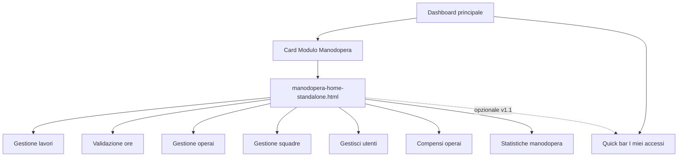

# Piano implementazione: Hub modulo Manodopera (navigazione)

**Data creazione**: 2026-06-12  
**Stato**: da implementare  
**Priorità**: media-alta (UX / coerenza moduli)  
**Tipo intervento**: solo **accessi e navigazione** — nessun cambio a logica business, Firestore, servizi o pagine operative esistenti.

---

## Contesto e problema

Oggi **Manodopera** è attivo come modulo in abbonamento (`core/config/subscription-plans.js`, `id: 'manodopera'`) ma **non ha** la stessa identità navigabile degli altri moduli:

| Elemento | Vigneto / Magazzino / … | Manodopera oggi |
|----------|-------------------------|-----------------|
| Cartella `modules/…` | Sì | No |
| Home / dashboard modulo | Sì | No |
| Card nel menu moduli (`MODULE_CATALOG`) | Sì | No |
| `dashboardRouteId` in quick bar | Sì | `null` in `QUICK_BAR_SECTION_ORDER` |

Le funzioni sono **sparse**: `core/admin/gestione-lavori-standalone.html`, `gestione-operai`, `gestione-squadre`, `validazione-ore`, `compensi-operai`, `statistiche-manodopera`, `core/segnatura-ore-standalone.html`, ecc. La quick bar espone già un gruppo **Manodopera** (`section: 'manodopera'` in `core/js/dashboard-quick-bar.js`), ma senza pagina hub.

**Obiettivo**: allineare Manodopera al pattern degli altri moduli **senza spostare file né riscrivere funzionalità** — una home con card che linkano alle pagine attuali.

**Documento correlato (scope diverso)**: sostituzioni operai, equipaggio, shortlist → `docs-sviluppo/tony/PIANO_SOSTITUZIONE_MANODOPERA_SQUADRE.md`. Non mescolare i due lavori.

---

## Decisioni di prodotto (2026-06-12)

### 1. Solo riorganizzazione accessi

- **Sì**: nuova pagina hub, card modulo in dashboard, aggiornamento catalogo quick bar / Tony routing.
- **No**: spostare HTML/JS da `core/admin/`, cambiare modelli, servizi, regole Firestore, flussi gestione lavori/ore.

Gli URL esistenti (`core/admin/…`, `core/segnatura-ore-…`) **restano validi** (bookmark, link da vigneto/conto terzi, Tony `APRI_PAGINA`).

### 2. V1 solo Manager / Amministratore

La home Manodopera è il **centro di comando** per chi pianifica e amministra:

- creazione e assegnazione lavori;
- operai, squadre, utenti (inviti);
- validazione ore globale;
- compensi;
- statistiche manodopera.

**Caposquadra e operaio**: nessun cambiamento in questa fase. Restano sulla **dashboard principale** con le sezioni già presenti (`createCaposquadraSection`, `createOperaioSection` in `core/js/dashboard-sections.js`) e su **workspace mobile** (`core/mobile/field-workspace-standalone.html`).

> Nota: caposquadra/operaio **non gestiscono** la pianificazione manodopera, ma **eseguono** lavori assegnati (ore, lavori, mobile). Non sono “fuori” dal modulo; semplicemente **non hanno bisogno di un hub dedicato** in v1.

### 3. Quick bar come widget

Sulla dashboard principale la riga **“I miei accessi”** (gestione lavori, validazione ore, …) **resta**.

Sulla home Manodopera si può **riusare lo stesso componente** (`createDashboardQuickBarSection` + `initDashboardQuickBar`) come scorciatoie personalizzate — opzionale in v1, consigliato in v1.1.

La home ha il **catalogo completo** a card; la quick bar resta **personalizzazione rapida** (max 5 slot).

### 4. Gestisci utenti

Incluso nel blocco **Persone** della home manager, in linea con il catalogo quick bar attuale (`gestisciUtenti`, `section: 'manodopera'`).

Se in futuro si preferisce separare “amministrazione IT” da “HR operai”, la card può essere rimossa dalla home e lasciata solo in `amministrazione-standalone.html`.

---

## Analisi coerenza Master Plan

**Fase 2 (mobilità globale)** — La home è un punto di ingresso canonico per il modulo; Tony e la dashboard possono usare lo stesso target senza eccezioni per pagina.

**Principio configurazione** — Card e catalogo derivano da una lista centralizzata (idealmente riuso voci `QUICK_BAR_CATALOG` filtrate per manager + `section: 'manodopera'`), non da `if (pagina === …)` sparsi.

**Scalabilità** — Nuove voci manodopera = nuova voce catalogo + card in hub; le pagine operative restano indipendenti.

---

## Deliverable v1

### A. Pagina hub

**Path proposto**: `modules/manodopera/views/manodopera-home-standalone.html`

**Riferimento golden**: struttura di `modules/magazzino/views/magazzino-home-standalone.html` (header, KPI, griglie `action-card`, link `← Dashboard`, `responsive-standalone.css`).

**Visibilità**: modulo `manodopera` attivo sul tenant **e** ruolo `manager` o `amministratore`. Altri ruoli: redirect a `core/dashboard-standalone.html` (o messaggio “non disponibile”).

**Header**:
- Titolo: **Manodopera** (o “Lavori, squadre e ore”)
- Sottotitolo breve
- Pulsante `← Dashboard` → `../../../core/dashboard-standalone.html`

### B. Fascia KPI (in alto)

Riutilizzare `getDashboardCountsSnapshot()` / `dashboard-counts-snapshot.js` (stessi dati della dashboard principale).

| KPI | Fonte snapshot | Link al click |
|-----|----------------|---------------|
| Programmati oggi | `operativitaOggi.programmatiOggi` | `gestione-lavori-standalone.html` (+ filtro oggi se già supportato) |
| In corso | `operativitaOggi.inCorso` | `gestione-lavori-standalone.html` |
| Ore da validare | `oreDaValidare` | `validazione-ore-standalone.html` |
| Da pianificare | `daPianificare` | `gestione-lavori-standalone.html?stato=da_pianificare` — **solo se** `availableModules` include `contoTerzi` |

Badge numerici sulle card sotto quando il conteggio è > 0 (validazione ore, da pianificare).

### C. Card azioni (solo manager / amministratore)

Path relativi dalla home: `../../../core/admin/…` o `../../../core/segnatura-ore-…` come da convenzione altre home modulo.

#### Sezione — Pianificazione e lavori

| Card | Icona | Destinazione | Note |
|------|-------|--------------|------|
| Gestione lavori | 📋 | `admin/gestione-lavori-standalone.html` | Card principale (enfasi visiva) |
| Da pianificare | 📝 | `admin/gestione-lavori-standalone.html?stato=da_pianificare` | Solo con Conto Terzi; badge `daPianificare` |
| Validazione ore | ✅ | `admin/validazione-ore-standalone.html` | Badge `oreDaValidare` |

#### Sezione — Persone

| Card | Icona | Destinazione |
|------|-------|--------------|
| Gestione operai | 👷‍♂️ | `admin/gestione-operai-standalone.html` |
| Gestione squadre | 👷 | `admin/gestione-squadre-standalone.html` |
| Gestisci utenti | 👥 | `admin/gestisci-utenti-standalone.html` |

#### Sezione — Controllo e analisi

| Card | Icona | Destinazione |
|------|-------|--------------|
| Compensi operai | 💰 | `admin/compensi-operai-standalone.html` |
| Statistiche manodopera | 📊 | `admin/statistiche-manodopera-standalone.html` |

#### Non in home v1

| Voce | Motivo |
|------|--------|
| Segnatura ore | Flusso caposquadra/operaio; manager può arrivarci da quick bar se serve |
| Workspace mobile | Idem |
| Gestione macchine | Modulo Parco Macchine |
| Amministrazione / Abbonamento | Core |
| Diario attività | Non canonico con manodopera attivo |
| Spostamento file da `core/admin/` | Fuori scope |

### D. Integrazione dashboard principale

1. **`core/js/dashboard-hub.js`** — aggiungere a `MODULE_CATALOG`:
   ```javascript
   manodopera: {
     label: 'Manodopera',
     href: '../modules/manodopera/views/manodopera-home-standalone.html',
     icon: '👷'
   }
   ```
   Visibile se `availableModules.includes('manodopera')` (o equivalente `hasManodopera`).

2. **`core/js/dashboard-sections.js`** — `createManodoperaCard()` sul modello `createMagazzinoCard()`; inserire nella sidebar:
   - variant `manodopera`: dopo Amministrazione/Statistiche o in posizione coerente con altri moduli operativi;
   - valutare se mostrarla anche in variant `core` quando il modulo è attivo (consigliato: **sì**, come gli altri moduli pay-per-use).

3. **`core/js/dashboard-quick-bar.js`**:
   - Nuova voce catalogo `manodoperaHome` → href home modulo, `section: 'manodopera'`, `requireManodopera: true`, visibile manager/amministratore.
   - Aggiornare `QUICK_BAR_SECTION_ORDER`:
     ```javascript
     { id: 'manodopera', label: 'Manodopera', dashboardRouteId: 'manodoperaHome' }
     ```
   - Nel picker configurazione, la dashboard modulo compare in testa al gruppo Manodopera (come Magazzino/Vigneto).

### E. Tony e navigazione

| File | Modifica |
|------|----------|
| `core/js/tony/engine.js` | Target `manodopera` / “apri manodopera” → home modulo (oggi punta spesso a `gestione-operai`) |
| `core/config/tony-routes.json` | Voce hub se presente pattern moduli |
| `functions/index.js` | Solo se istruzioni navigazione hardcoded per “modulo manodopera” — aggiornare target hub; **non** cambiare intent lavori/ore |

Deep link esistenti (`gestione-lavori`, `FILTER_TABLE` su `pageType: lavori`) **invariati**.

### F. Documentazione utente (dopo implementazione)

Seguire `tony-agent-onboarding.mdc`: aggiornare solo i 4 file consentiti (`COSA_ABBIAMO_FATTO.md`, `STATO_ATTUALE.md` se serve, ecc.) e guide MANODOPERA **solo se** richiesto aggiornamento guida utente.

---

## Fuori scope (esplicito)

- Refactor `gestione-lavori-*.js` o spostamento in `modules/manodopera/`
- Hub caposquadra / operaio
- Scheda operaio unificata (vedi piano sostituzioni)
- Cambio variant dashboard `manodopera` (sidebar senza Diario, ecc.) — opzionale fase 2
- Modifiche a permessi Firestore o ruoli
- Nuovi KPI Firestore (solo riuso snapshot esistente)

---

## Fasi di lavoro

### Fase 1 — Hub + card modulo (MVP)

| # | Task | File principali |
|---|------|-----------------|
| 1 | Creare `manodopera-home-standalone.html` con KPI + 3 sezioni card | `modules/manodopera/views/` |
| 2 | Auth, tenant, check modulo + ruolo manager/amministratore | stesso file (pattern magazzino-home) |
| 3 | `createManodoperaCard()` + sidebar dashboard | `dashboard-sections.js`, `dashboard-controller.js` se serve |
| 4 | `MODULE_CATALOG.manodopera` | `dashboard-hub.js` |
| 5 | `manodoperaHome` + `dashboardRouteId` | `dashboard-quick-bar.js` |
| 6 | Tony route hub | `tony/engine.js`, `tony-routes.json` |
| 7 | Test manuale: login manager con/senza modulo; bookmark vecchi URL ancora ok | — |

**Stima**: 1–3 giorni.

### Fase 2 — Raffinamenti (opzionale)

| # | Task |
|---|------|
| 1 | Montare quick bar widget sulla home manodopera |
| 2 | Allineare test automatici smoke (link hub in catalogo) |
| 3 | Tour onboarding manager “entra in Manodopera dalla card” |
| 4 | Semplificare sidebar dashboard principale ora che esiste hub (rimuovere ridondanze) |

### Fase 3 — Non pianificata ora

Spostamento fisico pagine in `modules/manodopera/views/` con redirect legacy.

---

## Criteri di accettazione

- [ ] Con modulo manodopera attivo, manager/amministratore vede **card Manodopera** nel menu moduli dashboard.
- [ ] La card apre **manodopera-home** con tutte le card v1 elencate sopra.
- [ ] KPI in alto mostrano dati coerenti con dashboard principale (stesso snapshot).
- [ ] Card “Da pianificare” visibile **solo** con Conto Terzi attivo.
- [ ] Caposquadra/operaio **non** vedono la home (redirect o assenza card).
- [ ] Tutti i link delle card aprono le **stesse pagine** di prima (nessuna regressione funzionale).
- [ ] Quick bar: gruppo Manodopera mostra **dashboard modulo** in testa (`dashboardRouteId`).
- [ ] Tony “apri manodopera” / navigazione modulo → home (non più default gestione operai).
- [ ] Link profondi da vigneto/conto terzi a `gestione-lavori` continuano a funzionare senza modifiche.

---

## Checklist file (riferimento rapido)

| Azione | Path |
|--------|------|
| **Nuovo** | `modules/manodopera/views/manodopera-home-standalone.html` |
| Modifica | `core/js/dashboard-sections.js` |
| Modifica | `core/js/dashboard-hub.js` |
| Modifica | `core/js/dashboard-quick-bar.js` |
| Modifica | `core/js/tony/engine.js` |
| Modifica | `core/config/tony-routes.json` (se applicabile) |
| Verifica only | `core/js/dashboard-controller.js` |
| Verifica only | `core/js/dashboard-counts-snapshot.js` |
| **Non toccare** | `core/admin/gestione-lavori-*.js`, servizi `manodopera-*`, `functions/index.js` (salvo riga navigazione Tony) |

---

## Schema navigazione (target)



---

## Note per agenti / handoff

1. Leggere questo piano prima di implementare; **non** confondere con `PIANO_SOSTITUZIONE_MANODOPERA_SQUADRE.md`.
2. Rispettare `tony-pagina-lista-e-form.mdc` solo per **nuove** liste/form — qui non si creano.
3. Dopo merge: voce in `docs-sviluppo/COSA_ABBIAMO_FATTO.md` con data e scope “hub navigazione manodopera v1 manager”.
4. Colore accent modulo suggerito: verde operativo `#2E8B57` (allineato a gestione lavori / sezioni caposquadra esistenti).

---

## Storico decisioni

| Data | Decisione |
|------|-----------|
| 2026-06-12 | Hub solo navigazione; pagine operative invariate |
| 2026-06-12 | V1 solo manager/amministratore; caposquadra/operaio invariati |
| 2026-06-12 | Card manager: lavori, validazione, operai, squadre, utenti, compensi, statistiche; da pianificare se Conto Terzi |
| 2026-06-12 | Quick bar principale invariata; riuso widget sulla home opzionale |
| 2026-06-12 | Gestisci utenti incluso in blocco Persone |
