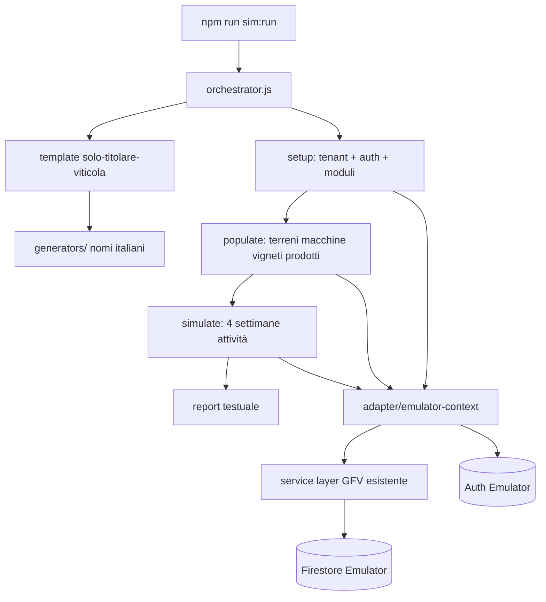
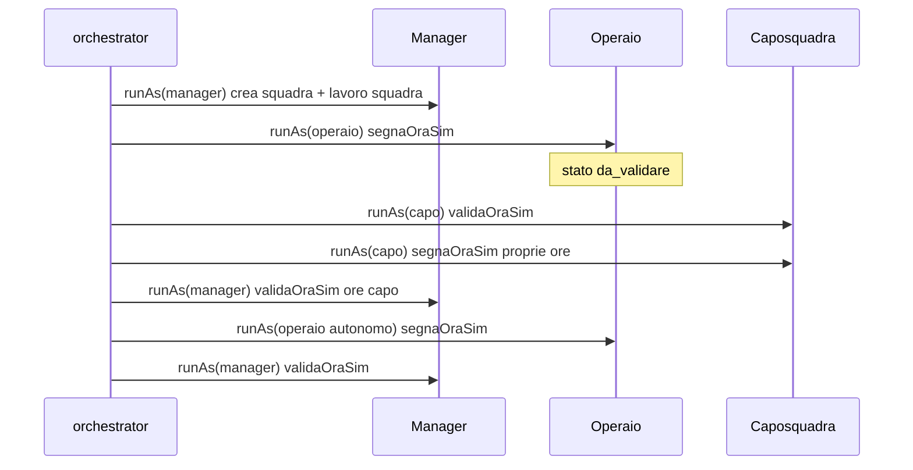

# GFV Farm Simulator — Guida sviluppo per agenti

**Versione:** 1.6.1 + **v2.1 manodopera** §14 + **v3 cascata** ✅ + **v4 Playwright** §11.2 (18 scenari read ✅) + **v5 roadmap** §11.3 (**54 scenari: 28 read + 26 write ✅**, catena A §11.3.12)  
**Data:** 2026-07-01  
**Stato:** v1.6.1 chiusa; **v2.1 manodopera chiusa**; **v2.2 conto terzi chiusa**; **v3 cascata** ✅ (§11.1); **v4 Playwright chiusa** — 18 read (§11.2); **v5 Fase 1 chiusa** ✅ — write scen. 20–34; **M2 template chiusa** ✅ (scen. 35–39 read); **P2 write chiusi** ✅ (scen. 40–44); **batch catena A 49–53 chiuso** ✅; **batch residuo 45–48 + 54 + potatura-completa chiuso** ✅; **CI target 54/54** (post-push); regime max + routine §13.4  
**Codename:** `gfv-farm-simulator`

---

## 1. Scopo

Il **GFV Farm Simulator** genera in autonomia aziende agricole di test, le popola con dati realistici (terreni, macchine, vigneti, magazzino…) e simula **l’uso operativo dell’app** — in v1 registrando **attività nel diario** per **4 settimane** — senza intervento umano.

Obiettivo prodotto:

- Validare flussi end-to-end su stack reale (Firestore + Auth + service layer)
- Produrre **tenant riutilizzabili** in locale per demo e debug
- Base scalabile per scenari futuri (multi-utente, errori, concorrenza, altri moduli)

**Non è (v1 orchestrator):** load test di produzione. **v4 (2026-06-27):** suite E2E browser Playwright su stack locale — v. §11.2 (`npm run sim:e2e`); i dati restano generati dal sim Node, i test assert solo DOM visibile.

---

## 2. Decisioni v1 (bloccate)


| Aspetto                  | Decisione                                                                    |
| ------------------------ | ---------------------------------------------------------------------------- |
| **Ambiente**             | Locale — Firebase Emulator Suite (Auth + Firestore)                          |
| **Scenario iniziale**    | **Solo titolare** — un utente, ruolo amministratore, nessun operaio/squadra  |
| **Moduli v1**            | Core + terreni + **parcoMacchine** + **vigneto** + **magazzino**             |
| **Durata simulazione**   | Setup completo + **4 settimane** di attività registrate                      |
| **Concorrenza**          | **1 scenario alla volta** (estensione futura)                                |
| **Esclusi v1**           | Tony, meteo, Stripe, manodopera (operai/squadre/lavori strutturati)          |
| **Comportamento utente** | Utente **perfetto** — nessun errore di battitura o concetto                  |
| **Nomi**                 | Solo **italiani**                                                            |
| **Persistenza**          | Aziende **restano** dopo il run (riutilizzabili); niente teardown automatico |
| **Report**               | Resoconto testuale a fine run (stdout + file opzionale)                      |
| **Budget**               | Non vincolante per v1                                                        |


### Criterio di successo v1

> L’utente simulato completa **setup azienda + popolamento + registrazione attività per 4 settimane** **senza eccezioni** (exit code 0).

Dettaglio misurabile:

- Tenant + utente Auth creati
- Moduli attivi: `vigneto`, `parcoMacchine`, `magazzino`
- Almeno **N terreni**, **N trattori**, **N attrezzi**, **N mezzi flotta**, **N vigneti**, **N prodotti** creati (numeri dal template, §6)
- Almeno **20 attività** create (4 settimane × ~5 giorni lavorativi × 1 attività/giorno), date **non future**, distribuite su terreni diversi
- Ogni attività passa `Attivita.validate()` e `createAttivita()` senza errori
- Report finale con conteggi e ID tenant/utente

---

## 3. Non obiettivi v1

- Simulazione UI (click, modali, responsive)
- Tony, meteo, billing Stripe
- Manodopera (operai, squadre, validazione ore, lavori manodopera)
- Conto terzi, frutteto, report avanzati
- Errori intenzionali / fuzzing
- Run paralleli multi-scenario
- CI obbligatoria su ogni push (v1: CI leggera su path simulator — v. §13.3)
- Pulizia automatica dati (solo comando manuale `sim:cleanup` in v2)

---

## 4. Architettura

### 4.1 Principio guida

**Riutilizzare la logica business esistente** (modelli + service), non duplicare regole di validazione in script ad hoc.

I service GFV (`core/services/`*, `modules/*/services/*`) sono pensati per **browser** (Firebase CDN + `sessionStorage` per tenant). Il simulatore gira in **Node** sull’emulator: serve un **adapter** che:

1. Inizializza Firebase Admin / client verso emulator
2. Imposta il **contesto tenant** (`setCurrentTenantId`) equivalente al browser
3. Autentica l’utente simulato (Auth emulator) o bypass controllato documentato
4. Invoca i **service esistenti** dove possibile




### 4.2 Vincolo tecnico critico (leggere prima di codificare)

`core/services/firebase-service.js` importa Firebase **da CDN** (`https://www.gstatic.com/...`). In Node **non funziona** out of the box.

**Strategia approvata per v1:**


| Componente                                   | Approccio                                                                                                                                                                 |
| -------------------------------------------- | ------------------------------------------------------------------------------------------------------------------------------------------------------------------------- |
| Setup tenant / utente / documenti root       | **firebase-admin** diretto su emulator                                                                                                                                    |
| CRUD business (terreni, attività, macchine…) | Adapter Node che **replica il contratto** di `firebase-service` (stessi path `tenants/{id}/...`) **oppure** bridge verso modelli + admin write con stessa shape Firestore |
| Validazione                                  | **Sempre** via modelli (`Terreno`, `Attivita`, `Macchina`, …) e, dove possibile, chiamate a `createTerreno`, `createAttivita`, ecc. dopo inject contesto                  |


**Prima milestone tecnica (Fase 0):** dimostrare una sola `createAttivita()` da Node sull’emulator. Solo dopo, costruire il resto.

### 4.3 Firebase Emulator

`firebase.json` include la sezione emulator (Auth 9099, Firestore 8080, UI). **Prerequisito:** Java JRE/JDK su PATH.

```json
"emulators": {
  "auth": { "port": 9099 },
  "firestore": { "port": 8080 },
  "ui": { "enabled": true }
}
```

Variabili per Admin SDK:

- `FIRESTORE_EMULATOR_HOST=127.0.0.1:8080`
- `FIREBASE_AUTH_EMULATOR_HOST=127.0.0.1:9099`

Project ID: usare lo stesso di `core/firebase-config.js` (es. `gfv-platform`) **o** un project ID fisso `gfv-simulator` documentato in `simulator/config/emulator.json`.

**Importante:** il simulatore **non** deve mai puntare a Firestore/Auth di produzione. Aggiungere guard in `simulator/lib/guard-production.js` che abortisce se mancano le env emulator.

### 4.4 Verifica UI su emulator (browser)

Il simulatore v1 scrive dati via **Admin SDK**; la verifica manuale in browser usa pagine standalone collegate all’emulator.

| Componente | Ruolo |
| ---------- | ----- |
| `core/js/firebase-emulator-dev.js` | Connessione **sincrona** Auth/Firestore emulator (`?emulator=1` o `localStorage gfv_firebase_emulator=1`) |
| `core/services/firebase-service.js` | `awaitFirebaseEmulatorConnect()` + `awaitAuthStateReady()` prima del controllo auth |
| `core/js/simulator-browser-auth.js` | Auto-login cross-page da pagina dev (`storeSimPendingLogin` / `ensureSimulatorSession`) |
| `core/dev/simulator-dev-standalone.html` | Lista `manifest.json`, **Entra**, link rapidi per modulo (Core / Magazzino / Parco / Vigneto; Conto terzi e Manodopera se template); v. §13.2 |
| `npm start` | `http-server` porta **8000** (richiesto per servire HTML + manifest) |

**URL pagina dev:**

`http://127.0.0.1:8000/core/dev/simulator-dev-standalone.html?emulator=1`

**Flusso operatore (3 terminali):**

1. `npm run sim:emulators`
2. `npm start`
3. Aprire URL dev → **Entra** su azienda con badge **Seed completo**
4. Verificare **Magazzino → Movimenti** (link rapido in pagina dev): uscite collegate ad attività, tracciabilità OK

**Auto-login (v1.4):** la pagina dev salva credenziali in `sessionStorage`; le pagine target rifanno login sull’emulator se la sessione non persiste al cambio URL. Connessione emulator avviene **subito** dopo `getAuth()` (no race con Auth produzione).

**Limiti noti UI locale:**

- Mappa Google su Terreni: badge «mappa» ok se `polygonCoords` presenti; tile/interattivo dipende da API key Maps in `firebase-config`.
- Tony, meteo, Stripe: esclusi v1.

**Aziende create prima del seed v2:** non si aggiornano da sole. Usare `npm run sim:migrate-terreni` (patch terreni/poderi/colture su tutte le entry del manifest) oppure `npm run sim:run` per una nuova azienda.

---

## 5. Struttura repository (target)

```
simulator/
  README.md                          # Quick start (comandi, emulator)
  config/
    emulator.json                    # porte, projectId
    defaults.json                    # seed RNG, prefissi ID
  templates/
    solo-titolare-viticola.json      # template v1
    viticola-manodopera.json         # template v2 (spec §14)
    viticola-conto-terzi.json        # v2 + modulo Conto Terzi
    viticola-conto-terzi-manodopera.json
  generators/
    nomi-italiani.js                 # persone, aziende, terreni, macchine
    date-calendario.js               # 4 settimane lavorative (no weekend opz.)
    conto-terzi-seed.js              # clienti, tariffe, preventivi demo
  lib/
    guard-production.js
    emulator-context.js              # init admin + auth + setCurrentTenantId
    firestore-write.js               # write Admin SDK + path tenant
    seed-reference-data.js           # podere principale (catalogo → seed-app-catalog.js)
    seed-app-catalog.js              # categorie/sottocat/tipi lavoro/colture (identico app)
    seed-parco-macchine-details.js   # flotta + scadenze/manutenzione/revisione/assicurazione (km/ore)
    seed-terreni-affitti.js          # profili affitto grey/red/yellow/green su terreni azienda
    sim-economia-vigneto.js          # tariffe, costoOra, sync spese vigneto
    seed-lavori-catalog.js           # re-export seedAppCatalog (compat legacy)
    link-scarichi-trattamento-vigneto.js  # origineTrattamento* su movimenti magazzino
    report.js                        # resoconto testuale
    manifest.js                      # append manifest + seedVersion
    tenant-inspect.js                # inspectTenantSeed (seed v2)
    conto-terzi-inspect.js           # inspectContoTerziSeed (clienti, tariffe, preventivi)
    cleanup-tenant.js                # deleteSimulatedTenant
    run-simulation.js                # runFullSimulation
    run-as-persona.js                # v2: contesto manager/capo/operaio
    manodopera-sim-actions.js        # v2: segnaOraSim / validaOraSim (permessi ruolo)
    emulator-available.js            # isEmulatorAvailable
  phases/
    01-setup-tenant.js               # tenant, utente, moduli, piano
    02-populate-assets.js            # ref data + terreni, macchine, vigneti, prodotti
    03-simulate-attivita.js          # 4 settimane diario attività
    04-simulate-magazzino.js         # scarichi catena B da trattamenti vigneto (post fase 5/7)
    05-simulate-vigneto.js           # potature + trattamenti vigneto da attività diario
    06-setup-personas.js             # v2: Auth + users multi-ruolo (no inviti)
    07-populate-manodopera.js        # v2: squadre + lavori (manager)
    08-simulate-manodopera-ore.js    # v2: ore + validazioni per persona
    09-populate-conto-terzi.js       # v2.2: clienti, poderi, terreni clienti, tariffe, preventivi
  orchestrator.js                    # entry point
  smoke-test.js                      # Fase 0
  inspect-tenant.js                  # ispezione terreni su emulator
  audit-manifest.js                  # audit manifest vs emulator (sim:audit)
  verify-spese.js                    # CLI verify spese vigneto (sim:verify-spese)
  ci-run.js                          # emulators:exec + test (CI / sim:test:ci)
  integration-test.js                # test integrazione CLI (sim:test)
  run-batch.js                     # N aziende in sequenza (sim:run:batch)
  backfill-existing.js             # aggiorna manifest senza nuovo tenant
  cleanup.js                         # rimuove tenant sim_* da manifest/emulator
  refresh-dates.js                   # ricalcolo date attività/movimenti
  manifest.json                      # elenco run/tenant creati (append, locale — git: [])
  manifest.example.json              # struttura di esempio (commit in repo)

core/dev/
  simulator-dev-standalone.html      # UI: elenco aziende + Entra (emulator)

core/js/
  firebase-emulator-dev.js           # connessione sync emulator
  simulator-browser-auth.js          # auto-login da pagina dev

docs-sviluppo/simulator/
  GFV_FARM_SIMULATOR.md              # questo file

playwright.config.js                 # v4 E2E — base URL emulator, project sim-chromium
scripts/
  sim-e2e-run.mjs                    # v4 runner locale (npm run sim:e2e)
  cascade-v3-live-smoke.js           # smoke v3 bucket semafori su emulator

tests/e2e/sim/
  helpers/sim-login.js               # login dev + gotoScadenzeList / gotoTerreniList
  scenarios/
    dashboard-deadlines.mjs            # assert widget dashboard (scenario 1)
    scadenze-list.mjs                  # assert parco scadenze (scenario 2)
    terreni-affitti.mjs                # assert colonna affitti (scenario 3)
  dashboard-deadlines.spec.js        # spec Playwright scenario 1
  scadenze-list.spec.js              # spec Playwright scenario 2
  terreni-affitti.spec.js            # spec Playwright scenario 3
```

Script npm (root `package.json`):

```json
"sim:emulators": "firebase emulators:start --only auth,firestore",
"sim:smoke": "node simulator/smoke-test.js",
"sim:run": "node simulator/orchestrator.js",
"sim:run:batch": "node simulator/run-batch.js [--count=N] [--verbose]",
"sim:run:verbose": "node simulator/orchestrator.js --verbose",
"sim:setup": "node simulator/orchestrator.js --setup-only",
"sim:backfill": "node simulator/backfill-existing.js",
"sim:verify-spese": "node simulator/verify-spese.js [--tenant=...]",
"sim:inspect": "node simulator/inspect-tenant.js [tenantId]",
"sim:audit": "node simulator/audit-manifest.js",
"sim:refresh-dates": "node simulator/refresh-dates.js [tenantId] | --all",
"sim:migrate-terreni": "node simulator/migrate-terreni-seed.js",
"sim:cleanup": "node simulator/cleanup.js [--keep N] [--dry-run]",
"sim:test": "node simulator/integration-test.js",
"sim:test:vitest": "vitest run tests/simulator/solo-titolare-viticola.test.js",
"sim:test:ci": "node simulator/ci-run.js",
"sim:e2e": "node scripts/sim-e2e-run.mjs",
"sim:e2e:pw": "playwright test",
"sim:e2e:ui": "playwright test --ui",
"sim:e2e:install": "playwright install chromium"
```

---

## 6. Template v1: `solo-titolare-viticola`

File: `simulator/templates/solo-titolare-viticola.json`

### 6.1 Profilo


| Campo         | Valore default                                                           |
| ------------- | ------------------------------------------------------------------------ |
| `templateId`  | `solo-titolare-viticola`                                                 |
| `descrizione` | Titolare unico, azienda viticola, moduli core+vigneto+macchine+magazzino |
| `utenti`      | 1 — ruolo `amministratore`                                               |
| `piano`       | `base` (terreni/attività illimitati — evita limiti Free)                 |
| `moduli`      | `vigneto`, `parcoMacchine`, `magazzino`                                  |


### 6.2 Quantità asset (default v1 — modificabili solo nel template)


| Risorsa                         | Quantità                 |
| ------------------------------- | ------------------------ |
| Terreni aziendali               | 4                        |
| Trattori                        | 1                        |
| Attrezzi                        | 3                        |
| **Flotta aziendale** (furgone/pickup/veicolo) | **2**        |
| **Macchine totali**             | **6** (1+3+2)            |
| Vigneti (1+ per terreno vitato) | 4                        |
| Prodotti magazzino              | 5                        |
| Attività (4 settimane)          | 20 (1/giorno lavorativo) |


### 6.3 Dati italiani (generator)

- **Titolare:** nome/cognome da liste IT (es. Marco Bianchi, Lucia Verdi…)
- **Azienda:** es. «Az. Agr. Bianchi», «Tenuta San Rocco»
- **Terreni:** es. «Podere Le Coste», «Ronco del Sole»
- **Trattori/attrezzi:** marche plausibili (Same, John Deere, Maschio, Kuhn…)
- **Flotta:** furgone, pickup (`automezzo`), veicolo — marche Fiat Professional, Ford, Iveco…; targa sintetica `FG…`
- **Vigneti:** varietà da catalogo app (es. Sangiovese, Glera, Merlot)
- **Email sim:** `sim+{slug}@gfv.local` (dominio fittizio, Auth emulator)

### 6.4 Tenant document (shape Firestore)

Allineare a registrazione reale (`core/auth/registrazione-standalone.html`) **e** `tenant-service`:

```javascript
{
  name: 'Az. Agr. …',
  plan: 'base',
  piano: 'base',           // retrocompatibilità
  modules: ['vigneto', 'parcoMacchine', 'magazzino'],
  moduli: ['vigneto', 'parcoMacchine', 'magazzino'],
  status: 'active',
  createdBy: '<uid>',
  simRunId: '<uuid>',
  simTemplate: 'solo-titolare-viticola'
}
```

**ID tenant:** prefisso obbligatorio `sim_` + slug azienda + suffisso breve (es. `sim_tenuta_san_rocco_a1b2c3`).

### 6.5 Utente Firestore (`users/{uid}`)

```javascript
{
  email: 'sim+…@gfv.local',
  nome: '…',
  cognome: '…',
  ruoli: ['amministratore'],
  tenantId: '<tenantId>',
  tenantMemberships: {
    '<tenantId>': {
      ruoli: ['amministratore'],
      stato: 'attivo',
      tenantIdPredefinito: true
    }
  },
  stato: 'attivo'
}
```

---

## 7. Flusso run (fasi)

### Fase 1 — Setup (`01-setup-tenant.js`)

1. Genera profilo da template + generator nomi IT
2. Crea utente in **Auth emulator** (email/password fissa per debug: documentare in README)
3. Crea documento `tenants/{id}`
4. Crea documento `users/{uid}`
5. Imposta contesto simulatore: `setCurrentTenantId(tenantId)`
6. Append a `simulator/manifest.json` con `seedVersion: 2`

**Manifest:** ogni entry include `runId`, `tenantId`, `email`, `aziendaNome`, `createdAt`, `seedVersion`. Le entry **senza** `seedVersion >= 2` hanno terreni incompleti (vedi §13.1).

### Fase 2 — Populate (`02-populate-assets.js`)

Ordine consigliato (rispetta dipendenze):

0. **Catalogo app completo** (`lib/seed-app-catalog.js` + `core/config/app-catalog-seed-data.js`)
  - Categorie principali lavori (11) + categorie colture (9) in `tenants/.../categorie`
  - Sottocategorie lavori (18, con `parentId`) — es. `lavorazione_terreno_generale`, `trattamenti_meccanico`, …
  - Tipi lavoro predefiniti (~78 nomi unici + alias sim `Trattamento`, `Concimazione`, `Controllo fitosanitario`)
  - Colture predefinite (99) con `categoriaId` — frutteto, seminativo, vite, ortive, …
  - Idempotente: skip per `codice`/`nome` già presenti
1. **Podere** (`lib/seed-reference-data.js`) — un record in `tenants/.../poderi` (nome = `aziendaNome`)
2. **Terreni** — write Admin con shape allineata UI
  - `coltura`: coerente con catalogo GFV (es. «Vite da Vino» — maiuscole come in `terreni-controller.js`)
  - `podere`: nome podere in `tenants/.../poderi` (es. nome azienda)
  - `tipoCampo`: morfologia (`pianura` | `collina` | `montagna`)
  - `polygonCoords`: poligono semplice opzionale (badge «Mappa» in lista; Google Maps resta opzionale in locale)  
  - Riferimento: `core/services/terreni-service.js`, `core/models/Terreno.js`
2. **Macchine** — trattori, attrezzi, **flotta aziendale** (v1.6)
  - `tipoMacchina`: `trattore` | `attrezzo` | `furgone` | `automezzo` | `veicolo`
  - Attrezzi: `categoriaId` / `cavalliMinimiRichiesti` se richiesti da validazione
  - **Scadenze (allineate dashboard app):** trattori/attrezzi — `prossimaManutenzione`, `oreProssimaManutenzione`, `prossimaRevisione`, `prossimaAssicurazione`; **flotta** — `kmAttuali`, `kmProssimaManutenzione` (tagliando km), `prossimaRevisione`, `prossimaAssicurazione` (no ore agricole su furgone/pickup); mix date scadute/imminenti/ok; almeno un attrezzo e un mezzo flotta in `stato: in_manutenzione`; almeno un mezzo flotta con tagliando km **superato** (demo lista Scadenze)
  - Helper: `lib/seed-parco-macchine-details.js` (`enrichTrattorePayload`, `enrichAttrezzoPayload`, `enrichFlottaPayload`, `ensureFlottaAndScadenzeMacchine` per backfill)
  - Riferimento app: `core/js/dashboard-deadlines.js`, `modules/macchine/views/flotta-list-standalone.html`, `scadenze-list-standalone.html`
  - Riferimento service: `modules/parco-macchine/services/macchine-service.js`, `Macchina.js`
3. **Vigneti** — uno per terreno (o subset), `terrenoId` valorizzato
  - Riferimento: `modules/vigneto/services/vigneti-service.js`, `Vigneto.js`
4. **Prodotti magazzino** — fitosanitari, concimi, materiali vigneto
  - Riferimento: `modules/magazzino/services/prodotti-service.js`, `Prodotto.js`

**v1.6+:** populate include **flotta + scadenze**; fase 4 magazzino; fase 5 vigneto; economia/spese sync (`sim-economia-vigneto.js`).

### Fase 3 — Simula 4 settimane (`03-simulate-attivita.js`)

- **Finestra temporale:** ultimi **28 giorni** da «oggi» del run, **solo giorni lavorativi** (lun–ven), oppure 20 giorni espliciti
- **Regola critica:** `Attivita.validate()` rifiuta date **future** — usare solo passato/presente (gg 00:00 local)
- Per ogni giorno lavorativo, creare **1 attività** via `createAttivita()`:

Campi minimi (`core/models/Attivita.js`):

```javascript
{
  data: 'YYYY-MM-DD',
  terrenoId, terrenoNome,
  tipoLavoro: '…',      // da catalogo tipi lavoro plausibile vigneto
  coltura: 'Vite',      // coerente con terreno
  orarioInizio: '08:00',
  orarioFine: '12:30',
  pauseMinuti: 30,
  note: '…',
  macchinaId,           // opzionale — trattore del tenant
  attrezzoId,           // opzionale — rotazione attrezzi
  oreMacchina: …        // opzionale
}
```

**Tipi lavoro suggeriti v1** (rotazione): Potatura, Trattamento, Erpicatura, Concimazione, Controllo fitosanitario — verificare valori accettati dall’app (liste/categorie in `core/services/categorie-service.js`, `tipi-lavoro-service.js`).

### Fase 4 — Magazzino (`04-simulate-magazzino.js`)

- **Catena B (2026-07-01):** eseguita **dopo** fase 5 vigneto (e fase 7 manodopera se template manodopera)
- Per ogni stub trattamento vigneto senza `magazzinoMovimentoIds`: completa righe `prodotti`, crea **uscita** in `movimentiMagazzino` con `origineTrattamento*` (equivalente Admin SDK di `syncScarichiMagazzinoTrattamento`)
- Collegamento `attivitaId` / `lavoroId` dal trattamento; note `Scarico da trattamento vigneto (…)`
- Aggiornamento `giacenza` su `prodotti`; `syncSpeseVignetoTenant` se almeno uno scarico creato
- Conteggio atteso: **1 movimento per trattamento vigneto** (`expectedMovimentiFromTemplate` = trattamenti diario + extra manodopera)
- E2E `trattamento-completa-write` (53) resta test UI della stessa catena; seed Node non usa più scarichi diretti da attività diario

### Fase 5 — Vigneto operativo (`05-simulate-vigneto.js`)

- **Catena A (2026-07-01):** da attività Diario → stub in subcollection vigneto con **stessa shape** dei service app (`createPotaturaFromAttivita`, `createTrattamentoFromAttivita`, `createVendemmiaFromAttivita`) via `lib/vigneto-stub-from-trigger.js`
- **Potatura:** `tipo: ''`, `ceppiPotati: null` — UI prefill da `getDatiPrecompilazionePotatura`
- **Trattamento/concim./fitosanitario:** `prodotto: ''`, `dosaggio: ''`, **senza** `magazzinoMovimentoIds` né `coperturaTerreno: 'completa'`
- **Vendemmia:** 1 attività **Vendemmia Manuale** (giorno Erpicatura sostituito in fase 03) → `quantitaQli/quantitaEttari/destinazione: null`
- **Template manodopera:** fase 07 aggiunge lavoro vendemmia + stub da lavori (`seedCateneVignetoFromLavori`) — +1 vendemmia e +1 trattamento con `lavoroId` (conteggi audit: `extraCatenaCountsManodopera`)
- Conteggi attesi base diario: **4 potature + 12 trattamenti + 1 vendemmia** (su 20 attività)

### Report (`lib/report.js`)

Output esempio:

```
=== GFV Farm Simulator — Run completato ===
Template: solo-titolare-viticola
Run ID: …
Esito: SUCCESS

Azienda: Az. Agr. Bianchi
Tenant ID: sim_tenuta_…
Utente: sim+…@gfv.local (uid: …)
Password (emulator): *** (vedi simulator/README)

Creati:
  terreni: 4
  trattori: 1
  attrezzi: 3
  flotta: 4
  macchine: 8
  vigneti: 4
  prodotti: 5
  attività: 20 (2026-05-26 → 2026-06-20)
  terreni in affitto: 4 (semafori grey/red/yellow/green)
  scadenze macchine: 8 mezzi con bucket km/ore/date demo

Durata: 12.4s
Manifest: simulator/manifest.json
```

In caso di errore: **prima eccezione**, fase, entità, messaggio; exit code 1.

---

## 8. File sorgente di riferimento (GFV)


| Area                 | Path                                                                        |
| -------------------- | --------------------------------------------------------------------------- |
| Registrazione tenant | `core/auth/registrazione-standalone.html`                                   |
| Tenant / moduli      | `core/services/tenant-service.js`, `core/utils/module-access-resolver.js`   |
| Piani / limiti       | `core/config/subscription-plans.js`, `core/services/plan-limits-service.js` |
| Terreni              | `core/services/terreni-service.js`, `core/models/Terreno.js`                |
| Attività (core v1)   | `core/services/attivita-service.js`, `core/models/Attivita.js`              |
| Conflitti macchine (solo UI) | `core/js/attivita-controller.js`, `core/js/attivita-events.js` |
| Macchine             | `modules/parco-macchine/services/macchine-service.js`                       |
| Vigneti              | `modules/vigneto/services/vigneti-service.js`                               |
| Prodotti             | `modules/magazzino/services/prodotti-service.js`                            |
| Test unitari modelli | `tests/models/Attivita.test.js`, `tests/models/Terreno.test.js`             |
| Security rules       | `firestore.rules` (emulator usa le stesse)                                  |
| Codice simulatore    | `simulator/` (README, orchestrator, phases, inspect, migrate)               |
| Pagina dev emulator  | `core/dev/simulator-dev-standalone.html`                                      |
| Auto-login emulator    | `core/js/simulator-browser-auth.js`                                           |
| Connessione emulator | `core/js/firebase-emulator-dev.js`, `firebase-service.js`                     |


**ID modulo macchine in config:** `parcoMacchine` (non `macchine`).

---

## 9. Piano di implementazione per agenti

Ogni agente che lavora sul simulatore **legge questo file per intero** prima di modificare codice.

### Fase 0 — Infrastruttura emulator ✅

- [x] Aggiungere sezione `emulators` a `firebase.json`
- [x] Creare `simulator/config/emulator.json`
- [x] Creare `simulator/lib/guard-production.js`
- [x] Creare `simulator/lib/emulator-context.js` (admin init + guard)
- [x] Creare `simulator/lib/firestore-write.js` (normalizzazione Timestamp, path tenant)
- [x] `simulator/smoke-test.js` + `npm run sim:smoke`
- [x] Smoke eseguito con successo (Java + `npm run sim:emulators`)
- [x] Documentare avvio in `simulator/README.md`

**Done quando:** `npm run sim:emulators` + `npm run sim:smoke` passano.

### Fase 1 — Setup tenant ✅

- [x] Template JSON `solo-titolare-viticola.json`
- [x] Generator nomi italiani
- [x] `01-setup-tenant.js` + manifest (`seedVersion: 2`)
- [x] Verifica su Emulator UI: tenant + user presenti

**Done quando:** run ferma dopo setup con report parziale OK.

### Fase 2 — Populate ✅

- [x] `02-populate-assets.js` con conteggi template
- [x] `lib/seed-reference-data.js` (colture, categorie, poderi — seed v2)
- [x] Terreni con `coltura`, `podere`, `tipoCampo`, `polygonCoords`
- [x] Payload allineati a shape Firestore (write Admin — v. §4.2)
- [x] Report include conteggi asset

**Done quando:** tutti gli asset creati senza errori.

### Fase 3 — Simulazione attività ✅

- [x] `generators/date-calendario.js` (20 giorni lavorativi, no future)
- [x] `03-simulate-attivita.js`
- [x] `orchestrator.js` + `npm run sim:run`
- [x] `lib/report.js`

**Done quando:** criterio successo §2 soddisfatto.

### Fase 4 — Consolidamento ✅

- [x] Pagina dev browser + connessione emulator (`simulator-dev-standalone.html`, connessione sync + `awaitAuthStateReady`)
- [x] Auto-login cross-page (`simulator-browser-auth.js`) su dashboard, terreni, attività, movimenti, bootstrap
- [x] `sim:inspect`, **`sim:audit`**, `sim:migrate-terreni`, `sim:cleanup`, `sim:test`, **`sim:test:ci`**, `sim:refresh-dates`, **`sim:backfill`**, **`sim:run:batch`**
- [x] GitHub Actions `.github/workflows/simulator-ci.yml` (path filter simulator)
- [x] Fase magazzino (movimenti + giacenza + sotto scorta + tracciabilità attività)
- [x] Test integrazione `tests/simulator/solo-titolare-viticola.test.js` (+ `npm run sim:test:vitest`)
- [x] Verifica UI manuale: login dev → dashboard → terreni → attività → magazzino (anagrafica, uscite, tracciabilità)
- [x] Batch **10 aziende** su emulator: 10/10 OK (4 terreni, 20 attività, 12 movimenti ciascuna)
- [x] **v1.6** — flotta + scadenze parco macchine; `sim:backfill` aggiorna manifest legacy
- [x] **v1.6.1** — assert km flotta (`validateFlottaKmSeed`); audit/test/Vitest; doc Java 21; fallback Tony km flotta
- [x] **v2.2 Conto Terzi** — template `viticola-conto-terzi` / `viticola-conto-terzi-manodopera`, fase 09, audit, Vitest, verifica UI browser (2026-06-27)
- [x] **v3 meccanismi a cascata** — affitti + semafori parco seed, inspect/smoke/Vitest, audit 8 macchine (2026-06-27) ✅

---

## 10. Regole per agenti

1. **Scope:** non modificare logica app in `core/` o `modules/` se non strettamente necessario per esporre un hook testabile — preferire adapter in `simulator/`.
2. **No produzione:** ogni PR che tocchi `simulator/` deve passare `guard-production`.
3. **No Tony/meteo/Stripe** in v1 — non importare `tony-service`, `meteo-service`, `stripe-billing`.
4. **Nomi italiani** — solo generator, nessun placeholder inglese tipo «John Doe».
5. **Persistenza:** non cancellare dati a fine run; prefix `sim_` per riconoscimento.
6. **Documentazione:** aggiornare **solo** `docs-sviluppo/COSA_ABBIAMO_FATTO.md` quando una fase è completata e verificata — **non** duplicare spec altrove.
7. **Commit:** solo se richiesto dall’utente.
8. **Estensioni future** (v2+): nuovi file in `simulator/templates/`, mai `if (scenario === '…')` sparsi — un template = un JSON + eventuale handler modulare.
9. **v2 manodopera — obbligatorio:** ore e validazioni solo via **`runAsPersona`** + `manodopera-sim-actions` (o service con stesso contratto). **Vietato** popolare `oreOperai` o cambiare `stato` con Admin write “al posto” di operaio/capo/manager. V. §14.

---

## 11. Roadmap post-v1 (non implementare senza richiesta)


| Versione | Contenuto                                                     |
| -------- | ------------------------------------------------------------- |
| **v1.1** | ~~Movimenti magazzino~~ (implementato v1.3); potature/trattamenti vigneto |
| **v1.4** | ~~Batch multi-azienda (`sim:run:batch`)~~; ~~backfill manifest (`sim:backfill`)~~ |
| **v1.5** | ~~CI leggera GitHub Actions (`sim:test:ci`)~~; vigneto operativo potature/trattamenti |
| **v1.6** | ~~Flotta aziendale + scadenze parco macchine~~; spese vigneto allineate app (`sim:verify-spese`) |
| **v1.6.1** | ~~Assert km flotta~~ in `tenant-inspect`, `sim:audit`, `sim:test`, Vitest; doc CI Java 21; fallback Tony parco macchine |
| **v2.0** | **Spec manodopera** (§14): multi-persona, `runAsPersona`, template `viticola-manodopera.json`, manifest `personas[]` |
| **v2.1** | ~~Implementazione fasi 06–08 + audit ore per ruolo + pagina dev «Entra come…» + template regime max + audit template-aware~~ |
| **v2.2** | ~~Template Conto Terzi~~ (`viticola-conto-terzi`, fase `09-populate-conto-terzi`, audit + Vitest + verifica UI) ✅ |
| **v2**   | Template frutteto, mista, solo titolare oliveto… |
| **v3**   | ~~**Meccanismi a cascata**~~ (scadenze/semafori, filtri UI, alert meteo i18n, compatibilità CV…) — v. §11.1 ✅ |
| **v3b**  | Run paralleli N tenant (infrastruttura, opzionale) |
| **v4**   | **E2E Playwright read** — **18 scenari** ✅ + **#9 CI** ✅ (§11.2); assert DOM, no duplicazione business logic |
| **v4b**  | CI notturna batch + `sim:cleanup` selettivo (oltre PR CI v1.5) |
| **v5**   | **Copertura app completa** — inventario ~66 pagine standalone; estensione **seed** + E2E **read** residue + E2E **write** su flussi critici; template frutteto; v. §11.3 |

### 11.1 Direzione v3 — meccanismi a cascata (deciso 2026-06-26)

Dopo v2.1 chiusa, la **v3 sim** non simula «utenti che sbagliano a digitare» (form a tendina + regole ruolo/ore già impediscono quasi tutti gli errori manuali; **recovery typo/conversazione → Tony**, non orchestrator Node).

**Obiettivo v3:** verificare che **se succede X → l’app mostra/comporta Y** — dati seed → regole → widget/alert/filtri.

| Area | Sim / seed | Test automatici | UI / Tony |
| ---- | ----------- | ----------------- | --------- |
| Scadenze parco, affitti, revisioni | `seed-terreni-affitti.js` + `seed-parco-macchine-details.js` (bucket grey/black/red/yellow/green) | Vitest `dashboard-deadlines`, `calcolaUrgenzaData` | §13.2 post `sim:run` |
| Filtri a cascata (CV trattore→attrezzi, colture, terreni, categoria→sottocat→tipo) | Catalogo app completo in seed (`seed-app-catalog.js`) + dataset CV demo | Vitest `cascade-*`, `scripts/cascade-v3-live-smoke.js` | Playwright v4 |
| Alert meteo in italiano | — (meteo escluso dal sim) | Vitest `meteo-alert-i18n` + fixture OpenWeather | Deploy CF + verifica dashboard |
| Errori battitura / voce / recovery | **Non** sim v3 | Test Tony client-side | Tony + CF |

**Ordine roadmap (2026-06-28):** ~~v3 cascata/test~~ ✅ → ~~v4 Playwright read 18 scenari~~ ✅ → **v5 copertura app** §11.3 → v4b CI notturna; stress **Tony** NL/recovery; template **frutteto** in Fase 3 v5; **v3b** run paralleli opzionale.

**Primo incremento v3 già in repo (2026-06-26):** i18n alert meteo completo + test semafori widget scadenze (`tests/meteo-alert-i18n.test.js`, `tests/dashboard-deadlines.test.js`).

**Secondo incremento v3 (2026-06-27):** test cascata CV trattore→attrezzi (`core/js/macchine-cv-compat.js`, `tests/cascade-attrezzi-cv.test.js`) + copertura bucket semafori completa in `tests/dashboard-deadlines.test.js` (km/ore in arrivo, affitti grey/red/yellow/green, revisione/assicurazione) + cascata colture/lavori (`core/js/lavoro-cascade-filters.js`, `tests/cascade-colture-lavori.test.js`).

**Terzo incremento v3 (2026-06-27):** catalogo sim = app — `core/config/app-catalog-seed-data.js` condiviso; `seed-app-catalog.js` su populate/backfill/migrate; inspect con soglie sottocategorie/tipi/colture; live smoke senza WARN «Lavorazione del Terreno senza sottocategorie»; rimosso duplicato «Diserbo Manuale» (solo categoria Diserbo); `TIPI_LAVORO_CANONICAL_FIXES` su tenant legacy.

**Quarto incremento v3 (2026-06-27):** fix cascata UI app — preserve padri su form attività/lavori/terreni + Tony (`lavoro-cascade-filters.js`, controller/events, `tony-form-injector.js`). Il sim **non** ha dropdown cascata; condivide solo le regole pure in `lavoro-cascade-filters.js` (Vitest + `scripts/cascade-v3-live-smoke.js`).

**Quinto incremento v3 (2026-06-27) — chiusura v3 ✅:** seed **affitti** su terreni azienda (`simulator/lib/seed-terreni-affitti.js` — bucket grey/red/yellow/green); profili scadenze macchine raffinati (`seed-parco-macchine-details.js` — km/ore/date su flotta/trattori/attrezzi; template default **4 flotta** → **8 macchine**); inspect `validateAffittiSemaforoSeed` + `validateMacchineSemaforoSeed`; `sim:backfill` allinea affitti + `forceSemaforoProfiles` su parco; smoke `scripts/cascade-v3-live-smoke.js` verifica bucket su emulator (default: ultimo tenant manifest).

**Verifica v3 (post `sim:run`):**

```bash
npm run sim:inspect                    # ultimo tenant — affitti + semafori km/ore OK
node scripts/cascade-v3-live-smoke.js  # cascata + bucket dashboard su emulator
npm run sim:audit                      # OK su tenant appena generato (manifest legacy: sim:backfill o sim:cleanup --keep N)
npm run test:run -- tests/dashboard-deadlines.test.js tests/cascade-colture-lavori.test.js tests/cascade-attrezzi-cv.test.js
```

**v4 chiusa (2026-06-28).** Prossimo: **v5 copertura app** §11.3; v4b CI notturna; typo/recovery NL → Tony + test client.

#### 11.2 v4 Playwright — E2E browser (chiusa 2026-06-28)

**Obiettivo:** test browser su stack locale reale (emulator + `npm start` + tenant `sim_*` dal sim). Il sim **continua** a generare/validare dati (v3); Playwright **assert su DOM** visibile — niente duplicazione logica business nei test.

**Architettura:**

| Componente | Ruolo |
| -------- | ----- |
| `playwright.config.js` | Config `@playwright/test` (base URL `http://127.0.0.1:8000`, project `sim-chromium`) |
| `scripts/sim-e2e-run.mjs` | **Runner locale** — prerequisiti HTTP/emulator/manifest + Chrome di sistema; esegue scenari registrati |
| `simulator/ci-e2e-run.js` + `scripts/sim-ci-e2e-inner.sh` | **CI E2E** — `emulators:exec` + http-server + seed + `sim:e2e:pw` (`npm run sim:e2e:ci`) |
| `tests/e2e/sim/helpers/sim-login.js` | Pagina dev → **Entra come manager**; `pickManifestEntry` + `loginAsManagerContoTerzi`; navigazione liste (scadenze, terreni, attività, movimenti, vigneto, conto terzi) |
| `tests/e2e/sim/scenarios/*.mjs` | Assert DOM condivise (spec Playwright + runner) |
| `tests/e2e/sim/*.spec.js` | Spec `@playwright/test` (CI con `npm run sim:e2e:pw`) |

Un scenario per file, niente `if (pagina === …)` sparsi. **No** Tony/meteo/Stripe nell’orchestrator sim.

**Struttura `tests/e2e/sim/` (2026-07-01):**

```
tests/e2e/sim/
  helpers/sim-login.js          # login dev + pickManifestEntry + goto* / waitFor*Loaded
  scenarios/
    dashboard-deadlines.mjs … conto-terzi.mjs, field-workspace.mjs
    parco-macchine.mjs, magazzino-hub.mjs, manodopera-admin.mjs, …
    attivita-write.mjs            # v5 write
    movimenti-write.mjs
    movimenti-uscita-write.mjs
    field-workspace-write.mjs
    gestione-lavori-write.mjs
    preventivi-write.mjs          # scenario condiviso (import da a-preventivi-write.spec)
    prodotti-write.mjs
    preventivi-accetta-write.mjs
    clienti-write.mjs
    preventivi-pianifica-write.mjs
    tariffe-write.mjs
    … segnatura-ore-write, guasti-resolve-write, gestione-macchine-write,
      vendemmia-write, validazione-ore-write, terreni-write, guasti-write, terreni-clienti-write
  a-preventivi-write.spec.js      # prefisso a- → marker preventivo prima di accetta/pianifica
  z-compensi-write.spec.js        # prefisso z- → ultimo (evita nested validazione ore in suite)
  *.spec.js                     # 43 spec totali (23 read + 20 write)
scripts/sim-e2e-run.mjs         # SCENARIOS: ordine runner locale
```

**Ordine Playwright (`sim:e2e:pw`):** alfabetico su `*.spec.js`. Prefissi **`a-`** / **`z-`** usati solo dove l’ordine influisce su idempotenza o timeout suite (preventivi, compensi).

**Node / browser:** in locale **`npm run sim:e2e`** usa **Chrome installato** (`playwright-core` + `channel: chrome`). Su **Node 24** la CLI `playwright test` può restare bloccata — usare il runner. In **CI (Node 22)** preferire `npm run sim:e2e:pw` dopo `npm run sim:e2e:install` (Chromium bundled).

**Assert scenario 1 (dashboard):** dati seed (4 affitti, bucket km/ore) verificati da v3 (`sim:inspect`, `cascade-v3-live-smoke`, Vitest). In E2E: ≥2 righe **Affitto** con testo semaforo (Scaduto/giorni/mesi), ≥3 voci **In arrivo** con tipi km/ore/manutenzione, footer scadenze mezzi. Il widget amministrazione mostra max **8 righe** (`MAX_RIGHE` in `dashboard-deadlines.js`) — non assert rigido `count === 4` affitti nel DOM.

**Esito suite (2026-06-28):** `npm run sim:e2e` → **8/8** scenari OK locale; `npm run sim:e2e:ci` → stessa suite in CI (job `simulator-e2e`).

**Tenant E2E consigliato (suite 8/8):** `npm run sim:run -- --template=viticola-conto-terzi-manodopera` — estende `solo-titolare-viticola` (scenari 1–6) + conto terzi (#7) + manodopera mobile (#8). Il login scenario 7 usa `templateIncludes: 'conto-terzi'`; scenario 8 usa `loginAsCapoFromDevPage` / `loginAsOperaioFromDevPage` (`templateIncludes: 'manodopera'`, `requirePersonas`, escluso `regime-max`). Scenari 1–6 usano l'entry **Seed completo** più recente. Alternativa solo manodopera: `viticola-manodopera` (scenario 7 fallisce senza conto terzi).

**Catena pre-E2E consigliata (tenant fresco):**

```bash
npm run sim:inspect
node scripts/cascade-v3-live-smoke.js
npm run sim:audit          # OK su tenant appena generato; legacy → sim:cleanup --keep 1
npm run test:run -- tests/dashboard-deadlines.test.js tests/cascade-colture-lavori.test.js tests/cascade-attrezzi-cv.test.js
npm run sim:e2e
```

**Prerequisiti (3 terminali + E2E):**

```bash
npm run sim:emulators   # terminale 1
npm start               # terminale 2 — http://127.0.0.1:8000
npm run sim:run -- --template=viticola-conto-terzi-manodopera   # suite E2E 8/8 (consigliato)
npm run sim:run -- --template=viticola-conto-terzi   # suite 7/8 (scenario 8 fallisce senza personas)
npm run sim:run -- --template=solo-titolare-viticola # solo scenari 1–6
npm run sim:e2e           # terminale 4 (runner Node — Chrome di sistema)
npm run sim:e2e:pw        # alternativa CI: CLI Playwright (Node 22 + sim:e2e:install)
```

Password emulator (pagina dev): **`SimGFV2026!`**. Preferire entry manifest **Seed completo** (`seedVersion >= 2`); legacy → `sim:backfill` o `sim:cleanup --keep 1` + nuovo `sim:run`.

**Comandi npm:**

| Comando | Scopo |
| ------- | ----- |
| `npm run sim:e2e` | Runner E2E headless (`scripts/sim-e2e-run.mjs`; Chrome locale, prerequisiti automatici) |
| `npm run sim:e2e:pw` | Suite `@playwright/test` nativa (`playwright test`; CI Node 22) |
| `npm run sim:e2e:install` | Scarica Chromium Playwright (CI / `sim:e2e:pw`) |
| `npm run sim:e2e:ui` | Modalità UI debug Playwright |

**Criterio v4 — scenari 1–8 ✅ (2026-06-28):**

| Incremento | Stato | File / verifica |
| ---------- | ----- | ----------------- |
| Config Playwright + base URL emulator | ✅ | `playwright.config.js` |
| Runner E2E locale + prerequisiti | ✅ | `scripts/sim-e2e-run.mjs` |
| Helper login pagina dev → manager | ✅ | `tests/e2e/sim/helpers/sim-login.js` |
| Assert condivise scenario dashboard | ✅ | `tests/e2e/sim/scenarios/dashboard-deadlines.mjs` |
| Scenario 1: dashboard widget **Scadenze amministrazione** + **In arrivo** | ✅ verificato | `dashboard-deadlines.spec.js` + `npm run sim:e2e` |
| Assert condivise scenario scadenze-list | ✅ | `tests/e2e/sim/scenarios/scadenze-list.mjs` |
| Helper navigazione scadenze-list | ✅ | `gotoScadenzeList` in `sim-login.js` |
| Scenario 2: parco — `scadenze-list-standalone.html` (black/red/yellow) | ✅ verificato | `scadenze-list.spec.js` + `npm run sim:e2e` |
| Assert condivise scenario terreni affitti | ✅ | `tests/e2e/sim/scenarios/terreni-affitti.mjs` |
| Helper navigazione terreni | ✅ | `gotoTerreniList` in `sim-login.js` |
| Scenario 3: terreni — colonna affitti semafori grey/red/yellow/green | ✅ verificato | `terreni-affitti.spec.js` + `npm run sim:e2e` |
| Assert condivise scenario attività diario | ✅ | `tests/e2e/sim/scenarios/attivita-list.mjs` |
| Helper navigazione attività | ✅ | `gotoAttivitaList` in `sim-login.js` |
| Scenario 4: diario — `attivita-standalone.html` (~20 righe seed) | ✅ verificato | `attivita-list.spec.js` + `npm run sim:e2e` |
| Assert condivise scenario movimenti magazzino | ✅ | `tests/e2e/sim/scenarios/movimenti.mjs` |
| Helper navigazione movimenti | ✅ | `gotoMovimentiList` in `sim-login.js` |
| Scenario 5: magazzino — `movimenti-standalone.html` (12 uscite + tracciabilità) | ✅ verificato | `movimenti.spec.js` + `npm run sim:e2e` |
| Assert condivise scenario vigneto | ✅ | `tests/e2e/sim/scenarios/vigneto.mjs` |
| Helper navigazione vigneto | ✅ | `gotoPotaturaList`, `gotoTrattamentiList`, `gotoConcimazioniList` in `sim-login.js` |
| Scenario 6: vigneto — potature + trattamenti + concimazioni | ✅ verificato | `vigneto.spec.js` + `npm run sim:e2e` |
| Assert condivise scenario conto terzi | ✅ | `tests/e2e/sim/scenarios/conto-terzi.mjs` |
| Helper navigazione conto terzi + login template | ✅ | `gotoClientiList`, `gotoTariffeList`, `gotoPreventiviList`, `gotoTerreniClientiList`, `loginAsManagerContoTerzi`, `pickManifestEntry` in `sim-login.js` |
| Scenario 7: conto terzi — clienti, tariffe, preventivi, terreni clienti | ✅ verificato | `conto-terzi.spec.js` + `npm run sim:e2e` |
| Assert condivise scenario field workspace | ✅ | `tests/e2e/sim/scenarios/field-workspace.mjs` |
| Helper login persona mobile + field workspace | ✅ | `loginAsCapoFromDevPage`, `loginAsOperaioFromDevPage`, `gotoFieldWorkspace`, `waitForFieldWorkspaceLoaded` in `sim-login.js` |
| Scenario 8: manodopera mobile — operaio + capo field workspace | ✅ verificato | `field-workspace.spec.js` + `npm run sim:e2e` |

**Assert scenario 2 (scadenze-list):** dati seed (profili km/ore/date su 8 macchine) verificati da v3. In E2E: tabella con ≥5 righe; almeno un dot **black**, **red**, **yellow**; testo stato urgente visibile; almeno una riga `row-scaduto`; tipi misti (Manutenzione/Tagliando/Revisione/Assicurazione).

**Assert scenario 3 (terreni affitti):** dati seed (4 terreni azienda in affitto, bucket grey/red/yellow/green) verificati da v3. In E2E: ≥4 righe con badge **Affitto**; almeno un dot **grey**, **red**, **yellow**, **green** (classi `.alert-dot-*`); tooltip possesso con testo scadenza visibile. Nessun ricalcolo `calcolaAlertAffitto` nel test.

**Assert scenario 4 (attività diario):** seed template `solo-titolare-viticola`: **20 attività** (4 settimane × 1/giorno lavorativo), tipi ciclici Potatura/Trattamento/Erpicatura/Concimazione/Controllo fitosanitario, coltura Vite — validati da orchestrator + Vitest v3. In E2E: tabella `.attivita-table` con header Data/Terreno/Tipo Lavoro/Coltura/Ore Nette; **≥15 righe** (soglia minima, atteso 20 su tenant fresco); almeno 3 tipi lavoro seed visibili; coltura Vite in almeno una riga; date non vuote. Nessuna chiamata a `Attivita.validate()` nel test.

**Assert scenario 5 (movimenti magazzino):** seed: **12 uscite** collegate ad attività Trattamento/Concimazione/Controllo fitosanitario (`attivitaId`; note «Scarico…») — validati da orchestrator + `sim:audit`. In E2E: tabella `.movimenti-table` con header Data/Prodotto/Tipo/Attività; **≥10 righe** (atteso 12; cap **≤18** con write entrata/uscita E2E); badge `.badge-uscita`; colonna **Attività** con label collegata (tipo lavoro + terreno visibili); almeno 2 tipi lavoro seed in colonna Attività; note scarico visibili. Nessun ricalcolo giacenza nel test.

**Assert scenario 6 (vigneto):** seed: **4 potature** + **12 trattamenti** Firestore (8 fitosanitari su `trattamenti-standalone.html` + 4 concimazioni su `concimazioni-standalone.html`) — validati da orchestrator + `sim:audit`. In E2E: **Potatura** — ≥3 righe, link **Vedi Attività**, tipo potatura visibile; **Trattamenti** — ≥6 righe, prodotti valorizzati, link attività; **Concimazioni** — ≥3 righe, link attività. Nessun ricalcolo spese/dosaggi nel test.

**Assert scenario 7 (conto terzi):** seed template `viticola-conto-terzi*`: **3 clienti** (2 attivi + 1 sospeso), **8 tariffe** (7 attive + 1 disattivata), **5 preventivi** (stati misti bozza/inviato/accettato/rifiutato), **6 terreni clienti** — validati da `inspectContoTerziSeed` + `sim:audit`. In E2E: **Clienti** — tabella `.clienti-table` ≥3 righe, badge Attivo/Sospeso, P.IVA 11 cifre; **Tariffe** — `.tariffe-table` ≥8 righe, badge Attiva/Disattivata, tipi lavoro seed visibili; **Preventivi** — `.preventivi-table` ≥5 righe, numeri `PREV-YYYY-NNN`, ≥4 stati distinti, coltura Vite; **Terreni clienti** — selezione primo cliente, ≥1 `.terreno-card` con coltura Vite, superficie, podere, mappa. Login dedicato `loginAsManagerContoTerzi` (`templateIncludes: 'conto-terzi'`). Nessun ricalcolo tariffe/preventivi nel test.

**Assert scenario 8 (field workspace):** seed template `viticola-manodopera*` / `viticola-conto-terzi-manodopera`: **1 capo**, **3 operai**, **1 squadra**, **2 lavori squadra + 1 autonomo**, ore simulate, comunicazioni + assenza malattia — validati da `inspectManodoperaSeed` + `sim:audit` + `tests/simulator/viticola-manodopera.test.js`. In E2E: login persona da pagina dev (`Capo (mobile)` / `Operaio (mobile)`) → `field-workspace-standalone.html?emulator=1`. **Operaio:** `#field-swiper`, `#selected-work` ≥1 lavoro, toolbar utente, form `#quick-hours-form`; comunicazioni ricevute non in loading. **Capo:** stesso + sezioni `#inline-validate-hours-section`, `#inline-team-section`, `#quick-communication-form`; liste comunicazioni inviate e ore da validare non in loading. Nessuna reimplementazione `manodopera-ore-validazione-scope.js` nel test.

**Piano incrementi v4 (Definition of Done finale):**

| # | Scenario §13.2 | Spec (target) | Stato |
| - | -------------- | ------------- | ----- |
| 1 | Login dev → dashboard scadenze | `dashboard-deadlines.spec.js` | ✅ |
| 2 | Parco — `scadenze-list-standalone.html` (black/red/yellow) | `scadenze-list.spec.js` | ✅ |
| 3 | Terreni — colonna affitti semafori | `terreni-affitti.spec.js` | ✅ |
| 4 | Diario / attività (~20) | `attivita-list.spec.js` | ✅ |
| 5 | Magazzino movimenti tracciabilità | `movimenti.spec.js` | ✅ |
| 6 | Vigneto trattamenti/potature | `vigneto.spec.js` | ✅ |
| 7 | Conto terzi (template `viticola-conto-terzi*`) | `conto-terzi.spec.js` | ✅ |
| 8 | Manodopera mobile capo/operaio | `field-workspace.spec.js` | ✅ |
| 9 | CI leggera emulator + sim:run + Playwright | §13.5 workflow | ✅ |
| 10 | Parco macchine — trattori / attrezzi / flotta | `parco-macchine.spec.js` | ✅ |
| 11 | Magazzino — anagrafica prodotti | `prodotti.spec.js` | ✅ |
| 12 | Vigneto — anagrafica vigneti | `vigneti.spec.js` | ✅ |
| 13 | Manodopera admin — gestione lavori + validazione ore | `manodopera-admin.spec.js` | ✅ |
| 14 | Hub parco macchine + guasti (lista) | `macchine-hub.spec.js` | ✅ |
| 15 | Hub magazzino + tracciabilità consumi | `magazzino-hub.spec.js` | ✅ |
| 16 | Hub vigneto (dashboard KPI) | `vigneto-hub.spec.js` | ✅ |
| 17 | Hub conto terzi + mappa clienti (select) | `conto-terzi-hub.spec.js` | ✅ |
| 18 | Team manodopera (home, operai, squadre, statistiche) | `manodopera-team.spec.js` | ✅ |
| 19 | Capo — lavori desktop | `capo-lavori.spec.js` | ✅ |
| 20 | Write — nuova attività (modale diario) | `attivita-write.spec.js` | ✅ |
| 21 | Write — movimento magazzino (entrata) | `movimenti-write.spec.js` | ✅ |
| 30 | Write — movimento magazzino (uscita) | `movimenti-uscita-write.spec.js` | ✅ |
| 22 | Write — ore mobile (field workspace → validazione) | `field-workspace-write.spec.js` | ✅ |
| 23 | Write — nuovo lavoro manodopera (gestione lavori) | `gestione-lavori-write.spec.js` | ✅ |
| 24 | Write — nuovo preventivo conto terzi | `a-preventivi-write.spec.js` | ✅ |
| 25 | Write — nuovo prodotto magazzino | `prodotti-write.spec.js` | ✅ |
| 26 | Write — accetta preventivo (manager) | `preventivi-accetta-write.spec.js` | ✅ |
| 27 | Write — nuovo cliente conto terzi | `clienti-write.spec.js` | ✅ |
| 28 | Write — pianifica preventivo (crea lavoro) | `preventivi-pianifica-write.spec.js` | ✅ |
| 29 | Write — nuova tariffa conto terzi | `tariffe-write.spec.js` | ✅ |
| 31 | Write — validazione ore manager | `validazione-ore-write.spec.js` | ✅ |
| 32 | Write — nuovo terreno azienda | `terreni-write.spec.js` | ✅ |
| 33 | Write — segnalazione guasto operaio | `guasti-write.spec.js` | ✅ |
| 34 | Write — nuovo terreno cliente CT | `terreni-clienti-write.spec.js` | ✅ |
| 35 | Read — mappa + statistiche core | `core-analytics-read.spec.js` | ✅ |
| 36 | Read — admin macchine + guasti | `macchine-admin-read.spec.js` | ✅ |
| 37 | Read — form nuovo preventivo | `conto-terzi-forms-read.spec.js` | ✅ |
| 38 | Read — vigneto extended + vendemmia empty | `vigneto-extended-read.spec.js` | ✅ |
| 39 | Read — manodopera extended | `manodopera-extended-read.spec.js` | ✅ |
| 40 | Write — segnatura ore capo desktop | `segnatura-ore-write.spec.js` | ✅ |
| 41 | Write — risolvi guasto (lista officina) | `guasti-resolve-write.spec.js` | ✅ |
| 42 | Write — nuova macchina admin | `gestione-macchine-write.spec.js` | ✅ |
| 43 | Write — vendemmia qli | `vendemmia-write.spec.js` | ✅ |
| 44 | Write — compensi operai mese | `z-compensi-write.spec.js` | ✅ |

**Assert scenario 22 (field workspace write):** template manodopera. Operaio → `field-workspace-standalone.html` → lavoro assegnato → slide **Segna ore** → 14:00–16:00, note marker `GFV_SIM_E2E_WRITE_ORE`. Manager → `validazione-ore-standalone.html` → **`waitForMarkerInValidazioneQueue`** (propagazione Firestore) → riga in coda con pulsante **✅ Valida** (idempotente). Pattern condiviso con scen. 31.

**Assert scenario 23 (gestione lavori write):** template `viticola-conto-terzi-manodopera`. Login manager manodopera → `gestione-lavori-standalone.html` → modale **Crea Nuovo Lavoro** → cascade categoria/tipo (preferenza Erpicatura), terreno seed, caposquadra, durata 3 giorni, nome marker `GFV SIM E2E WRITE LAVORO`. Assert: toast o riga in `#lavori-container .lavori-table` con badge `.badge-assegnato` e «3 giorni» (idempotente). **Fix app collegato:** `creatoDa` con fallback `id || uid || currentAuthUid` in wrapper `handleSalvaLavoro` (prima Firestore rifiutava `undefined`).

**Assert scenario 24 (preventivi write):** template `viticola-conto-terzi*`. Spec **`a-preventivi-write.spec.js`** (esegue per primo in suite). Login `loginAsManagerContoTerzi` → `preventivi-standalone.html` → **Nuovo Preventivo** → `selectClienteWithTerreni` (un solo `onClienteChange`, no reset `#terreno-id`) → cascade Erpicatura, superficie marker **9.99 ha**, note `GFV_SIM_E2E_WRITE_PREVENTIVO`. Assert: toast, redirect, riga 9.99 ha, badge Bozza (idempotente). Scen. 26–28 riusano marker senza ricreare preventivo.

**Assert scenario 25 (prodotti write):** template seed completo. Login manager → `prodotti-standalone.html` → modale **Nuovo Prodotto** → codice/nome marker `GFV_SIM_E2E_WRITE_PRODOTTO` / `GFV SIM E2E WRITE PRODOTTO`, categoria **ricambi** (no dosaggio obbligatorio), um pezzi, scorta min 5. Assert: toast «Prodotto creato.», riga filtrata con giacenza 0 e badge Attivo (idempotente via codice in `#filter-search`).

**Assert scenario 26 (preventivi accetta write):** template `viticola-conto-terzi*`. Login `loginAsManagerContoTerzi` → lista preventivi → riga marker **9.99 ha** (scen. 24) → pulsante **Accetta** se bozza. Assert: toast «Preventivo accettato con successo», badge **Accettato (Manager)**, pulsante **Pianifica** (idempotente se già accettato). Scen. 24 aggiornato: badge Bozza richiesto solo alla creazione.

**Assert scenario 27 (clienti write):** template `viticola-conto-terzi*`. Login conto terzi → `clienti-standalone.html` → modale **Nuovo Cliente** → ragione `GFV SIM E2E WRITE CLIENTE`, P.IVA `99988877701`, email marker, stato attivo. Assert: toast «Cliente creato con successo», riga filtrata con badge Attivo e 0 lavori (idempotente via `#filter-search`).

**Assert scenario 28 (preventivi pianifica write):** template `viticola-conto-terzi*`. Login conto terzi → riga marker **9.99 ha** accettata (scen. 24–26) → **Pianifica** + conferma dialog → assert toast «Lavoro creato con successo!», badge **Pianificato**, testo «Lavoro creato» (idempotente). Scen. 26 aggiornato: tollera già pianificato.

**Assert scenario 29 (tariffe write):** template `viticola-conto-terzi*`. Login conto terzi → `tariffe-standalone.html` → modale **Nuova Tariffa** → cascade tipo lavoro (preferenza Erpicatura) + coltura Vite, tipo campo **montagna**, tariffa base **777 €/ha**, coefficiente 1, attiva, note marker. Assert: toast «Tariffa creata con successo», riga con Montagna, 777.00 €/ha, badge Attiva (idempotente via marker in tabella). Read scen. 7: tariffe ≥8 e ≤12 — con +1 ancora OK.

**Assert scenario 30 (movimenti uscita write):** template seed completo. Login manager → `movimenti-standalone.html` → modale **Nuovo Movimento** → prodotto con giacenza ≥1 (`window.__gfvMagazzinoProdotti`), tipo **uscita**, qty 1, note `GFV_SIM_E2E_SCARICO`. Assert: toast «Movimento registrato.», riga badge **Uscita** (idempotente). Marker corto per colonna Note (max 30 char visibili).

**Assert scenario 31 (validazione-ore write):** tenant manodopera. Se marker `GFV_SIM_E2E_WRITE_ORE` assente in coda, operaio registra ore 14:00–16:00 (stesso flusso scen. 22). Manager → `validazione-ore-standalone.html` → ✅ **Valida** su tutte le righe marker (`window.confirm` stub). Assert: badge validata / righe fuori coda «da validare»; idempotente se già validate.

**Assert scenario 32 (terreni write):** login manager → `terreni-standalone.html` → modale **Aggiungi Terreno** → nome `GFV SIM E2E WRITE TERRENO`, superficie **6.66** ha, possesso proprietà, note `GFV_SIM_E2E_WRITE_TERRENO`. Assert: toast «Terreno creato con successo», riga in tabella terreni.

**Assert scenario 33 (guasti write):** login operaio manodopera → `segnalazione-guasti-standalone.html` → tipo **Segnalazione Generica** → ubicazione Podere E2E Sim, tipo Altro, gravità non grave, dettagli `GFV_SIM_E2E_WRITE_GUASTO`. Manager → `guasti-list-standalone.html` filtro tutti. Assert: riga marker, badge in-attesa + non-grave. Fix app: chiusura `initApp()` in segnalazione (parse JS); toggle form prima di `loadMacchine`; `waitForSegnalazioneGuastiLoaded` non matcha stringhe negli script inline.

**Assert scenario 34 (terreni-clienti write):** login conto terzi → `terreni-clienti-standalone.html` → cliente seed → **Nuovo terreno** → nome `GFV SIM E2E WRITE TERRENO CT`, superficie **8.88** ha, note `GFV_SIM_E2E_WRITE_TERRENO_CT`. Assert: `.terreno-card` con marker. Read scen. 7: cap terreni clienti ≤6.

#### 11.2.1 Stato v4/v5 e prossimi passi (2026-07-01)

**Completato:** scenari Playwright **1–54** (batch §11.3.11) — suite **54/54** target locale + **CI** (`sim:e2e:ci` → `sim:e2e:pw`).

**CI stabile (2026-07-01):** run [28531826939](https://github.com/VitaraDragon/gfv-platform/actions/runs/28531826939) — **48 passed, 0 flaky**. Commit catena A: `25e104a` (batch 49–51), `708c2f9` (fix terreno/vigneto assert), `c917aef` (stabilizza `preventivi-invia-write` post-create).

**v5 Fase 1 chiusa ✅** (M3 inclusa): 15 flussi write su path business critici (scen. 20–34).

**M2 + P2 chiusi ✅** (scen. 35–39 read, 40–44 write).

**Prossimo — v5 Fase 2 (§11.3):** batch scen. **45–54 + potatura-completa chiuso** ✅ — opz. allineamento seed magazzino solo catena B; track **Tony E2E** (gate v5 app ✅ — v. `TONY_E2E_GUIDA_SVILUPPO.md` §7).

**Parallelo (v4b / fuori sim):**

| Voce | Dove |
| ---- | ---- |
| Typo / recovery NL | Tony + test client (non orchestrator sim) |
| E2E meteo live | mock/skip — meteo escluso dal sim |
| CI notturna batch + cleanup selettivo | v4b roadmap |

**Checklist §13.2 — copertura E2E vs manuale:**

| Flusso | E2E | Note |
| ------ | --- | ---- |
| Dashboard scadenze, parco, terreni, diario, magazzino, vigneto | ✅ 1–6 | |
| Conto terzi (clienti, tariffe, preventivi, terreni clienti) | ✅ 7 | |
| Field workspace operaio + capo | ✅ 8 | assert DOM; seed ore/comunicazioni validato da Node |
| Gestione lavori (`gestione-lavori-standalone`) | ✅ 13 read + ✅ 23 write | E2E `manodopera-admin` + `gestione-lavori-write` |
| Validazione ore full screen | ✅ 13 + ✅ 22 write + ✅ 31 write | coda + valida marker ore mobile |
| Hub moduli (macchine, magazzino, vigneto, conto terzi, manodopera team) | ✅ 14–18 | |
| Capo lavori desktop | ✅ 19 | |
| Guasti in lista | ✅ 14 read + ✅ 33 write | seed 3 guasti + segnalazione generica operaio |
| Banner assenza malattia / contenuto comunicazioni | ⚠️ smoke | conteggi in `sim:audit` + `viticola-manodopera.test.js` |
| Copertura totale pagine / form write | ⚠️ v5 Fase 2 | **15 write** ✅ (scen. 20–34, M3); v. §11.3 |

**Catena pre-E2E consigliata (tenant manodopera):**

```bash
npm run sim:inspect
node scripts/cascade-v3-live-smoke.js
npm run sim:audit                    # manifest snello: sim:cleanup --keep 1
npm run test:run -- tests/dashboard-deadlines.test.js tests/cascade-colture-lavori.test.js tests/cascade-attrezzi-cv.test.js
npm run test:run -- tests/simulator/viticola-manodopera.test.js   # emulator attivo
npm run sim:e2e                      # 48/48 attesi (~3–4 min locale; CI ~1,4 min)
```

**Nota audit:** `sim:audit` su manifest con molte entry legacy o tenant `regime-max` può fallire anche con E2E verde — usare `sim:cleanup --keep 1` + nuovo `sim:run` prima dell’audit.

**Anti-pattern v4:** assert triviali; reimplementare `calcolaAlertAffitto` / `calcolaUrgenzaKm` / `manodopera-ore-validazione-scope` nei test (già coperti da Vitest v3 + `sim:audit`); patch app in `core/` salvo bug reali scoperti in E2E.

#### 11.3 v5 — Roadmap copertura app completa (pianificato 2026-06-28)

**Obiettivo prodotto:** avvicinarsi al principio *«ciò che passa nel sim passa nell’app reale»* — **stesso codice** (HTML, JS, service), **dati seed realistici**, **test che ripercorrono i flussi utente**. Non sostituisce test in produzione (Firebase live, Stripe, Tony cloud, Maps tile).

**Due ruoli (non due simulatori):**

| Ruolo | Cosa fa | Comandi |
| ----- | ------- | ------- |
| **Generatore (sim Node)** | Scrive tenant su emulator via service layer | `sim:run`, template in `simulator/templates/` |
| **Verifica** | Usa dati esistenti — read DOM, poi write su form | `sim:e2e`, Vitest, `sim:audit`, pagina dev |

**Tre assi da coprire:**

| Asse | Descrizione | Stato (2026-06-28) |
| ---- | ----------- | ------------------- |
| **A — Seed** | Ogni pagina testata ha dati nel template giusto | Buono su `viticola-conto-terzi-manodopera`; **guasti (3) + ore coda validazione (2)** ✅ v5 Fase 1; gap: vendemmia, frutteto… |
| **B — E2E read** | Pagina si apre + contenuto coerente col seed (controllo visivo automatizzato) | **~40/45 URL** template con assert minimo ✅ (23 scenari multi-pagina); **profondità read** ⚠️ Fase 2 (admin piattaforma, KPI hub, vendemmia dati) |
| **C — E2E write** | Compila form → salva → verifica effetto (lista o Firestore) | **20** scenari — scen. 20–44; **M3 + P2 ✅**; **~15+ form** ancora senza write — Fase 2 |

**Inventario pagine:** ~**66** file `*-standalone.html` (esclusa `simulator-dev-standalone.html`). Molti **form** non sono pagine standalone (modali nelle liste) — copertura form = scenari write per modulo.

**Tenant di riferimento v5 fase 1:** `npm run sim:run -- --template=viticola-conto-terzi-manodopera` → `npm run sim:e2e`.

**Legenda tabelle sotto:** Seed ✅/⚠️/❌ · E2E read ✅/❌ · E2E write ✅/❌ · **P** = priorità (1 alta, 3 bassa / fuori sim).

##### 11.3.1 Core

| Pagina / area | Seed | E2E read | E2E write | P |
| ------------- | ---- | -------- | --------- | - |
| Dashboard | ✅ | ✅ scen. 1 | ❌ | 1 |
| Terreni | ✅ | ✅ scen. 3 | ✅ scen. 32 (nuovo terreno azienda) | 1 |
| Attività (lista + form modale) | ✅ | ✅ scen. 4 | ✅ scen. 20 (nuova attività) | **1** |
| Mappa aziendale | ✅ parziale | ✅ scen. 35 (`core-analytics-read`) | ❌ | 2 |
| Statistiche core | ✅ parziale | ✅ scen. 35 | ❌ | 2 |
| Segnatura ore | ✅ | ✅ scen. 39 | ✅ scen. 40 | 2 |

##### 11.3.2 Magazzino

| Pagina | Seed | E2E read | E2E write | P |
| ------ | ---- | -------- | --------- | - |
| Home magazzino | ✅ | ✅ scen. 15 | ❌ | 1 |
| Movimenti | ✅ | ✅ scen. 5 | ✅ scen. 21 (entrata) | **1** |
| Prodotti | ✅ | ✅ scen. 11 | ✅ scen. 25 (anagrafica) | **1** |
| Tracciabilità consumi | ✅ | ✅ scen. 15 | ❌ | 2 |

##### 11.3.3 Parco macchine

| Pagina | Seed | E2E read | E2E write | P |
| ------ | ---- | -------- | --------- | - |
| Dashboard macchine | ✅ | ✅ scen. 14 | ❌ | 1 |
| Scadenze | ✅ | ✅ scen. 2 | ❌ | 2 |
| Trattori / Attrezzi / Flotta | ✅ | ✅ scen. 10 | ❌ | 2 |
| Guasti (lista) | ✅ 3 record | ✅ scen. 14 (tabella + badge) | ✅ scen. 33 (segnalazione generica operaio) | **1** |
| Segnalazione guasti (operaio) | ✅ | ✅ scen. 39 (form) | ✅ scen. 33 | **1** |
| Admin gestione macchine / guasti | parziale | ✅ scen. 36 | ✅ scen. 42 / 41 (risolvi) | 2 |

##### 11.3.4 Vigneto

| Pagina | Seed | E2E read | E2E write | P |
| ------ | ---- | -------- | --------- | - |
| Dashboard vigneto | ✅ | ✅ scen. 16 | ❌ | 1 |
| Vigneti anagrafica | ✅ | ✅ scen. 12 | ❌ | 2 |
| Potatura / Trattamenti / Concimazioni | ✅ | ✅ scen. 6 | ❌ | 2 |
| Statistiche vigneto | parziale | ✅ scen. 38 (`vigneto-extended-read`) | ❌ | 2 |
| Vendemmia | ❌ (empty OK) | ✅ scen. 38 (empty-state) | ✅ scen. 43 | 2 |
| Pianifica impianto / Calcolo materiali | ❌ / indiretto | ✅ scen. 38 | ❌ | 3 |

##### 11.3.5 Conto terzi

| Pagina | Seed | E2E read | E2E write | P |
| ------ | ---- | -------- | --------- | - |
| Home conto terzi | ✅ | ✅ scen. 17 | ❌ | 1 |
| Clienti / Tariffe / Preventivi / Terreni clienti | ✅ | ✅ scen. 7 | ✅ scen. 27 (cliente), ✅ 34 (terreno cliente) | 2 |
| Mappa clienti | ✅ select | ✅ scen. 17 (no tile Google) | ❌ | 2 |
| Nuovo preventivo | ✅ base | ✅ scen. 37 (`conto-terzi-forms-read`) | ✅ scen. 24 (bozza) | **1** |
| Accetta preventivo | ✅ stati misti | ❌ | ✅ scen. 26 (manager, marker 9.99 ha) | **1** |
| Pianifica preventivo | ✅ base | ❌ | ✅ scen. 28 (lavoro da marker) | **1** |

##### 11.3.6 Manodopera

| Pagina | Seed | E2E read | E2E write | P |
| ------ | ---- | -------- | --------- | - |
| Home manodopera | ✅ | ✅ scen. 18 | ❌ | 1 |
| Gestione lavori | ✅ | ✅ scen. 13 | ✅ scen. 23 | **1** |
| Validazione ore | ✅ coda 2 ore manager | ✅ scen. 13 (stat + righe) | ✅ scen. 31 (valida marker ore) | **1** |
| Operai / Squadre / Statistiche | ✅ | ✅ scen. 18 | ❌ | 2 |
| Lavori capo desktop | ✅ | ✅ scen. 19 | ❌ | 2 |
| Field workspace mobile | ✅ | ✅ scen. 8 | ✅ scen. 22 (registra ore) | **1** |
| Compensi operai | ❌ | ✅ scen. 39 | ✅ scen. 44 (calcolo) | 2 |
| Statistiche lavoratore (mobile) | parziale | ✅ scen. 39 | ❌ | 2 |

##### 11.3.7 Frutteto *(modulo non seedato — ~7 pagine standalone)*

| Pagina | Seed | E2E | P |
| ------ | ---- | --- | - |
| Dashboard, frutteti, potatura, trattamenti, concimazioni, raccolta, statistiche | ❌ | ❌ | **2** (nuovo template `frutteto-*`) |

##### 11.3.8 Report, meteo, auth, admin piattaforma, Tony

| Area | Seed sim | E2E sim | P |
| ---- | -------- | ------- | - |
| Report (dashboard / terreni / admin) | ❌ minimo | ❌ | 3 |
| Meteo dashboard | ❌ escluso | mock/skip | 3 |
| Login / registrazione / reset password | N/A emulator | test auth separati | 3 |
| Impostazioni, abbonamento, gestisci utenti, amministrazione | ❌ | ❌ | 3 |
| **Tony** (widget, form injection) | ❌ escluso orchestrator | track **Tony test client** + E2E post-v5 — **gate v5 app ✅ 2026-07-01** | parallelo |

**Guida sviluppo Tony + sim (checklist agenti, matrice scenari, M-T0…M-T6):** [`TONY_E2E_GUIDA_SVILUPPO.md`](TONY_E2E_GUIDA_SVILUPPO.md) — gate §7.1 soddisfatto; kick-off dopo §7.2–7.3.

##### 11.3.9 Milestone misurabili

| Milestone | Criterio |
| --------- | -------- |
| **M1** | ✅ v4 — **18/18** E2E read + link rapidi pagina dev |
| **M2** | E2E read su **tutte le pagine** del template `viticola-conto-terzi-manodopera` (~45 URL) — **✅ chiusa 2026-06-30** (+5 scenari read 35–39) |
| **M3** | **10–15 flussi E2E write** su path business critici — **15/15 ✅** (scen. 20–34); **P2 ✅** (40–44); prossimo: **Fase 2 batch 45–54** §11.3.11 |
| **M4** | Template **frutteto** + parity read/write |
| **M5** | Matrice **ruolo × modulo** (manager / capo / operaio) + CI notturna suite piena (v4b) |
| **M-T*** | **Tony E2E + sim** — tempi, typo, concetto, forbidden; v. [`TONY_E2E_GUIDA_SVILUPPO.md`](TONY_E2E_GUIDA_SVILUPPO.md) §10 |

##### 11.3.10 Fasi di implementazione (ordine consigliato)

**Fase 1 — Chiudere template attuale (P1)** — ~4–8 incrementi

- Seed: ~~**guasti**, **ore in coda validazione**~~ ✅ (2026-06-28)
- E2E read: ~~mappa aziendale, statistiche core/vigneto, admin macchine/guasti, apertura nuovo preventivo~~ ✅ scen. 35–39 (M2)
- E2E write: ~~attività~~ ✅ scen. 20 … ~~tariffa~~ ✅ scen. 29; ~~validazione ore~~ ✅ scen. 31; ~~terreni~~ ✅ scen. 32; ~~guasto~~ ✅ scen. 33; ~~terreno cliente CT~~ ✅ scen. 34 — **M3 chiusa**; prossimo: **batch read P1** (M2)

**Fase 2 — Conto terzi + manodopera profondi**

- Accetta preventivo end-to-end; compensi operai; gestione guasti con dati seedati

**Fase 3 — Template frutteto**

- `simulator/templates/frutteto-*.json` + ~7 pagine + E2E analoghi vigneto

**Fase 4 — Report, meteo, auth, billing**

- Mock/skip dove il sim non ha senso; test fuori orchestrator

**Fase 5 — CI a strati**

- PR: smoke veloce (~20 scenari core); notturno: suite completa + matrix template (v4b)

**Incremento v5 consigliato subito dopo v4:** (1) seed guasti + ore da validare → (2) ~10 pagine read P1 mancanti → (3) primo write **nuova attività**.

**Anti-pattern v5:** duplicare validazione business nei test E2E; assert su Maps/Stripe/Tony cloud nel job sim; patch `core/` senza bug dimostrato.

**Cosa garantisce verde v5 (onesto):** alta confidenza su **codice + flussi coperti** in emulator — non zero bug in produzione (regole Firestore live, latenza, API esterne).

##### 11.3.11 Gap analysis v5 Fase 2 — stato batch catena A (2026-07-01)

**Contesto:** **54/54** spec chiudono M2 + M3 + P2 + **batch catena A (49–53)** + **batch residuo (45–48, 54, potatura-completa)** sul template `viticola-conto-terzi-manodopera`. CI precedente **48/48** ([28531826939](https://github.com/VitaraDragon/gfv-platform/actions/runs/28531826939)); verificare run post-push.

**Inventario onesto (template viticola-conto-terzi-manodopera):**

| Categoria | Stato | Note |
| --------- | ----- | ---- |
| URL navigabili manager/capo/operaio | ~**45** | Esclusi token cliente (`accetta-preventivo`), frutteto, report, meteo |
| Read smoke (pagina + seed minimo) | **~41/45** | + `vendemmia-auto-read` (49); mancano admin read 45–46 |
| Read profondo (KPI, filtri, stati, admin) | **⚠️ parziale** | Dashboard solo widget scadenze; admin piattaforma non visitato (45–47) |
| Write form/modali business | **23/35+** | + vigneti (50), preventivi invia (51), catene vendemmia/trattamento (52–53) |
| Seed catena A vigneto | **✅ allineato** | Stub incompleti da attività/lavoro (§11.3.12); **non** record finiti |
| Gap sim vs app residui | frutteto M4 | V. §11.3.12 «Sim vs app — tre livelli» |
| Fuori scope Fase 2a | frutteto (~7 pag), report (3), meteo, auth live, Tony | M4 frutteto; M-T* Tony |

**Principio obbligatorio Fase 2:** il sim e gli E2E devono seguire **l’ordine app** — *trigger (lavoro/attività) → record auto incompleto → completamento utente → effetti collaterali* (es. scarico magazzino). V. **§11.3.12**.

**Batch 49–53 — chiuso ✅** (2026-07-01). **Prossimo batch — scenari 45–48 + 54 + potatura-completa — chiuso ✅** (2026-07-01). **Opzionale:** allineamento seed magazzino solo catena B.

###### Read (45–49) — profondità + catene auto

| # | Spec (target) | Pagina / focus | Priorità | Perché ora |
| - | ------------- | -------------- | -------- | ---------- |
| 45 | `gestisci-utenti-read` | `gestisci-utenti-standalone.html` | P2 ✅ | Admin piattaforma; personas seed |
| 46 | `impostazioni-read` | `impostazioni-standalone.html` | P2 ✅ | Smoke impostazioni tenant |
| 47 | `macchine-dashboard-read` | KPI `#card-trattori-value` ecc. | P2 ✅ | Assert numerici dedicati |
| 48 | `terreni-catalogo-read` | Colonne coltura / podere / ettari | P2 ✅ | Scen. 3 = solo affitti |
| 49 | `vendemmia-auto-read` | Riga **⚠ Incompleta** da lavoro vendemmia seed | **P1 ✅** | Badge + link lavoro — **non** empty-state (scen. 38) |

###### Write (50–54) — catene reali + form manuali dove serve

| # | Spec (target) | Flusso app reale | Priorità | Dipendenze |
| - | ------------- | ---------------- | -------- | ---------- |
| 50 | `vigneti-write` | **Manuale** — Nuovo vigneto anagrafica (OK standalone) | **P1 ✅** | Terreni seed |
| 51 | `preventivi-invia-write` | **CT** — Invia bozza marker **8.88 ha** | **P1 ✅** | `a-preventivi-write` (9.99 accetta) |
| 52 | `vendemmia-completa-write` | **Catena** — lavoro Vendemmia → stub auto → completa qli/ettari/destinazione → badge Completa | **P1 ✅** | Seed sim: lavoro vendemmia (§11.3.12) |
| 53 | `trattamento-completa-write` | **Catena** — lavoro/attività Trattamento → stub (prodotto/dosaggio vuoti) → completa → scarico magazzino | **P1 ✅** | Prodotti seed; assert +1 uscita movimenti |
| 54 | `attrezzi-write` | **Manuale** — nuovo attrezzo da lista (complementa scen. 42 admin) | P2 ✅ | Parco macchine |
| — | `potatura-completa-write` | **Catena A** — stub potatura → Modifica → tipo/ceppi/superficie | **P1 ✅** | Seed stub fase 05 |

**Rimossi dal batch (errore precedente):** `potatura-write` / `trattamenti-write` come «Nuovo record da zero» — in app la potatura/trattamento nasce quasi sempre da **lavoro/attività**; il test giusto è **completa** (+ opzionale read stub), non bypassare la catena.

**Ordine implementazione (aggiornato):** batch **45–48 + 54 + potatura-completa** ✅ → opz. seed magazzino solo catena B.

**Esclusi dal batch 1 (Fase 2b / M4):** template frutteto (raccolta frutta — stessa catena vendemmia); report; meteo; Tony E2E.

**Definition of Done batch 49–53:** `npm run sim:e2e` + CI **48/48** ✅ ([28531826939](https://github.com/VitaraDragon/gfv-platform/actions/runs/28531826939)); catene idempotenti; §11.3.12 su vendemmia/trattamento vigneto.

**Definition of Done batch residuo (45–48, 54, potatura):** target **54/54** spec; potatura completa da attività/lavoro in E2E ✅.

##### 11.3.12 Catene auto-compilazione — app, simulatore, E2E (2026-07-01)

**Regola:** *Il simulatore deve produrre dati raggiungibili con gli stessi trigger dell’app* (lavoro/attività/preventivo/validazione ore), non solo documenti Firestore «finishing touch» scollegati dalla UI.

###### Catena tipo A — lavoro/attività → scheda coltura **incompleta** → completamento utente

Trigger in app: `gestione-lavori-events.js` (salva lavoro), `attivita-events.js` (salva attività).

| Modulo | Trigger (tipo lavoro) | Service `create*FromLavoro/Attivita` | Precompilato | Da completare in UI |
| ------ | --------------------- | ------------------------------------ | ------------ | ------------------- |
| **Vigneto — vendemmia** | Vendemmia Manuale/Meccanica + terreno vite | `vendemmia-service.js` | data, varietà, operai/macchine/ore da lavoro | **qli, ettari, destinazione** (+ qualità opz.) |
| **Vigneto — potatura** | categoria Potatura + vite | `potatura-vigneto-service.js` | data, operai/ore da lavoro | **tipo, ceppi, parcella**, costi |
| **Vigneto — tratt./concim.** | categoria Trattamenti + vite | `trattamenti-vigneto-service.js` | data, tipo trattamento, operatore, superficie | **prodotto, dosaggio**, righe prodotto |
| **Frutteto — raccolta** | tipo «raccolta» + coltura frutteto | `raccolta-frutta-service.js` | data, specie/varietà | **kg, ettari** |
| **Frutteto — potatura/tratt.** | come vigneto | `potatura/trattamenti-frutteto-service.js` | analogo | analogo |

UI: badge **⚠ Incompleta** (vendemmia) o righe «da completare» in liste potatura/trattamenti/concimazioni.

###### Catena tipo B — completamento → effetto collaterale

| Azione utente | Effetto automatico | Service |
| ------------- | ------------------ | ------- |
| Salva trattamento vigneto/frutteto con prodotti | Scarico magazzino + tracciabilità | `trattamento-scarico-magazzino-service.js` → `syncScarichiMagazzinoTrattamento` |
| Valida ore (manager) | Aggiorna ore macchina/attrezzo | `validazione-ore-standalone.html` |
| Pianifica preventivo CT | Crea lavoro `da_pianificare` | `preventivi-standalone.html` → Firestore lavori |
| Accetta preventivo | Cambio stato | — |

###### Catena tipo C — form manuali puri (OK test «Nuovo …»)

| Modulo | E2E attuale | Note |
| ------ | ----------- | ---- |
| Attività diario (Erpicatura ecc.) | `attivita-write` ✅ | Non innesca catena A (tipo non vigneto-special) |
| Movimenti entrata/uscita | `movimenti-write`, `movimenti-uscita-write` ✅ | Manuale; diverso da scarico auto trattamento |
| Preventivo bozza | `a-preventivi-write` ✅ | Manuale form |
| Prodotto, cliente, terreno, guasto… | vari write ✅ | Manuale |

###### Sim vs app — tre livelli (2026-07-01)

| Livello | Domanda | Stato oggi |
| ------- | ------- | ---------- |
| **1 — Seed Firestore** | I dati seed sono raggiungibili con gli stessi trigger dell’app (lavoro/attività → stub incompleto)? | **✅ vigneto catena A** (vendemmia, trattamento, potatura stub); **✅ magazzino catena B** (scarichi da trattamento completato in fase 4 post-vigneto) |
| **2 — Percorso UI (E2E)** | L’utente completa stub in browser come in produzione? | **✅** vendemmia/trattamento/potatura (49, 52–53, potatura-completa); CT invia (51); **❌** frutteto |
| **3 — Esecuzione Node** | Il sim passa dalla UI? | **❌** Admin SDK + helper allineati ai service — stessa shape documenti, **non** stessi eventi DOM |

**Conclusione:** il sim **non è 1:1 con l’app intera**, ma per **vendemmia + trattamento vigneto** seed + E2E rispettano il flusso *trigger → stub → completa → effetto collaterale* (§11.3.12).

###### Simulatore oggi vs app (gap residui)

| Dato | App (UI) | Sim Node oggi | E2E | Prossimo passo |
| ---- | -------- | ------------- | --- | -------------- |
| Vendemmia vigneto | Stub da lavoro → completa qli/destinazione | Stub catena A ✅ (attività + lavoro manodopera) | **49, 52–53 ✅** | — |
| Trattamento vigneto | Stub → prodotto/dosaggio → scarico magazzino | Stub catena A ✅ + completamento + scarico fase 4 ✅ | **53 ✅** | — |
| Potatura vigneto | Stub da lavoro → completa tipo/ceppi | Stub catena A ✅ | **potatura-completa-write ✅** | — |
| Scarichi magazzino | Da trattamento **completato** | **Catena B** fase 4 (post vigneto/manodopera) ✅ | movimenti read ✅; catena B assert ✅ in 53 | — |
| Raccolta frutta | Stub da lavoro | **M4** — non in template | — | Template frutteto |
| Preventivo CT | Bozza → invia → accetta → pianifica | Seed + form CT ✅ | **a-preventivi, invia, accetta, pianifica ✅** | — |
| Vendemmia manuale (form) | Percorso secondario «Nuova vendemmia» | — | `vendemmia-write` (43) smoke | Tenere come complemento, non catena principale |

| Compensi operai | Calcolo da ore validate | Ore validate in seed manodopera ✅ | `z-compensi-write` ✅ | — |

###### Audit E2E esistenti — errori simili a vendemmia

| Spec | Cosa testa | Allineamento app | Azione |
| ---- | ---------- | ---------------- | ------ |
| `vendemmia-write` (43) | **Nuova Vendemmia** manuale, qli 88.8 | ⚠️ Percorso secondario | Tenere smoke; catena principale = **52** ✅ |
| `vendemmia-auto-read` (49) | Stub da lavoro, link + badge | ✅ catena A read | — |
| `vendemmia-completa-write` (52) | Completa stub da lavoro | ✅ catena A write | — |
| `trattamento-completa-write` (53) | Completa stub + scarico magazzino | ✅ catena A+B | — |
| `vigneto.spec.js` (6) | Read potature/trattamenti seed | OK lista stub/completi; limite righe ≤12 (catena A) | — |
| `movimenti.spec.js` (5) | Uscite con tracciabilità attività | ✅ seed catena B (origine trattamento + attivitaId) | — |
| `gestione-lavori-write` (23) | Lavoro Erpicatura | OK; non innesca catena A | Seed vendemmia in fase 07 ✅ |
| `attivita-write` (20) | Erpicatura | OK manuale | Opz.: variante Trattamento da diario |
| `preventivi-invia-write` (51) | Bozza → Invia | ✅ catena CT | Stabilizzato post-create (`c917aef`) |
| `preventivi-pianifica-write` (28) | Pianifica → lavoro creato | ✅ catena CT | OK |
| ~~potatura/trattamenti-write ex novo~~ | Creazione bypass catena | ❌ | **Sostituiti** da completa-write (52–53, potatura-completa) |

**Anti-pattern Fase 2:** seed diretto di vendemmie/raccolte «complete» senza lavoro; E2E «Nuovo trattamento» quando il flusso utente abituale è «completa riga da lavoro»; sim che scrive solo Firestore senza passare dagli hook documentati in §11.3.12.

#### 11.1.2 Definition of Done v3 (2026-06-27)

| Criterio | Stato |
| -------- | ----- |
| Ogni bucket semaforo §11.1 verificabile su emulator (`sim:inspect` + `cascade-v3-live-smoke.js`) | ✅ |
| `sim:audit` OK su tenant **appena generato** (`sim:run` default) | ✅ |
| Vitest v3 (`dashboard-deadlines`, `cascade-*`, opz. `meteo-alert-i18n`) | ✅ 21+ test |
| §13.2 checklist scadenze/affitti documentata | ✅ |
| Nessuna integrazione Tony/meteo nel sim | ✅ |
| Manifest legacy multi-tenant | ⚠️ `sim:audit` fallisce finché restano entry pre-v3 — usare `sim:cleanup --keep N` o `sim:backfill` |

#### 11.1.1 Allineamento app ↔ simulatore (2026-06-27)

| Cosa | App | Sim | Condiviso |
|------|-----|-----|-----------|
| Categorie lavori | 11 | 11 | `CATEGORIE_PRINCIPALI_PREDEFINITE` |
| Categorie colture | 9 | 9 | `CATEGORIE_COLTURE_PREDEFINITE` |
| Sottocategorie lavori | 18 | 18 | `SOTTOCATEGORIE_PREDEFINITE` |
| Tipi lavoro (nomi unici) | 78 | 78 (+3 alias template) | `TIPI_LAVORO_PREDEFINITI` |
| Colture | 99 | 99 | `COLTURE_PREDEFINITE` |
| Init catalogo | `initialize*Predefiniti()` su primo accesso | `seedAppCatalog()` su populate/backfill | stessa shape Firestore (`categorie`, `tipiLavoro`, `colture`) |
| Filtri cascata (logica) | form + Tony | test Node | `lavoro-cascade-filters.js` |
| Preserve selezione padre | form browser + injector | — | solo app |

**Backfill tenant sim vecchi:** `npm run sim:backfill` · **Verifica:** `npm run sim:inspect` · **Test:** `npm run test:run -- tests/cascade-colture-lavori.test.js` (9 test).

---

## 12. Domande aperte / chiarimenti futuri


| #   | Domanda                            | Stato / decisione                                                |
| --- | ---------------------------------- | ---------------------------------------------------------------- |
| 1   | Password utenti sim in emulator    | **Deciso** — `SimGFV2026!` (README, solo emulator)               |
| 2   | Weekend nelle 4 settimane          | **Deciso** — esclusi, solo lun–ven                                 |
| 3   | Movimenti magazzino in v1          | **Implementato** v1.3+                                           |
| 4   | Potature/trattamenti vigneto in v1 | **Implementato** v1.5+                                           |
| 5   | Uso CI                             | **Implementato** v1.5 — `sim:test:ci`, Java 21                   |
| 6   | `sim:cleanup`                      | **Implementato** v1.2                                            |
| 7   | Run batch N aziende                | **Implementato** v1.4 — `sim:run:batch --count=N`                |
| 8   | Uso test vs demo vs CI             | **Parziale** — CI = template minimal; demo locale = batch/`quantities` alti; manifest `[]` in git |
| 9   | Persistenza tenant post-run        | **Deciso** — restano su emulator; manifest locale traccia run   |
| 10  | Manodopera v2: inviti collaboratori | **Deciso — no** — profili pre-creati; invito/mail già validati in app (§14.2) |
| 11  | Manodopera v2: chi agisce sulle ore | **Deciso** — solo `runAsPersona` (operaio/capo/manager); no Admin “al posto” (§14.4) |
| 12  | Numero capi/operai configurabile   | **Deciso** — `quantities` template + override CLI `--caposquadra` / `--operai` (§14.5) |
| 13  | Utenti simulati che sbagliano      | **Ridimensionato 2026-06-26** — typo/recovery **Tony** + v4 Playwright; sim v3 = **meccanismi a cascata** (§11.1) |
| 14  | Ordine roadmap post-v1.6           | **Deciso** — v2.1 → v2.2 conto terzi → ~~**v3 cascata/test**~~ ✅ → **v4 Playwright**; Tony per NL/recovery |
| 15  | Manager multipli per tenant sim    | **Deciso** — 1 manager (`amministratore`); capi/operai N configurabili |

**Persistenza per riuso** confermata — il manifest traccia le aziende create (non committare manifest pieno in git).

---

## 13. Checklist rapida pre-run (operatore umano)

### 13.1 Generazione dati (CLI)

```bash
# Terminale 1 — emulator (resta in esecuzione)
npm run sim:emulators

# Terminale 2
npm run sim:smoke          # opzionale — sanity check
npm run sim:run            # nuova azienda completa (1) — default solo-titolare-viticola
npm run sim:run -- --template=viticola-conto-terzi --verbose
npm run sim:run -- --template=viticola-conto-terzi-manodopera --verbose   # conto terzi + manodopera + diario/magazzino/vigneto
npm run sim:run:batch -- --count=10   # 10 aziende in sequenza
npm run sim:run:demo-max   # 2 aziende regime max (manodopera 2 capi/10 op + solo titolare, 30 gg)
npm run sim:backfill       # aggiorna tutte le entry del manifest (no nuovo tenant)
npm run sim:inspect        # ultima azienda in manifest — verifica terreni
npm run sim:audit          # tutte le entry manifest vs emulator (OK/WARN/FAIL)
npm run sim:migrate-terreni  # patch terreni vecchi nel manifest (seed pre-v2)
npm run sim:refresh-dates    # ricalcola date attività/movimenti (ultima azienda)
npm run sim:refresh-dates -- --all
npm run sim:cleanup        # rimuove tutte le aziende del manifest
npm run sim:cleanup -- --keep 10  # mantiene le ultime 10
npm run sim:cleanup -- --dry-run
npm run sim:verify-spese -- --tenant=sim_...   # coerenza spese vigneto vs aggregaSpese
npm run sim:test           # test integrazione (richiede emulator)
npm run sim:test:vitest    # stesso test via vitest
npm run sim:test:ci        # come CI — avvia emulator, esegue entrambi, termina
```

**Audit manifest:** `npm run sim:audit` — verifica Auth, seed terreni v2 (`inspectTenantSeed`) e conteggi attesi per ogni `tenantId` in `manifest.json`: **8 macchine** (1 trattore + 3 attrezzi + 4 flotta), flotta ≥4 con **kmAttuali/kmProssimaManutenzione** validi e bucket km black/red/yellow/green, ore black/red/yellow/green su trattori/attrezzi, **4 terreni in affitto** con bucket grey/red/yellow/green, scadenze ≥3, almeno 1 mezzo in manutenzione, 4 vigneti, 5 prodotti, 20 attività, 12 movimenti, 4 potature + 12 trattamenti vigneto. Template **conto terzi**: `inspectContoTerziSeed` (clienti, poderi, terreni clienti, tariffe, preventivi); terreni totali = `quantities.terreni` + `terreniClienti`. Template **manodopera**: personas Auth + `inspectManodoperaSeed`. Exit 0 se OK/WARN; exit 1 se almeno un FAIL. Tenant legacy pre-v3: `npm run sim:backfill` (affitti + `forceSemaforoProfiles`) o `sim:cleanup --keep N` + nuovo `sim:run`.

**Manifest in git:** `simulator/manifest.json` resta **vuoto** (`[]`); i run locali (`sim:run`, batch) popolano manifest + emulator solo sulla macchina dev. Struttura di riferimento: `simulator/manifest.example.json`. Non committare manifest con molte entry batch.

Verificare su Emulator UI (`http://127.0.0.1:4000`): Auth user, tenant `sim_*`, collections terreni/macchine/vigneti/prodotti/attivita/movimentiMagazzino.

**Ispezione terreno (seed v2 OK):** ogni terreno deve avere `coltura: "Vite da Vino"`, `podere`, `tipoCampo`, `polygonCoords` (≥3 vertici).

### 13.2 Verifica UI (browser)

```bash
# Terminale 3 — static server (resta in esecuzione)
npm start
```

Apri: `http://127.0.0.1:8000/core/dev/simulator-dev-standalone.html?emulator=1`

- Scegli azienda con badge **Seed completo** (o esegui migrate/backfill prima)
- **Entra (dashboard)** → resta loggato (auto-login emulator)
- **Terreni** → coltura, podere, morfologia valorizzati
- **Attività** → ~20 record
- **Movimenti** (link dev o modulo magazzino) → 12 uscite, tracciabilità prodotto↔attività; prodotti con eventuale sotto scorta
- **Macchine / Trattori / Attrezzi / Flotta / Scadenze** → **8 macchine** (1 trattore + 3 attrezzi + 4 flotta); flotta con **km** e bucket tagliando visibili; attrezzi/trattore con **manutenzione ore**; widget dashboard **Scadenze amministrazione** (affitti grey/red/yellow/green + revisione/assicurazione urgenti) e **In arrivo** (manutenzioni km/ore/data); niente redirect login con `?emulator=1`
- **E2E automatizzato (v4):** `npm run sim:e2e` — scenari **1–8** (dashboard … conto terzi … **field workspace manodopera**) — v. §11.2. Tenant consigliato: **`viticola-conto-terzi-manodopera`** (suite **8/8**). Solo conto terzi senza manodopera: `viticola-conto-terzi` (**7/8**, scenario 8 fallisce).
- **Terreni** → 4 terreni azienda: tutti in **affitto** con scadenze demo (semafori in lista Terreni + widget scadenze)
- **Vigneto / Vigneti** → 4 vigneti collegati ai terreni; navigazione dashboard ok
- **Trattamenti / Potatura / Concimazioni** → righe da attività diario (4 potature + 12 trattamenti: 8 fitosanitari + 4 concimazioni); trattamenti con prodotti da magazzino dove presente
- **Conto Terzi** (template `viticola-conto-terzi*` — entrare come **manager** dalla pagina dev; **E2E scenario 7 ✅**):
  - Home: `modules/conto-terzi/views/conto-terzi-home-standalone.html?emulator=1`
  - Clienti: `.../clienti-standalone.html?emulator=1` — 3 anagrafiche demo
  - Tariffe: `.../tariffe-standalone.html?emulator=1`
  - Preventivi: `.../preventivi-standalone.html?emulator=1` — stati misti (bozza, inviato, accettato, rifiutato)
  - Terreni clienti: `.../terreni-clienti-standalone.html?emulator=1` — terreni con `clienteId` (totale terreni in lista Terreni = azienda + clienti)
- **Gestione lavori** (manodopera): `core/admin/gestione-lavori-standalone.html?emulator=1` — lavori squadra/autonomi seed

Password emulator: **`SimGFV2026!`**

**Manodopera mobile (v2, E2E scenario 8 ✅):** dalla pagina dev, pulsanti **Capo (mobile)** / **Operaio (mobile)** → `field-workspace-standalone.html?emulator=1`. Verificare comunicazioni, assenza capo→manager (se seed con flag assenza), segna ore. Template demo completa: **`viticola-conto-terzi-manodopera`**. Con template **regime max** il caricamento è più lento: preferire manifest snello (§13.4). Pagine admin manodopera (gestione lavori, validazione ore full screen): checklist manuale §11.2.1.

### 13.4 Routine periodica, glossario e perf locale

Pratica storica (pre-simulatore): test manuale in app → controllo documenti su **Firebase** (oggi **Emulator UI** o pagine standalone) — es. movimento creato in UI ↔ riga in `movimentiMagazzino`, giacenza prodotto, link `attivitaId` / tracciabilità.

**Non confondere i termini:**

| Termine | Cosa fa | Quando usarlo |
| ------- | ------- | ------------- |
| **`sim:refresh-dates`** | Ricalcola date **attività** e **movimenti** collegati (`attivitaId`) sulle ultime settimane lavorative fino a oggi | Periodicamente in dev, così filtri/dashboard mostrano dati «recenti» senza rigenerare il tenant |
| **`sim:audit`** / **`sim:inspect`** | Verifica **coerenza dati** manifest ↔ emulator (conteggi, seed v2, manodopera v2) | Dopo run/batch o prima di una demo |
| **Verifica UI manuale** | Stesso spirito del controllo Firestore: apri **Movimenti**, tracciabilità, field workspace | Dopo modifiche modulo o seed |
| **Prefisso `sim_`** | Naming tenant (`sim_podere_romano_880001`) — cleanup riconosce `sim_*` | Automatico a ogni run; **non** è una routine |
| **`prefetch`** | Precaricamento login dashboard / TTS Tony | Performance UX, non verifica dati |
| **Perf (performance)** | Misura **tempi** di caricamento, non correttezza dati | Vedi sotto |

**Routine consigliata (dev, ogni sessione lunga o prima demo):**

```bash
# 1. Emulator pulito o manifest snello (evita 20+ tenant accumulati)
npm run sim:cleanup -- --keep 2    # oppure riavvia sim:emulators per DB vuoto

# 2. Dataset ricco ma controllato
npm run sim:run:demo-max

# 3. Date allineate a oggi
npm run sim:refresh-dates -- --all

# 4. Coerenza automatica
npm run sim:audit

# 4b. Smoke v3 (cascata + semafori su emulator)
node scripts/cascade-v3-live-smoke.js

# 5. Browser: pagina dev → checklist §13.2 (o E2E sotto)
npm start   # terminale separato

# 5b. E2E scenari 1–8 (tenant consigliato: viticola-conto-terzi-manodopera — suite 8/8)
npm run sim:run -- --template=viticola-conto-terzi-manodopera
npm run sim:e2e    # dashboard … field workspace → 8/8 attesi
```

**Perf locale con dati simulati:** il simulatore **non** sostituisce `npm run tony:perf-review` (log Cloud Functions produzione). In locale, un seed **regime max** (30 attività, molte ore/comunicazioni, 12+ movimenti) rende **realistici** i tempi di:

- dashboard manager — strumentazione `core/js/dashboard-perf.js` (`[Dashboard Perf]`, `?dashboardPerf=1` o localhost)
- liste manodopera / validazione ore / **field workspace mobile**

Più dati in emulator ⇒ query Firestore più pesanti ⇒ numeri perf più utili per trovare colli di bottiglia. Per misure stabili: **2 tenant demo-max**, non manifest con decine di batch obsoleti.

**Field workspace (2026-06-26):** lazy load iframe statistiche/dettaglio lavoro; retry auth emulator su `onAuthStateChanged`; meno query duplicate comunicazioni operaio — v. `COSA_ABBIAMO_FATTO.md` voce omonima.

### 13.5 CI (GitHub Actions)

Workflow: `.github/workflows/simulator-ci.yml`

- **Quando:** push/PR su path `simulator/**`, `tests/simulator/**`, `tests/e2e/sim/**`, `scripts/sim-e2e-run.mjs`, `scripts/sim-ci-e2e-inner.sh`, `playwright.config.js`, `firebase.json`, lockfile; oppure **Run workflow** manuale.
- **Job `simulator-emulator`:** `npm run sim:test:ci` (Java **21**, Node **22** + `emulators:exec` + `sim:test` + `sim:test:vitest`). Timeout 15 min.
- **Job `simulator-e2e` (v4 #9 ✅, v5 Fase 1 ✅, M2 + P2 ✅):** `npm run sim:e2e:install` + `npm run sim:e2e:ci` — `emulators:exec` avvia http-server su `:8000`, seed `viticola-conto-terzi-manodopera`, `sim:e2e:pw` (**43 spec** — 23 read + 20 write, headless Chromium). Timeout 25 min. I due job girano in parallelo.
- **Locale (stesso comando CI Node):** `npm run sim:test:ci` — richiede Java su PATH.
- **Locale (stesso comando CI E2E, bash + Java):** `npm run sim:e2e:install && npm run sim:e2e:ci`.

| Step CI E2E | Comando | Note |
| ----------- | ------- | ---- |
| Browser | `sim:e2e:install` | Chromium Playwright + deps OS (`--with-deps`) |
| Orchestrazione | `sim:e2e:ci` | `simulator/ci-e2e-run.js` → `scripts/sim-ci-e2e-inner.sh` |
| Seed minimal | `sim:run -- --template=viticola-conto-terzi-manodopera` | template completo manodopera + CT |
| Assert browser | `sim:e2e:pw` | Node 22; **43 spec** headless (23 read + 20 write) |

Su Node 24 locale preferire `npm run sim:e2e` (runner Node + Chrome di sistema); in CI usare `sim:e2e:pw`.

**Roadmap oltre v4:** v4b — CI notturna batch + `sim:cleanup` selettivo (§11 roadmap).

---

## 14. Template v2 — `viticola-manodopera` (spec bloccata)

**File template:** `simulator/templates/viticola-manodopera.json`  
**Estende:** asset e flussi v1 (`solo-titolare-viticola`) + modulo **`manodopera`**.  
**Codename storico roadmap:** «Mario Rossi» — azienda già organizzata con personale campo.

### 14.0 Decisioni bloccate v2 (2026-06-24)

Decisioni prese in design prodotto/simulatore — **non reinterpretare** senza aggiornare questo paragrafo.

| # | Tema | Decisione |
| - | ---- | --------- |
| D1 | **Ordine di lavoro** | v1.6.1 **chiusa** → **v2.1** **chiusa** → **v2.2 conto terzi** **chiusa** → ~~**v3 cascata**~~ ✅ → **v4 Playwright**; altri template v2 opzionali; Tony per errori/recovery NL |
| D2 | **Errori utente (typo/concetto)** | **Non** nel sim — **Tony** + test client; sim v3 = scadenze/filtri/alert/i18n (§11.1), non fuzzing form |
| D3 | **Inviti / email / onboarding** | **Esclusi** dal simulatore — il flusso «Invita collaboratore» è già validato nell’app; il sim assume **azienda già organizzata** |
| D4 | **Profili campo** | Auth + `users/{uid}` + `tenantMemberships` **pre-provisionati** in fase 06 (capo + operai reali, non anagrafiche fittizie) |
| D5 | **Multi-account** | Stesso `tenantId`, **N login** distinti; dashboard/permessi diversi (manager desktop, capo/operaio mobile) |
| D6 | **Attore delle ore** | **Obbligatorio** `runAsPersona` + `segnaOraSim` / `validaOraSim` — il sim **non** deve “inventare” ore o validazioni solo dal manager |
| D7 | **Admin write consentito** | Solo **setup** (asset v1, squadre, lavori, assegnazioni) **come manager** — mai per `oreOperai.stato` al posto di capo/operaio |
| D8 | **Flusso squadra** | Manager crea lavoro (`caposquadraId`, terreno, macchine) → operaio **segna** → capo **valida** → capo può **segnare proprie** ore → manager **valida** ore capo |
| D9 | **Flusso autonomo** | Manager crea lavoro (`operaioId`) → operaio **segna** → manager **valida** (senza passaggio capo) |
| D10 | **Numeri configurabili** | `quantities.caposquadra`, `operai`, `squadre`, `lavoriSquadra`, `lavoriAutonomi`, `giorniOreSimulate` nel template; es. 3 capi + 16 operai (§14.5) |
| D11 | **Manager per tenant** | Sempre **1** (`amministratore`); capi e operai **N** |
| D12 | **Comportamento sim** | Utente **perfetto** (v2); stesso criterio v1 |
| D13 | **Tony / meteo / Stripe** | Esclusi sim v1 e v2 |
| D14 | **CI vs demo** | CI: quantità **minimali** (1 capo, 3 operai); demo locale: quantità **ricche** (es. 3 capi, 16 operai) via template o CLI |
| D15 | **Manifest git** | `manifest.json` resta **`[]`** in repo; entry con `personas[]` solo locale dopo `sim:run` |
| D16 | **Allineamento app** | Regole ore = `manodopera-ore-validazione-scope.js` + pagine segnatura/validazione ore (non duplicare regole diverse nel sim) |

### 14.1 Obiettivo

Simulare un’azienda che usa **correttamente** manodopera end-to-end:

- Manager crea **squadre**, **lavori** (terreno, macchine, assegnazioni)
- **Operaio** segnala ore → validazione **caposquadra** (lavoro di squadra)
- **Caposquadra** segnala **proprie** ore → validazione **manager**
- **Operaio autonomo** (lavoro con `operaioId`) → validazione **manager** diretta

Allineamento prodotto: `core/services/manodopera-ore-validazione-scope.js`, guide `GUIDA/MANODOPERA/utente/guida-*.md`, flusso verificato in app (2026-05-19).

**Non obiettivo v2:** inviti email, onboarding collaboratori, Tony, errori utente (v3), E2E Playwright (v4).

### 14.2 Assunti (decisioni prodotto)

| Tema | Decisione |
| ---- | --------- |
| **Profili operai/capo** | **Già creati** al setup (Auth + `users/{uid}` + `tenantMemberships`) — **no** flusso invito/mail |
| **Password** | Stessa v1: `SimGFV2026!` (solo emulator) |
| **Comportamento** | Utente **perfetto** (v3 = errori) |
| **Attore per azione** | Ogni scrittura ore/validazione passa dal **ruolo corretto** — v. §14.4 |
| **Diario attività v1** | Resta opzionale / parallelo; v2 aggiunge **lavori manodopera** + ore strutturate |

### 14.3 Personas (multi-account, stesso tenant)

Per ogni run v2 il simulatore crea **N utenti Auth** sullo **stesso** `tenantId`:

| Ruolo | Quantità default | Dashboard / uso |
| ----- | ---------------- | --------------- |
| `amministratore` (manager) | 1 | Desktop: lavori, squadre, validazione ore globale |
| `caposquadra` | 1 | Mobile field workspace: valida operai, segna proprie ore |
| `operaio` | 3 | Mobile: segna ore su lavori assegnati |

**Email pattern:** `sim+{slug_azienda}_{role}@gfv.local` (es. `sim+marini_capo@gfv.local`, `sim+marini_op1@gfv.local`).

**Shape `users/{uid}`** (esempio caposquadra):

```javascript
{
  email: 'sim+marini_capo@gfv.local',
  nome: 'Luca',
  cognome: 'Rossi',
  ruoli: ['caposquadra'],
  tenantId: '<tenantId>',
  tenantMemberships: {
    '<tenantId>': { ruoli: ['caposquadra'], stato: 'attivo' }
  },
  stato: 'attivo'
}
```

**Manifest** — oltre a `userId`/`email` del manager (retrocompat v1), array **`personas`**:

```json
"personas": [
  { "userId": "…", "email": "sim+…_manager@gfv.local", "displayName": "…", "ruoli": ["amministratore"] },
  { "userId": "…", "email": "sim+…_capo@gfv.local", "displayName": "…", "ruoli": ["caposquadra"] },
  { "userId": "…", "email": "sim+…_op1@gfv.local", "displayName": "…", "ruoli": ["operaio"] }
]
```

Vedi `simulator/manifest.example.json`.

### 14.4 Regola architetturale — `runAsPersona` (obbligatoria)

**Problema v1:** Admin SDK + un solo `userId` → valido per seed asset, **invalido** per manodopera (sembrerebbe che il manager “inventi” ore altrui).

**Soluzione v2:** `simulator/lib/run-as-persona.js`

```javascript
await runAsPersona(operaioUserDoc, () =>
  segnaOraSim(db, lavoroId, { operaioId: operaioUserDoc.id, data, orarioInizio, orarioFine })
);
await runAsPersona(capoUserDoc, () => validaOraSim(db, lavoroId, oraId));
await runAsPersona(managerUserDoc, () => validaOraSim(db, lavoroId, oraIdCapo));
```

**Azioni:** `simulator/lib/manodopera-sim-actions.js`

- `segnaOraSim` — solo **operaio o caposquadra**, solo **proprie** ore (`operaioId === user.id`); allineato a `segnatura-ore-standalone.html`
- `validaOraSim` — caposquadra (ore operai squadra, non le proprie) o manager (`assertUtentePuoValidareOra`); allineato a `validazione-ore-standalone.html` + `manodopera-ore-validazione-scope.js`

**Vietato in v2:**

- Scrivere `oreOperai` con Admin “come manager” fingendo un `operaioId`
- Impostare `stato: validate` senza `validatoDa` = uid del ruolo che ha validato
- Contare solo totali finali senza traccia attori

**Consentito con Admin (solo setup, attore manager):**

- Creare `squadre`, `lavori`, assegnazioni `caposquadraId` / `operaioId`
- Populate v1 (terreni, macchine, …) — stesso pattern v1.6



### 14.5 Quantità default e configurabilità (template)

Tutti i numeri sotto sono in **`quantities`** nel JSON template (`viticola-manodopera.json`) — **modificabili** come per terreni/macchine in v1 (es. 3 caposquadra, 16 operai). Non sono hardcoded nel codice.

| Chiave `quantities` | Default | Note |
| ------------------- | ------- | ---- |
| `manager` | 1 | Sempre 1 (amministratore titolare sim) |
| `caposquadra` | 1 | N account Auth + `users` con ruolo `caposquadra` |
| `operai` | 3 | N account Auth + `users` con ruolo `operaio` |
| `squadre` | 1 | Default = `caposquadra` (1 squadra per capo). Se `squadre` < `caposquadra`, fase 07 crea 1 squadra per capo fino a `squadre` |
| `lavoriSquadra` | 2 | Lavori con `caposquadraId` |
| `lavoriAutonomi` | 1 | Lavori con `operaioId` (validazione manager) |
| `giorniOreSimulate` | 10 | Giorni lavorativi con ciclo segna/valida |
| Asset v1 | (eredita) | terreni, macchine, … come `solo-titolare-viticola` |

**Esempio azienda media:**

```json
"caposquadra": 3,
"operai": 16,
"squadre": 3,
"lavoriSquadra": 6,
"lavoriAutonomi": 2
```

**Regole di ripartizione (fase 07, generator):**

- Operai distribuiti **round-robin** sulle squadre (es. 16 operai / 3 squadre → 6+5+5).
- Ogni squadra: `caposquadraId` + array `operai[]` con uid reali creati in fase 06.
- Email: `sim+{slug}_capo1@gfv.local` … `sim+{slug}_op16@gfv.local` (indice nel manifest `personas[]`).
- Lavori squadra: assegnati a capi in rotazione; almeno un operaio della squadra simula ore in fase 08.

**Override run (previsto v2.1):** oltre al template, opzionale CLI  
`npm run sim:run -- --template=viticola-manodopera --caposquadra=3 --operai=16`  
(merge su `quantities` prima del run — stesso pattern di `--count` per batch).

**Limiti pratici:**

| Contesto | Suggerimento |
| -------- | ------------ |
| CI / `sim:test` | Template **minimal** (1 capo, 3 operai) — veloce |
| Demo locale | 3 capi, 10–20 operai — ok sull’emulator |
| Batch N aziende | Ogni tenant = N utenti Auth; 16 operai × 10 aziende = molti account — accettabile in locale, più lento |

Moduli tenant: `[vigneto, parcoMacchine, magazzino, manodopera]`.

### 14.6 Fasi run v2 (implementazione)

| Fase | File | Attore | Contenuto |
| ---- | ---- | ------ | --------- |
| 1–5 | (v1) | manager | setup tenant, populate, attività/magazzino/vigneto opz. |
| **6** | `06-setup-personas.js` | — | Auth + `users` per capo + operai |
| **7** | `07-populate-manodopera.js` | **manager** | squadre, lavori squadra/autonomo, collegamenti terreno/macchine |
| **8** | `08-simulate-manodopera-ore.js` | **operaio / capo / manager** | segna + valida catena completa su N giorni |

Comando previsto: `npm run sim:run -- --template=viticola-manodopera` (o template default v2 quando implementato).

### 14.7 Criterio di successo v2

Exit code 0 quando:

1. Tutte le **personas** esistono su Auth + Firestore
2. Squadre e lavori attesi creati
3. Per ogni lavoro squadra simulato: almeno 1 ora operaio **validata da capo** (`validatoDa` = uid capo)
4. Almeno 1 ora capo su lavoro squadra **validata da manager**
5. Lavoro autonomo: ore **validate da manager**
6. **Zero** ore in `da_validare` a fine run
7. `sim:audit` v2: controlli conteggi + campione `simSegnatoDa` / `validatoDa` coerenti con ruoli

### 14.8 Pagina dev (browser)

Estendere `simulator-dev-standalone.html`:

- Per entry con `personas[]`: pulsanti **Entra come manager / capo / operaio N**
- Login Auth reale (`simulator-browser-auth.js`) con email persona
- Verifica manuale: capo → field workspace; operaio → mobile; manager → validazione ore desktop

### 14.9 Riferimenti codice app

| Area | Path |
| ---- | ---- |
| Regole validazione | `core/services/manodopera-ore-validazione-scope.js` |
| Ore (browser) | `core/services/ore-service.js` |
| Segnatura | `core/segnatura-ore-standalone.html` |
| Validazione manager/capo | `core/admin/validazione-ore-standalone.html` |
| Lavori | `core/services/lavori-service.js`, `core/models/Lavoro.js` |
| Squadre | `core/services/squadre-service.js` |
| Test scope | `tests/services/manodopera-ore-validazione-scope.test.js` |

### 14.10 Stato implementazione

| Componente | Stato |
| ---------- | ----- |
| Spec §14 (questo documento) | ✅ |
| Template JSON `viticola-manodopera.json` | ✅ |
| `run-as-persona.js`, `manodopera-sim-actions.js` | ✅ |
| `manifest.example.json` con `personas` | ✅ |
| Fasi 06–08 (`06-setup-personas`, `07-populate-manodopera`, `08-simulate-manodopera-ore`) | ✅ |
| Orchestrator / `run-simulation.js` template v2 + override CLI quantità | ✅ |
| `sim:audit` v2 (personas, squadre, ore, `validatoDa`, zero `da_validare`; conteggi da `entry.templateId`, regime-max) | ✅ |
| `sim:test` + Vitest v2 minimal | ✅ |
| Pagina dev «Entra come manager / capo / operaio» | ✅ |

---

## 15. Template v2.2 — Conto Terzi (implementato ✅)

**File template:** `simulator/templates/viticola-conto-terzi.json`, `viticola-conto-terzi-manodopera.json`

**Modulo tenant:** `contoTerzi` in `modules` / `moduli`.

**Fase orchestrator:** `09-populate-conto-terzi.js` — eseguita se `isContoTerziTemplate(template)` (dopo vigneto; prima di manodopera se presente).

**Collections Firestore:** `clienti`, `poderi-clienti`, `terreni` (con `clienteId`), `tariffe`, `preventivi`.

**Adapter sim (no import modelli app):** `simulator/lib/conto-terzi-write.js` — validazione + payload Admin SDK (i modelli in `modules/conto-terzi/models/` importano `firebase-service.js` CDN, incompatibile con Node orchestrator).

**Inspect / audit:** `conto-terzi-inspect.js`; `sim:audit` + `sim:inspect` template-aware; terreni attesi = `quantities.terreni + terreniClienti`.

**Test:** `tests/simulator/viticola-conto-terzi.test.js` (emulator).

**Run demo completo (tutto il stack):**

```bash
npm run sim:emulators   # terminale 1
npm start               # terminale 3
npm run sim:run -- --template=viticola-conto-terzi-manodopera --verbose
```

**Verifica UI:** §13.2 — pagina dev + moduli conto terzi + manodopera mobile.

**Verifica E2E (v4 + v5 + M2 + P2 + catena A + batch residuo):** `npm run sim:e2e` / `npm run sim:e2e:ci` — suite **54/54** target con tenant `viticola-conto-terzi-manodopera`; v. §11.2–§11.3.12.

**Non in scope v2.2 (aggiornato):** preventivo accettato → creazione lavoro conto terzi automatica. ~~Link rapidi Conto Terzi in pagina dev~~ → **implementato 2026-06-28** (gruppi modulo condizionati al template).

---

*Fine guida v1.6.1 + v2.1 manodopera §14 + v2.2 conto terzi §15 + **v3 cascata chiusa** §11.1 + **v4 Playwright chiusa** §11.2 (18 scenari ✅) + **v5 roadmap** §11.3; Tony per errori/recovery NL.*