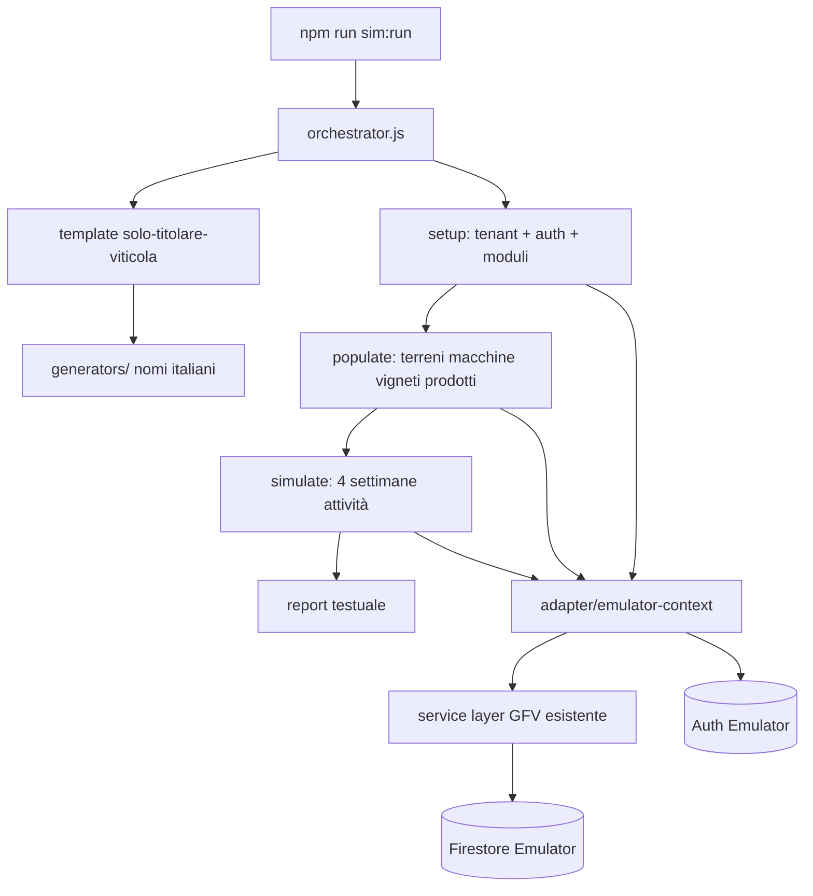
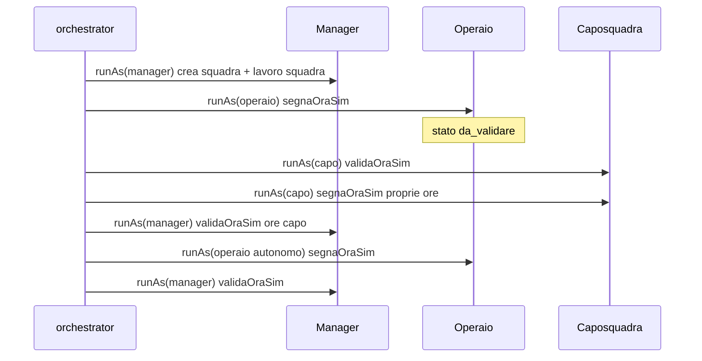

# GFV Farm Simulator — Guida sviluppo per agenti

**Versione:** 1.6.1 + **v2.1 manodopera** §14  
**Data:** 2026-06-26  
**Stato:** v1.6.1 chiusa; **v2.1 manodopera chiusa e validata in dev**; **v3** ridimensionata → meccanismi a cascata + test (§11.1); regime max + routine §13.4  
**Codename:** `gfv-farm-simulator`

---

## 1. Scopo

Il **GFV Farm Simulator** genera in autonomia aziende agricole di test, le popola con dati realistici (terreni, macchine, vigneti, magazzino…) e simula **l’uso operativo dell’app** — in v1 registrando **attività nel diario** per **4 settimane** — senza intervento umano.

Obiettivo prodotto:

- Validare flussi end-to-end su stack reale (Firestore + Auth + service layer)
- Produrre **tenant riutilizzabili** in locale per demo e debug
- Base scalabile per scenari futuri (multi-utente, errori, concorrenza, altri moduli)

**Non è:** un test E2E browser (Playwright) né un load test di produzione.

---

## 2. Decisioni v1 (bloccate)


| Aspetto                  | Decisione                                                                    |
| ------------------------ | ---------------------------------------------------------------------------- |
| **Ambiente**             | Locale — Firebase Emulator Suite (Auth + Firestore)                          |
| **Scenario iniziale**    | **Solo titolare** — un utente, ruolo amministratore, nessun operaio/squadra  |
| **Moduli v1**            | Core + terreni + **parcoMacchine** + **vigneto** + **magazzino**             |
| **Durata simulazione**   | Setup completo + **4 settimane** di attività registrate                      |
| **Concorrenza**          | **1 scenario alla volta** (estensione futura)                                |
| **Esclusi v1**           | Tony, meteo, Stripe, manodopera (operai/squadre/lavori strutturati)          |
| **Comportamento utente** | Utente **perfetto** — nessun errore di battitura o concetto                  |
| **Nomi**                 | Solo **italiani**                                                            |
| **Persistenza**          | Aziende **restano** dopo il run (riutilizzabili); niente teardown automatico |
| **Report**               | Resoconto testuale a fine run (stdout + file opzionale)                      |
| **Budget**               | Non vincolante per v1                                                        |


### Criterio di successo v1

> L’utente simulato completa **setup azienda + popolamento + registrazione attività per 4 settimane** **senza eccezioni** (exit code 0).

Dettaglio misurabile:

- Tenant + utente Auth creati
- Moduli attivi: `vigneto`, `parcoMacchine`, `magazzino`
- Almeno **N terreni**, **N trattori**, **N attrezzi**, **N mezzi flotta**, **N vigneti**, **N prodotti** creati (numeri dal template, §6)
- Almeno **20 attività** create (4 settimane × ~5 giorni lavorativi × 1 attività/giorno), date **non future**, distribuite su terreni diversi
- Ogni attività passa `Attivita.validate()` e `createAttivita()` senza errori
- Report finale con conteggi e ID tenant/utente

---

## 3. Non obiettivi v1

- Simulazione UI (click, modali, responsive)
- Tony, meteo, billing Stripe
- Manodopera (operai, squadre, validazione ore, lavori manodopera)
- Conto terzi, frutteto, report avanzati
- Errori intenzionali / fuzzing
- Run paralleli multi-scenario
- CI obbligatoria su ogni push (v1: CI leggera su path simulator — v. §13.3)
- Pulizia automatica dati (solo comando manuale `sim:cleanup` in v2)

---

## 4. Architettura

### 4.1 Principio guida

**Riutilizzare la logica business esistente** (modelli + service), non duplicare regole di validazione in script ad hoc.

I service GFV (`core/services/`*, `modules/*/services/*`) sono pensati per **browser** (Firebase CDN + `sessionStorage` per tenant). Il simulatore gira in **Node** sull’emulator: serve un **adapter** che:

1. Inizializza Firebase Admin / client verso emulator
2. Imposta il **contesto tenant** (`setCurrentTenantId`) equivalente al browser
3. Autentica l’utente simulato (Auth emulator) o bypass controllato documentato
4. Invoca i **service esistenti** dove possibile




### 4.2 Vincolo tecnico critico (leggere prima di codificare)

`core/services/firebase-service.js` importa Firebase **da CDN** (`https://www.gstatic.com/...`). In Node **non funziona** out of the box.

**Strategia approvata per v1:**


| Componente                                   | Approccio                                                                                                                                                                 |
| -------------------------------------------- | ------------------------------------------------------------------------------------------------------------------------------------------------------------------------- |
| Setup tenant / utente / documenti root       | **firebase-admin** diretto su emulator                                                                                                                                    |
| CRUD business (terreni, attività, macchine…) | Adapter Node che **replica il contratto** di `firebase-service` (stessi path `tenants/{id}/...`) **oppure** bridge verso modelli + admin write con stessa shape Firestore |
| Validazione                                  | **Sempre** via modelli (`Terreno`, `Attivita`, `Macchina`, …) e, dove possibile, chiamate a `createTerreno`, `createAttivita`, ecc. dopo inject contesto                  |


**Prima milestone tecnica (Fase 0):** dimostrare una sola `createAttivita()` da Node sull’emulator. Solo dopo, costruire il resto.

### 4.3 Firebase Emulator

`firebase.json` include la sezione emulator (Auth 9099, Firestore 8080, UI). **Prerequisito:** Java JRE/JDK su PATH.

```json
"emulators": {
  "auth": { "port": 9099 },
  "firestore": { "port": 8080 },
  "ui": { "enabled": true }
}
```

Variabili per Admin SDK:

- `FIRESTORE_EMULATOR_HOST=127.0.0.1:8080`
- `FIREBASE_AUTH_EMULATOR_HOST=127.0.0.1:9099`

Project ID: usare lo stesso di `core/firebase-config.js` (es. `gfv-platform`) **o** un project ID fisso `gfv-simulator` documentato in `simulator/config/emulator.json`.

**Importante:** il simulatore **non** deve mai puntare a Firestore/Auth di produzione. Aggiungere guard in `simulator/lib/guard-production.js` che abortisce se mancano le env emulator.

### 4.4 Verifica UI su emulator (browser)

Il simulatore v1 scrive dati via **Admin SDK**; la verifica manuale in browser usa pagine standalone collegate all’emulator.

| Componente | Ruolo |
| ---------- | ----- |
| `core/js/firebase-emulator-dev.js` | Connessione **sincrona** Auth/Firestore emulator (`?emulator=1` o `localStorage gfv_firebase_emulator=1`) |
| `core/services/firebase-service.js` | `awaitFirebaseEmulatorConnect()` + `awaitAuthStateReady()` prima del controllo auth |
| `core/js/simulator-browser-auth.js` | Auto-login cross-page da pagina dev (`storeSimPendingLogin` / `ensureSimulatorSession`) |
| `core/dev/simulator-dev-standalone.html` | Lista `manifest.json`, **Entra**, link Terreni / Attività / Movimenti / Macchine / Vigneto |
| `npm start` | `http-server` porta **8000** (richiesto per servire HTML + manifest) |

**URL pagina dev:**

`http://127.0.0.1:8000/core/dev/simulator-dev-standalone.html?emulator=1`

**Flusso operatore (3 terminali):**

1. `npm run sim:emulators`
2. `npm start`
3. Aprire URL dev → **Entra** su azienda con badge **Seed completo**
4. Verificare **Magazzino → Movimenti** (link rapido in pagina dev): uscite collegate ad attività, tracciabilità OK

**Auto-login (v1.4):** la pagina dev salva credenziali in `sessionStorage`; le pagine target rifanno login sull’emulator se la sessione non persiste al cambio URL. Connessione emulator avviene **subito** dopo `getAuth()` (no race con Auth produzione).

**Limiti noti UI locale:**

- Mappa Google su Terreni: badge «mappa» ok se `polygonCoords` presenti; tile/interattivo dipende da API key Maps in `firebase-config`.
- Tony, meteo, Stripe: esclusi v1.

**Aziende create prima del seed v2:** non si aggiornano da sole. Usare `npm run sim:migrate-terreni` (patch terreni/poderi/colture su tutte le entry del manifest) oppure `npm run sim:run` per una nuova azienda.

---

## 5. Struttura repository (target)

```
simulator/
  README.md                          # Quick start (comandi, emulator)
  config/
    emulator.json                    # porte, projectId
    defaults.json                    # seed RNG, prefissi ID
  templates/
    solo-titolare-viticola.json      # template v1
    viticola-manodopera.json         # template v2 (spec §14)
  generators/
    nomi-italiani.js                 # persone, aziende, terreni, macchine
    date-calendario.js               # 4 settimane lavorative (no weekend opz.)
  lib/
    guard-production.js
    emulator-context.js              # init admin + auth + setCurrentTenantId
    firestore-write.js               # write Admin SDK + path tenant
    seed-reference-data.js           # podere principale (catalogo → seed-app-catalog.js)
    seed-app-catalog.js              # categorie/sottocat/tipi lavoro/colture (identico app)
    seed-parco-macchine-details.js   # flotta + scadenze/manutenzione/revisione/assicurazione
    sim-economia-vigneto.js          # tariffe, costoOra, sync spese vigneto
    seed-lavori-catalog.js           # re-export seedAppCatalog (compat legacy)
    link-scarichi-trattamento-vigneto.js  # origineTrattamento* su movimenti magazzino
    report.js                        # resoconto testuale
    manifest.js                      # append manifest + seedVersion
    tenant-inspect.js                # inspectTenantSeed (seed v2)
    cleanup-tenant.js                # deleteSimulatedTenant
    run-simulation.js                # runFullSimulation
    run-as-persona.js                # v2: contesto manager/capo/operaio
    manodopera-sim-actions.js        # v2: segnaOraSim / validaOraSim (permessi ruolo)
    emulator-available.js            # isEmulatorAvailable
  phases/
    01-setup-tenant.js               # tenant, utente, moduli, piano
    02-populate-assets.js            # ref data + terreni, macchine, vigneti, prodotti
    03-simulate-attivita.js          # 4 settimane diario attività
    04-simulate-magazzino.js         # scarichi magazzino su trattamenti/concimazioni
    05-simulate-vigneto.js           # potature + trattamenti vigneto da attività diario
    06-setup-personas.js             # v2: Auth + users multi-ruolo (no inviti)
    07-populate-manodopera.js        # v2: squadre + lavori (manager)
    08-simulate-manodopera-ore.js    # v2: ore + validazioni per persona
  orchestrator.js                    # entry point
  smoke-test.js                      # Fase 0
  inspect-tenant.js                  # ispezione terreni su emulator
  audit-manifest.js                  # audit manifest vs emulator (sim:audit)
  verify-spese.js                    # CLI verify spese vigneto (sim:verify-spese)
  ci-run.js                          # emulators:exec + test (CI / sim:test:ci)
  integration-test.js                # test integrazione CLI (sim:test)
  run-batch.js                     # N aziende in sequenza (sim:run:batch)
  backfill-existing.js             # aggiorna manifest senza nuovo tenant
  cleanup.js                         # rimuove tenant sim_* da manifest/emulator
  refresh-dates.js                   # ricalcolo date attività/movimenti
  manifest.json                      # elenco run/tenant creati (append, locale — git: [])
  manifest.example.json              # struttura di esempio (commit in repo)

core/dev/
  simulator-dev-standalone.html      # UI: elenco aziende + Entra (emulator)

core/js/
  firebase-emulator-dev.js           # connessione sync emulator
  simulator-browser-auth.js          # auto-login da pagina dev

docs-sviluppo/simulator/
  GFV_FARM_SIMULATOR.md              # questo file
```

Script npm (root `package.json`):

```json
"sim:emulators": "firebase emulators:start --only auth,firestore",
"sim:smoke": "node simulator/smoke-test.js",
"sim:run": "node simulator/orchestrator.js",
"sim:run:batch": "node simulator/run-batch.js [--count=N] [--verbose]",
"sim:run:verbose": "node simulator/orchestrator.js --verbose",
"sim:setup": "node simulator/orchestrator.js --setup-only",
"sim:backfill": "node simulator/backfill-existing.js",
"sim:verify-spese": "node simulator/verify-spese.js [--tenant=...]",
"sim:inspect": "node simulator/inspect-tenant.js [tenantId]",
"sim:audit": "node simulator/audit-manifest.js",
"sim:refresh-dates": "node simulator/refresh-dates.js [tenantId] | --all",
"sim:migrate-terreni": "node simulator/migrate-terreni-seed.js",
"sim:cleanup": "node simulator/cleanup.js [--keep N] [--dry-run]",
"sim:test": "node simulator/integration-test.js",
"sim:test:vitest": "vitest run tests/simulator/solo-titolare-viticola.test.js",
"sim:test:ci": "node simulator/ci-run.js"
```

---

## 6. Template v1: `solo-titolare-viticola`

File: `simulator/templates/solo-titolare-viticola.json`

### 6.1 Profilo


| Campo         | Valore default                                                           |
| ------------- | ------------------------------------------------------------------------ |
| `templateId`  | `solo-titolare-viticola`                                                 |
| `descrizione` | Titolare unico, azienda viticola, moduli core+vigneto+macchine+magazzino |
| `utenti`      | 1 — ruolo `amministratore`                                               |
| `piano`       | `base` (terreni/attività illimitati — evita limiti Free)                 |
| `moduli`      | `vigneto`, `parcoMacchine`, `magazzino`                                  |


### 6.2 Quantità asset (default v1 — modificabili solo nel template)


| Risorsa                         | Quantità                 |
| ------------------------------- | ------------------------ |
| Terreni aziendali               | 4                        |
| Trattori                        | 1                        |
| Attrezzi                        | 3                        |
| **Flotta aziendale** (furgone/pickup/veicolo) | **2**        |
| **Macchine totali**             | **6** (1+3+2)            |
| Vigneti (1+ per terreno vitato) | 4                        |
| Prodotti magazzino              | 5                        |
| Attività (4 settimane)          | 20 (1/giorno lavorativo) |


### 6.3 Dati italiani (generator)

- **Titolare:** nome/cognome da liste IT (es. Marco Bianchi, Lucia Verdi…)
- **Azienda:** es. «Az. Agr. Bianchi», «Tenuta San Rocco»
- **Terreni:** es. «Podere Le Coste», «Ronco del Sole»
- **Trattori/attrezzi:** marche plausibili (Same, John Deere, Maschio, Kuhn…)
- **Flotta:** furgone, pickup (`automezzo`), veicolo — marche Fiat Professional, Ford, Iveco…; targa sintetica `FG…`
- **Vigneti:** varietà da catalogo app (es. Sangiovese, Glera, Merlot)
- **Email sim:** `sim+{slug}@gfv.local` (dominio fittizio, Auth emulator)

### 6.4 Tenant document (shape Firestore)

Allineare a registrazione reale (`core/auth/registrazione-standalone.html`) **e** `tenant-service`:

```javascript
{
  name: 'Az. Agr. …',
  plan: 'base',
  piano: 'base',           // retrocompatibilità
  modules: ['vigneto', 'parcoMacchine', 'magazzino'],
  moduli: ['vigneto', 'parcoMacchine', 'magazzino'],
  status: 'active',
  createdBy: '<uid>',
  simRunId: '<uuid>',
  simTemplate: 'solo-titolare-viticola'
}
```

**ID tenant:** prefisso obbligatorio `sim_` + slug azienda + suffisso breve (es. `sim_tenuta_san_rocco_a1b2c3`).

### 6.5 Utente Firestore (`users/{uid}`)

```javascript
{
  email: 'sim+…@gfv.local',
  nome: '…',
  cognome: '…',
  ruoli: ['amministratore'],
  tenantId: '<tenantId>',
  tenantMemberships: {
    '<tenantId>': {
      ruoli: ['amministratore'],
      stato: 'attivo',
      tenantIdPredefinito: true
    }
  },
  stato: 'attivo'
}
```

---

## 7. Flusso run (fasi)

### Fase 1 — Setup (`01-setup-tenant.js`)

1. Genera profilo da template + generator nomi IT
2. Crea utente in **Auth emulator** (email/password fissa per debug: documentare in README)
3. Crea documento `tenants/{id}`
4. Crea documento `users/{uid}`
5. Imposta contesto simulatore: `setCurrentTenantId(tenantId)`
6. Append a `simulator/manifest.json` con `seedVersion: 2`

**Manifest:** ogni entry include `runId`, `tenantId`, `email`, `aziendaNome`, `createdAt`, `seedVersion`. Le entry **senza** `seedVersion >= 2` hanno terreni incompleti (vedi §13.1).

### Fase 2 — Populate (`02-populate-assets.js`)

Ordine consigliato (rispetta dipendenze):

0. **Catalogo app completo** (`lib/seed-app-catalog.js` + `core/config/app-catalog-seed-data.js`)
  - Categorie principali lavori (11) + categorie colture (9) in `tenants/.../categorie`
  - Sottocategorie lavori (18, con `parentId`) — es. `lavorazione_terreno_generale`, `trattamenti_meccanico`, …
  - Tipi lavoro predefiniti (~78 nomi unici + alias sim `Trattamento`, `Concimazione`, `Controllo fitosanitario`)
  - Colture predefinite (99) con `categoriaId` — frutteto, seminativo, vite, ortive, …
  - Idempotente: skip per `codice`/`nome` già presenti
1. **Podere** (`lib/seed-reference-data.js`) — un record in `tenants/.../poderi` (nome = `aziendaNome`)
2. **Terreni** — write Admin con shape allineata UI
  - `coltura`: coerente con catalogo GFV (es. «Vite da Vino» — maiuscole come in `terreni-controller.js`)
  - `podere`: nome podere in `tenants/.../poderi` (es. nome azienda)
  - `tipoCampo`: morfologia (`pianura` | `collina` | `montagna`)
  - `polygonCoords`: poligono semplice opzionale (badge «Mappa» in lista; Google Maps resta opzionale in locale)  
  - Riferimento: `core/services/terreni-service.js`, `core/models/Terreno.js`
2. **Macchine** — trattori, attrezzi, **flotta aziendale** (v1.6)
  - `tipoMacchina`: `trattore` | `attrezzo` | `furgone` | `automezzo` | `veicolo`
  - Attrezzi: `categoriaId` / `cavalliMinimiRichiesti` se richiesti da validazione
  - **Scadenze (allineate dashboard app):** trattori/attrezzi — `prossimaManutenzione`, `oreProssimaManutenzione`, `prossimaRevisione`, `prossimaAssicurazione`; **flotta** — `kmAttuali`, `kmProssimaManutenzione` (tagliando km), `prossimaRevisione`, `prossimaAssicurazione` (no ore agricole su furgone/pickup); mix date scadute/imminenti/ok; almeno un attrezzo e un mezzo flotta in `stato: in_manutenzione`; almeno un mezzo flotta con tagliando km **superato** (demo lista Scadenze)
  - Helper: `lib/seed-parco-macchine-details.js` (`enrichTrattorePayload`, `enrichAttrezzoPayload`, `enrichFlottaPayload`, `ensureFlottaAndScadenzeMacchine` per backfill)
  - Riferimento app: `core/js/dashboard-deadlines.js`, `modules/macchine/views/flotta-list-standalone.html`, `scadenze-list-standalone.html`
  - Riferimento service: `modules/parco-macchine/services/macchine-service.js`, `Macchina.js`
3. **Vigneti** — uno per terreno (o subset), `terrenoId` valorizzato
  - Riferimento: `modules/vigneto/services/vigneti-service.js`, `Vigneto.js`
4. **Prodotti magazzino** — fitosanitari, concimi, materiali vigneto
  - Riferimento: `modules/magazzino/services/prodotti-service.js`, `Prodotto.js`

**v1.6+:** populate include **flotta + scadenze**; fase 4 magazzino; fase 5 vigneto; economia/spese sync (`sim-economia-vigneto.js`).

### Fase 3 — Simula 4 settimane (`03-simulate-attivita.js`)

- **Finestra temporale:** ultimi **28 giorni** da «oggi» del run, **solo giorni lavorativi** (lun–ven), oppure 20 giorni espliciti
- **Regola critica:** `Attivita.validate()` rifiuta date **future** — usare solo passato/presente (gg 00:00 local)
- Per ogni giorno lavorativo, creare **1 attività** via `createAttivita()`:

Campi minimi (`core/models/Attivita.js`):

```javascript
{
  data: 'YYYY-MM-DD',
  terrenoId, terrenoNome,
  tipoLavoro: '…',      // da catalogo tipi lavoro plausibile vigneto
  coltura: 'Vite',      // coerente con terreno
  orarioInizio: '08:00',
  orarioFine: '12:30',
  pauseMinuti: 30,
  note: '…',
  macchinaId,           // opzionale — trattore del tenant
  attrezzoId,           // opzionale — rotazione attrezzi
  oreMacchina: …        // opzionale
}
```

**Tipi lavoro suggeriti v1** (rotazione): Potatura, Trattamento, Erpicatura, Concimazione, Controllo fitosanitario — verificare valori accettati dall’app (liste/categorie in `core/services/categorie-service.js`, `tipi-lavoro-service.js`).

### Fase 4 — Magazzino (`04-simulate-magazzino.js`)

- Scarichi **uscita** in `movimentiMagazzino` per attività **Trattamento**, **Concimazione**, **Controllo fitosanitario**
- Collegamento `attivitaId`, data allineata all’attività
- Aggiornamento `giacenza` su `prodotti` (campo canonico app, non `quantitaDisponibile`)
- Obiettivo demo: almeno un prodotto **sotto scorta minima** dopo i run

### Fase 5 — Vigneto operativo (`05-simulate-vigneto.js`)

- Da attività Diario con tipo **Potatura** → documento in `vigneti/{id}/potature` (`attivitaId`, costi ore)
- Da **Trattamento**, **Concimazione**, **Controllo fitosanitario** → `vigneti/{id}/trattamenti` con `tipoTrattamento`, prodotti da movimento magazzino collegato (`magazzinoMovimentoIds`)
- Seed catalogo lavori/colture in populate (`seed-app-catalog.js`) — identico a `initializeCategoriePredefinite` / `initializeTipiLavoroPredefiniti` / `initializeColturePredefinite` dell’app
- Conteggi attesi: **4 potature + 12 trattamenti** (su 20 attività, rotazione 5 tipi)

### Report (`lib/report.js`)

Output esempio:

```
=== GFV Farm Simulator — Run completato ===
Template: solo-titolare-viticola
Run ID: …
Esito: SUCCESS

Azienda: Az. Agr. Bianchi
Tenant ID: sim_tenuta_…
Utente: sim+…@gfv.local (uid: …)
Password (emulator): *** (vedi simulator/README)

Creati:
  terreni: 4
  trattori: 1
  attrezzi: 3
  flotta: 2
  macchine: 6
  vigneti: 4
  prodotti: 5
  attività: 20 (2026-05-26 → 2026-06-20)
  scadenze macchine: 6 mezzi con almeno una scadenza

Durata: 12.4s
Manifest: simulator/manifest.json
```

In caso di errore: **prima eccezione**, fase, entità, messaggio; exit code 1.

---

## 8. File sorgente di riferimento (GFV)


| Area                 | Path                                                                        |
| -------------------- | --------------------------------------------------------------------------- |
| Registrazione tenant | `core/auth/registrazione-standalone.html`                                   |
| Tenant / moduli      | `core/services/tenant-service.js`, `core/utils/module-access-resolver.js`   |
| Piani / limiti       | `core/config/subscription-plans.js`, `core/services/plan-limits-service.js` |
| Terreni              | `core/services/terreni-service.js`, `core/models/Terreno.js`                |
| Attività (core v1)   | `core/services/attivita-service.js`, `core/models/Attivita.js`              |
| Conflitti macchine (solo UI) | `core/js/attivita-controller.js`, `core/js/attivita-events.js` |
| Macchine             | `modules/parco-macchine/services/macchine-service.js`                       |
| Vigneti              | `modules/vigneto/services/vigneti-service.js`                               |
| Prodotti             | `modules/magazzino/services/prodotti-service.js`                            |
| Test unitari modelli | `tests/models/Attivita.test.js`, `tests/models/Terreno.test.js`             |
| Security rules       | `firestore.rules` (emulator usa le stesse)                                  |
| Codice simulatore    | `simulator/` (README, orchestrator, phases, inspect, migrate)               |
| Pagina dev emulator  | `core/dev/simulator-dev-standalone.html`                                      |
| Auto-login emulator    | `core/js/simulator-browser-auth.js`                                           |
| Connessione emulator | `core/js/firebase-emulator-dev.js`, `firebase-service.js`                     |


**ID modulo macchine in config:** `parcoMacchine` (non `macchine`).

---

## 9. Piano di implementazione per agenti

Ogni agente che lavora sul simulatore **legge questo file per intero** prima di modificare codice.

### Fase 0 — Infrastruttura emulator ✅

- [x] Aggiungere sezione `emulators` a `firebase.json`
- [x] Creare `simulator/config/emulator.json`
- [x] Creare `simulator/lib/guard-production.js`
- [x] Creare `simulator/lib/emulator-context.js` (admin init + guard)
- [x] Creare `simulator/lib/firestore-write.js` (normalizzazione Timestamp, path tenant)
- [x] `simulator/smoke-test.js` + `npm run sim:smoke`
- [x] Smoke eseguito con successo (Java + `npm run sim:emulators`)
- [x] Documentare avvio in `simulator/README.md`

**Done quando:** `npm run sim:emulators` + `npm run sim:smoke` passano.

### Fase 1 — Setup tenant ✅

- [x] Template JSON `solo-titolare-viticola.json`
- [x] Generator nomi italiani
- [x] `01-setup-tenant.js` + manifest (`seedVersion: 2`)
- [x] Verifica su Emulator UI: tenant + user presenti

**Done quando:** run ferma dopo setup con report parziale OK.

### Fase 2 — Populate ✅

- [x] `02-populate-assets.js` con conteggi template
- [x] `lib/seed-reference-data.js` (colture, categorie, poderi — seed v2)
- [x] Terreni con `coltura`, `podere`, `tipoCampo`, `polygonCoords`
- [x] Payload allineati a shape Firestore (write Admin — v. §4.2)
- [x] Report include conteggi asset

**Done quando:** tutti gli asset creati senza errori.

### Fase 3 — Simulazione attività ✅

- [x] `generators/date-calendario.js` (20 giorni lavorativi, no future)
- [x] `03-simulate-attivita.js`
- [x] `orchestrator.js` + `npm run sim:run`
- [x] `lib/report.js`

**Done quando:** criterio successo §2 soddisfatto.

### Fase 4 — Consolidamento ✅

- [x] Pagina dev browser + connessione emulator (`simulator-dev-standalone.html`, connessione sync + `awaitAuthStateReady`)
- [x] Auto-login cross-page (`simulator-browser-auth.js`) su dashboard, terreni, attività, movimenti, bootstrap
- [x] `sim:inspect`, **`sim:audit`**, `sim:migrate-terreni`, `sim:cleanup`, `sim:test`, **`sim:test:ci`**, `sim:refresh-dates`, **`sim:backfill`**, **`sim:run:batch`**
- [x] GitHub Actions `.github/workflows/simulator-ci.yml` (path filter simulator)
- [x] Fase magazzino (movimenti + giacenza + sotto scorta + tracciabilità attività)
- [x] Test integrazione `tests/simulator/solo-titolare-viticola.test.js` (+ `npm run sim:test:vitest`)
- [x] Verifica UI manuale: login dev → dashboard → terreni → attività → magazzino (anagrafica, uscite, tracciabilità)
- [x] Batch **10 aziende** su emulator: 10/10 OK (4 terreni, 20 attività, 12 movimenti ciascuna)
- [x] **v1.6** — flotta + scadenze parco macchine; `sim:backfill` aggiorna manifest legacy; `sim:audit` 6 macchine attese
- [x] **v1.6.1** — assert km flotta (`validateFlottaKmSeed`); audit/test/Vitest; doc Java 21; fallback Tony km flotta

---

## 10. Regole per agenti

1. **Scope:** non modificare logica app in `core/` o `modules/` se non strettamente necessario per esporre un hook testabile — preferire adapter in `simulator/`.
2. **No produzione:** ogni PR che tocchi `simulator/` deve passare `guard-production`.
3. **No Tony/meteo/Stripe** in v1 — non importare `tony-service`, `meteo-service`, `stripe-billing`.
4. **Nomi italiani** — solo generator, nessun placeholder inglese tipo «John Doe».
5. **Persistenza:** non cancellare dati a fine run; prefix `sim_` per riconoscimento.
6. **Documentazione:** aggiornare **solo** `docs-sviluppo/COSA_ABBIAMO_FATTO.md` quando una fase è completata e verificata — **non** duplicare spec altrove.
7. **Commit:** solo se richiesto dall’utente.
8. **Estensioni future** (v2+): nuovi file in `simulator/templates/`, mai `if (scenario === '…')` sparsi — un template = un JSON + eventuale handler modulare.
9. **v2 manodopera — obbligatorio:** ore e validazioni solo via **`runAsPersona`** + `manodopera-sim-actions` (o service con stesso contratto). **Vietato** popolare `oreOperai` o cambiare `stato` con Admin write “al posto” di operaio/capo/manager. V. §14.

---

## 11. Roadmap post-v1 (non implementare senza richiesta)


| Versione | Contenuto                                                     |
| -------- | ------------------------------------------------------------- |
| **v1.1** | ~~Movimenti magazzino~~ (implementato v1.3); potature/trattamenti vigneto |
| **v1.4** | ~~Batch multi-azienda (`sim:run:batch`)~~; ~~backfill manifest (`sim:backfill`)~~ |
| **v1.5** | ~~CI leggera GitHub Actions (`sim:test:ci`)~~; vigneto operativo potature/trattamenti |
| **v1.6** | ~~Flotta aziendale + scadenze parco macchine~~; spese vigneto allineate app (`sim:verify-spese`) |
| **v1.6.1** | ~~Assert km flotta~~ in `tenant-inspect`, `sim:audit`, `sim:test`, Vitest; doc CI Java 21; fallback Tony parco macchine |
| **v2.0** | **Spec manodopera** (§14): multi-persona, `runAsPersona`, template `viticola-manodopera.json`, manifest `personas[]` |
| **v2.1** | ~~Implementazione fasi 06–08 + audit ore per ruolo + pagina dev «Entra come…» + template regime max + audit template-aware~~ |
| **v2**   | Template conto terzi, frutteto, mista, solo titolare oliveto… |
| **v3**   | **Meccanismi a cascata** (scadenze/semafori, filtri UI, alert meteo i18n, compatibilità CV…) — v. §11.1; **non** typo/recovery utente nel sim |
| **v3b**  | Run paralleli N tenant (infrastruttura, opzionale) |
| **v4**   | E2E Playwright — flussi UI + widget scadenze/meteo; errori linguaggio naturale / recovery → **Tony** + test dedicati |
| **v4b**  | CI notturna batch + `sim:cleanup` selettivo (oltre PR CI v1.5) |

### 11.1 Direzione v3 — meccanismi a cascata (deciso 2026-06-26)

Dopo v2.1 chiusa, la **v3 sim** non simula «utenti che sbagliano a digitare» (form a tendina + regole ruolo/ore già impediscono quasi tutti gli errori manuali; **recovery typo/conversazione → Tony**, non orchestrator Node).

**Obiettivo v3:** verificare che **se succede X → l’app mostra/comporta Y** — dati seed → regole → widget/alert/filtri.

| Area | Sim / seed | Test automatici | UI / Tony |
| ---- | ----------- | ----------------- | --------- |
| Scadenze parco, affitti, revisioni | Profili edge-case per bucket semaforo (scaduto, rosso, giallo, verde) — già parziale in `seed-parco-macchine-details.js` | Vitest `dashboard-deadlines`, `calcolaUrgenzaData` | Checklist post `sim:run` |
| Filtri a cascata (CV trattore→attrezzi, colture, terreni, categoria→sottocat→tipo) | Catalogo app completo in seed (`seed-app-catalog.js`) + dataset CV demo | Vitest `cascade-*`, `scripts/cascade-v3-live-smoke.js` | Playwright v4 |
| Alert meteo in italiano | — (meteo escluso dal sim) | Vitest `meteo-alert-i18n` + fixture OpenWeather | Deploy CF + verifica dashboard |
| Errori battitura / voce / recovery | **Non** sim v3 | Test Tony client-side | Tony + CF |

**Ordine consigliato:** altri template **v2** (se servono moduli) → ampliare **test a cascata** (v3) → **Playwright v4** → stress **Tony** su NL/recovery.

**Primo incremento v3 già in repo (2026-06-26):** i18n alert meteo completo + test semafori widget scadenze (`tests/meteo-alert-i18n.test.js`, `tests/dashboard-deadlines.test.js`).

**Secondo incremento v3 (2026-06-27):** test cascata CV trattore→attrezzi (`core/js/macchine-cv-compat.js`, `tests/cascade-attrezzi-cv.test.js`) + copertura bucket semafori completa in `tests/dashboard-deadlines.test.js` (km/ore in arrivo, affitti grey/red/yellow/green, revisione/assicurazione) + cascata colture/lavori (`core/js/lavoro-cascade-filters.js`, `tests/cascade-colture-lavori.test.js`).

**Terzo incremento v3 (2026-06-27):** catalogo sim = app — `core/config/app-catalog-seed-data.js` condiviso; `seed-app-catalog.js` su populate/backfill/migrate; inspect con soglie sottocategorie/tipi/colture; live smoke senza WARN «Lavorazione del Terreno senza sottocategorie»; rimosso duplicato «Diserbo Manuale» (solo categoria Diserbo); `TIPI_LAVORO_CANONICAL_FIXES` su tenant legacy.

**Quarto incremento v3 (2026-06-27):** fix cascata UI app — preserve padri su form attività/lavori/terreni + Tony (`lavoro-cascade-filters.js`, controller/events, `tony-form-injector.js`). Il sim **non** ha dropdown cascata; condivide solo le regole pure in `lavoro-cascade-filters.js` (Vitest + `scripts/cascade-v3-live-smoke.js`).

#### 11.1.1 Allineamento app ↔ simulatore (2026-06-27)

| Cosa | App | Sim | Condiviso |
|------|-----|-----|-----------|
| Categorie lavori | 11 | 11 | `CATEGORIE_PRINCIPALI_PREDEFINITE` |
| Categorie colture | 9 | 9 | `CATEGORIE_COLTURE_PREDEFINITE` |
| Sottocategorie lavori | 18 | 18 | `SOTTOCATEGORIE_PREDEFINITE` |
| Tipi lavoro (nomi unici) | 78 | 78 (+3 alias template) | `TIPI_LAVORO_PREDEFINITI` |
| Colture | 99 | 99 | `COLTURE_PREDEFINITE` |
| Init catalogo | `initialize*Predefiniti()` su primo accesso | `seedAppCatalog()` su populate/backfill | stessa shape Firestore (`categorie`, `tipiLavoro`, `colture`) |
| Filtri cascata (logica) | form + Tony | test Node | `lavoro-cascade-filters.js` |
| Preserve selezione padre | form browser + injector | — | solo app |

**Backfill tenant sim vecchi:** `npm run sim:backfill` · **Verifica:** `npm run sim:inspect` · **Test:** `npm run test:run -- tests/cascade-colture-lavori.test.js` (9 test).

---

## 12. Domande aperte / chiarimenti futuri


| #   | Domanda                            | Stato / decisione                                                |
| --- | ---------------------------------- | ---------------------------------------------------------------- |
| 1   | Password utenti sim in emulator    | **Deciso** — `SimGFV2026!` (README, solo emulator)               |
| 2   | Weekend nelle 4 settimane          | **Deciso** — esclusi, solo lun–ven                                 |
| 3   | Movimenti magazzino in v1          | **Implementato** v1.3+                                           |
| 4   | Potature/trattamenti vigneto in v1 | **Implementato** v1.5+                                           |
| 5   | Uso CI                             | **Implementato** v1.5 — `sim:test:ci`, Java 21                   |
| 6   | `sim:cleanup`                      | **Implementato** v1.2                                            |
| 7   | Run batch N aziende                | **Implementato** v1.4 — `sim:run:batch --count=N`                |
| 8   | Uso test vs demo vs CI             | **Parziale** — CI = template minimal; demo locale = batch/`quantities` alti; manifest `[]` in git |
| 9   | Persistenza tenant post-run        | **Deciso** — restano su emulator; manifest locale traccia run   |
| 10  | Manodopera v2: inviti collaboratori | **Deciso — no** — profili pre-creati; invito/mail già validati in app (§14.2) |
| 11  | Manodopera v2: chi agisce sulle ore | **Deciso** — solo `runAsPersona` (operaio/capo/manager); no Admin “al posto” (§14.4) |
| 12  | Numero capi/operai configurabile   | **Deciso** — `quantities` template + override CLI `--caposquadra` / `--operai` (§14.5) |
| 13  | Utenti simulati che sbagliano      | **Ridimensionato 2026-06-26** — typo/recovery **Tony** + v4 Playwright; sim v3 = **meccanismi a cascata** (§11.1) |
| 14  | Ordine roadmap post-v1.6           | **Deciso** — v2.1 → altri template v2 → **v3 cascata/test** → v4 Playwright; Tony per NL/recovery |
| 15  | Manager multipli per tenant sim    | **Deciso** — 1 manager (`amministratore`); capi/operai N configurabili |

**Persistenza per riuso** confermata — il manifest traccia le aziende create (non committare manifest pieno in git).

---

## 13. Checklist rapida pre-run (operatore umano)

### 13.1 Generazione dati (CLI)

```bash
# Terminale 1 — emulator (resta in esecuzione)
npm run sim:emulators

# Terminale 2
npm run sim:smoke          # opzionale — sanity check
npm run sim:run            # nuova azienda completa (1)
npm run sim:run:batch -- --count=10   # 10 aziende in sequenza
npm run sim:run:demo-max   # 2 aziende regime max (manodopera 2 capi/10 op + solo titolare, 30 gg)
npm run sim:backfill       # aggiorna tutte le entry del manifest (no nuovo tenant)
npm run sim:inspect        # ultima azienda in manifest — verifica terreni
npm run sim:audit          # tutte le entry manifest vs emulator (OK/WARN/FAIL)
npm run sim:migrate-terreni  # patch terreni vecchi nel manifest (seed pre-v2)
npm run sim:refresh-dates    # ricalcola date attività/movimenti (ultima azienda)
npm run sim:refresh-dates -- --all
npm run sim:cleanup        # rimuove tutte le aziende del manifest
npm run sim:cleanup -- --keep 10  # mantiene le ultime 10
npm run sim:cleanup -- --dry-run
npm run sim:verify-spese -- --tenant=sim_...   # coerenza spese vigneto vs aggregaSpese
npm run sim:test           # test integrazione (richiede emulator)
npm run sim:test:vitest    # stesso test via vitest
npm run sim:test:ci        # come CI — avvia emulator, esegue entrambi, termina
```

**Audit manifest:** `npm run sim:audit` — verifica Auth, seed terreni v2 (`inspectTenantSeed`) e conteggi attesi per ogni `tenantId` in `manifest.json`: **6 macchine** (1 trattore + 3 attrezzi + 2 flotta), flotta ≥2 con **kmAttuali/kmProssimaManutenzione** validi e ≥1 tagliando km superato, scadenze ≥3, almeno 1 mezzo in manutenzione, 4 vigneti, 5 prodotti, 20 attività, 12 movimenti, 4 potature + 12 trattamenti vigneto. Exit 0 se OK/WARN; exit 1 se almeno un FAIL.

**Manifest in git:** `simulator/manifest.json` resta **vuoto** (`[]`); i run locali (`sim:run`, batch) popolano manifest + emulator solo sulla macchina dev. Struttura di riferimento: `simulator/manifest.example.json`. Non committare manifest con molte entry batch.

Verificare su Emulator UI (`http://127.0.0.1:4000`): Auth user, tenant `sim_*`, collections terreni/macchine/vigneti/prodotti/attivita/movimentiMagazzino.

**Ispezione terreno (seed v2 OK):** ogni terreno deve avere `coltura: "Vite da Vino"`, `podere`, `tipoCampo`, `polygonCoords` (≥3 vertici).

### 13.2 Verifica UI (browser)

```bash
# Terminale 3 — static server (resta in esecuzione)
npm start
```

Apri: `http://127.0.0.1:8000/core/dev/simulator-dev-standalone.html?emulator=1`

- Scegli azienda con badge **Seed completo** (o esegui migrate/backfill prima)
- **Entra (dashboard)** → resta loggato (auto-login emulator)
- **Terreni** → coltura, podere, morfologia valorizzati
- **Attività** → ~20 record
- **Movimenti** (link dev o modulo magazzino) → 12 uscite, tracciabilità prodotto↔attività; prodotti con eventuale sotto scorta
- **Macchine / Trattori / Attrezzi / Flotta / Scadenze** → **6 macchine** (1 trattore + 3 attrezzi + 2 flotta); flotta con **km**, targa e stato; almeno un **Tagliando (km)** in rosso in Scadenze; revisione/assicurazione visibili in lista Scadenze e widget dashboard; niente redirect login con `?emulator=1`
- **Vigneto / Vigneti** → 4 vigneti collegati ai terreni; navigazione dashboard ok
- **Trattamenti / Potatura** → righe da attività diario (4 potature + 12 trattamenti); trattamenti con prodotti da magazzino dove presente

Password emulator: **`SimGFV2026!`**

**Manodopera mobile (v2):** dalla pagina dev, **Entra come capo** / **Entra come operaio** → `field-workspace-standalone.html`. Verificare comunicazioni, assenza capo→manager (se seed con flag assenza), segna ore. Con template **regime max** il caricamento è più lento (centinaia di ore/comunicazioni): preferire manifest snello (§13.4).

### 13.4 Routine periodica, glossario e perf locale

Pratica storica (pre-simulatore): test manuale in app → controllo documenti su **Firebase** (oggi **Emulator UI** o pagine standalone) — es. movimento creato in UI ↔ riga in `movimentiMagazzino`, giacenza prodotto, link `attivitaId` / tracciabilità.

**Non confondere i termini:**

| Termine | Cosa fa | Quando usarlo |
| ------- | ------- | ------------- |
| **`sim:refresh-dates`** | Ricalcola date **attività** e **movimenti** collegati (`attivitaId`) sulle ultime settimane lavorative fino a oggi | Periodicamente in dev, così filtri/dashboard mostrano dati «recenti» senza rigenerare il tenant |
| **`sim:audit`** / **`sim:inspect`** | Verifica **coerenza dati** manifest ↔ emulator (conteggi, seed v2, manodopera v2) | Dopo run/batch o prima di una demo |
| **Verifica UI manuale** | Stesso spirito del controllo Firestore: apri **Movimenti**, tracciabilità, field workspace | Dopo modifiche modulo o seed |
| **Prefisso `sim_`** | Naming tenant (`sim_podere_romano_880001`) — cleanup riconosce `sim_*` | Automatico a ogni run; **non** è una routine |
| **`prefetch`** | Precaricamento login dashboard / TTS Tony | Performance UX, non verifica dati |
| **Perf (performance)** | Misura **tempi** di caricamento, non correttezza dati | Vedi sotto |

**Routine consigliata (dev, ogni sessione lunga o prima demo):**

```bash
# 1. Emulator pulito o manifest snello (evita 20+ tenant accumulati)
npm run sim:cleanup -- --keep 2    # oppure riavvia sim:emulators per DB vuoto

# 2. Dataset ricco ma controllato
npm run sim:run:demo-max

# 3. Date allineate a oggi
npm run sim:refresh-dates -- --all

# 4. Coerenza automatica
npm run sim:audit

# 5. Browser: pagina dev → Movimenti + Entra come capo/operaio (field workspace)
npm start   # terminale separato
```

**Perf locale con dati simulati:** il simulatore **non** sostituisce `npm run tony:perf-review` (log Cloud Functions produzione). In locale, un seed **regime max** (30 attività, molte ore/comunicazioni, 12+ movimenti) rende **realistici** i tempi di:

- dashboard manager — strumentazione `core/js/dashboard-perf.js` (`[Dashboard Perf]`, `?dashboardPerf=1` o localhost)
- liste manodopera / validazione ore / **field workspace mobile**

Più dati in emulator ⇒ query Firestore più pesanti ⇒ numeri perf più utili per trovare colli di bottiglia. Per misure stabili: **2 tenant demo-max**, non manifest con decine di batch obsoleti.

**Field workspace (2026-06-26):** lazy load iframe statistiche/dettaglio lavoro; retry auth emulator su `onAuthStateChanged`; meno query duplicate comunicazioni operaio — v. `COSA_ABBIAMO_FATTO.md` voce omonima.

### 13.5 CI (GitHub Actions)

Workflow: `.github/workflows/simulator-ci.yml`

- **Quando:** push/PR su path `simulator/**`, `tests/simulator/**`, `firebase.json`, lockfile; oppure **Run workflow** manuale.
- **Cosa esegue:** `npm run sim:test:ci` (Java **21**, Node **22** + `emulators:exec` + `sim:test` + `sim:test:vitest`).
- **Locale (stesso comando CI):** `npm run sim:test:ci` — richiede Java su PATH.

---

## 14. Template v2 — `viticola-manodopera` (spec bloccata)

**File template:** `simulator/templates/viticola-manodopera.json`  
**Estende:** asset e flussi v1 (`solo-titolare-viticola`) + modulo **`manodopera`**.  
**Codename storico roadmap:** «Mario Rossi» — azienda già organizzata con personale campo.

### 14.0 Decisioni bloccate v2 (2026-06-24)

Decisioni prese in design prodotto/simulatore — **non reinterpretare** senza aggiornare questo paragrafo.

| # | Tema | Decisione |
| - | ---- | --------- |
| D1 | **Ordine di lavoro** | v1.6.1 **chiusa** → **v2.1** **chiusa** → altri template v2 → **v3 meccanismi a cascata** (§11.1) → **v4** Playwright; Tony per errori/recovery NL |
| D2 | **Errori utente (typo/concetto)** | **Non** nel sim — **Tony** + test client; sim v3 = scadenze/filtri/alert/i18n (§11.1), non fuzzing form |
| D3 | **Inviti / email / onboarding** | **Esclusi** dal simulatore — il flusso «Invita collaboratore» è già validato nell’app; il sim assume **azienda già organizzata** |
| D4 | **Profili campo** | Auth + `users/{uid}` + `tenantMemberships` **pre-provisionati** in fase 06 (capo + operai reali, non anagrafiche fittizie) |
| D5 | **Multi-account** | Stesso `tenantId`, **N login** distinti; dashboard/permessi diversi (manager desktop, capo/operaio mobile) |
| D6 | **Attore delle ore** | **Obbligatorio** `runAsPersona` + `segnaOraSim` / `validaOraSim` — il sim **non** deve “inventare” ore o validazioni solo dal manager |
| D7 | **Admin write consentito** | Solo **setup** (asset v1, squadre, lavori, assegnazioni) **come manager** — mai per `oreOperai.stato` al posto di capo/operaio |
| D8 | **Flusso squadra** | Manager crea lavoro (`caposquadraId`, terreno, macchine) → operaio **segna** → capo **valida** → capo può **segnare proprie** ore → manager **valida** ore capo |
| D9 | **Flusso autonomo** | Manager crea lavoro (`operaioId`) → operaio **segna** → manager **valida** (senza passaggio capo) |
| D10 | **Numeri configurabili** | `quantities.caposquadra`, `operai`, `squadre`, `lavoriSquadra`, `lavoriAutonomi`, `giorniOreSimulate` nel template; es. 3 capi + 16 operai (§14.5) |
| D11 | **Manager per tenant** | Sempre **1** (`amministratore`); capi e operai **N** |
| D12 | **Comportamento sim** | Utente **perfetto** (v2); stesso criterio v1 |
| D13 | **Tony / meteo / Stripe** | Esclusi sim v1 e v2 |
| D14 | **CI vs demo** | CI: quantità **minimali** (1 capo, 3 operai); demo locale: quantità **ricche** (es. 3 capi, 16 operai) via template o CLI |
| D15 | **Manifest git** | `manifest.json` resta **`[]`** in repo; entry con `personas[]` solo locale dopo `sim:run` |
| D16 | **Allineamento app** | Regole ore = `manodopera-ore-validazione-scope.js` + pagine segnatura/validazione ore (non duplicare regole diverse nel sim) |

### 14.1 Obiettivo

Simulare un’azienda che usa **correttamente** manodopera end-to-end:

- Manager crea **squadre**, **lavori** (terreno, macchine, assegnazioni)
- **Operaio** segnala ore → validazione **caposquadra** (lavoro di squadra)
- **Caposquadra** segnala **proprie** ore → validazione **manager**
- **Operaio autonomo** (lavoro con `operaioId`) → validazione **manager** diretta

Allineamento prodotto: `core/services/manodopera-ore-validazione-scope.js`, guide `GUIDA/MANODOPERA/utente/guida-*.md`, flusso verificato in app (2026-05-19).

**Non obiettivo v2:** inviti email, onboarding collaboratori, Tony, errori utente (v3), E2E Playwright (v4).

### 14.2 Assunti (decisioni prodotto)

| Tema | Decisione |
| ---- | --------- |
| **Profili operai/capo** | **Già creati** al setup (Auth + `users/{uid}` + `tenantMemberships`) — **no** flusso invito/mail |
| **Password** | Stessa v1: `SimGFV2026!` (solo emulator) |
| **Comportamento** | Utente **perfetto** (v3 = errori) |
| **Attore per azione** | Ogni scrittura ore/validazione passa dal **ruolo corretto** — v. §14.4 |
| **Diario attività v1** | Resta opzionale / parallelo; v2 aggiunge **lavori manodopera** + ore strutturate |

### 14.3 Personas (multi-account, stesso tenant)

Per ogni run v2 il simulatore crea **N utenti Auth** sullo **stesso** `tenantId`:

| Ruolo | Quantità default | Dashboard / uso |
| ----- | ---------------- | --------------- |
| `amministratore` (manager) | 1 | Desktop: lavori, squadre, validazione ore globale |
| `caposquadra` | 1 | Mobile field workspace: valida operai, segna proprie ore |
| `operaio` | 3 | Mobile: segna ore su lavori assegnati |

**Email pattern:** `sim+{slug_azienda}_{role}@gfv.local` (es. `sim+marini_capo@gfv.local`, `sim+marini_op1@gfv.local`).

**Shape `users/{uid}`** (esempio caposquadra):

```javascript
{
  email: 'sim+marini_capo@gfv.local',
  nome: 'Luca',
  cognome: 'Rossi',
  ruoli: ['caposquadra'],
  tenantId: '<tenantId>',
  tenantMemberships: {
    '<tenantId>': { ruoli: ['caposquadra'], stato: 'attivo' }
  },
  stato: 'attivo'
}
```

**Manifest** — oltre a `userId`/`email` del manager (retrocompat v1), array **`personas`**:

```json
"personas": [
  { "userId": "…", "email": "sim+…_manager@gfv.local", "displayName": "…", "ruoli": ["amministratore"] },
  { "userId": "…", "email": "sim+…_capo@gfv.local", "displayName": "…", "ruoli": ["caposquadra"] },
  { "userId": "…", "email": "sim+…_op1@gfv.local", "displayName": "…", "ruoli": ["operaio"] }
]
```

Vedi `simulator/manifest.example.json`.

### 14.4 Regola architetturale — `runAsPersona` (obbligatoria)

**Problema v1:** Admin SDK + un solo `userId` → valido per seed asset, **invalido** per manodopera (sembrerebbe che il manager “inventi” ore altrui).

**Soluzione v2:** `simulator/lib/run-as-persona.js`

```javascript
await runAsPersona(operaioUserDoc, () =>
  segnaOraSim(db, lavoroId, { operaioId: operaioUserDoc.id, data, orarioInizio, orarioFine })
);
await runAsPersona(capoUserDoc, () => validaOraSim(db, lavoroId, oraId));
await runAsPersona(managerUserDoc, () => validaOraSim(db, lavoroId, oraIdCapo));
```

**Azioni:** `simulator/lib/manodopera-sim-actions.js`

- `segnaOraSim` — solo **operaio o caposquadra**, solo **proprie** ore (`operaioId === user.id`); allineato a `segnatura-ore-standalone.html`
- `validaOraSim` — caposquadra (ore operai squadra, non le proprie) o manager (`assertUtentePuoValidareOra`); allineato a `validazione-ore-standalone.html` + `manodopera-ore-validazione-scope.js`

**Vietato in v2:**

- Scrivere `oreOperai` con Admin “come manager” fingendo un `operaioId`
- Impostare `stato: validate` senza `validatoDa` = uid del ruolo che ha validato
- Contare solo totali finali senza traccia attori

**Consentito con Admin (solo setup, attore manager):**

- Creare `squadre`, `lavori`, assegnazioni `caposquadraId` / `operaioId`
- Populate v1 (terreni, macchine, …) — stesso pattern v1.6



### 14.5 Quantità default e configurabilità (template)

Tutti i numeri sotto sono in **`quantities`** nel JSON template (`viticola-manodopera.json`) — **modificabili** come per terreni/macchine in v1 (es. 3 caposquadra, 16 operai). Non sono hardcoded nel codice.

| Chiave `quantities` | Default | Note |
| ------------------- | ------- | ---- |
| `manager` | 1 | Sempre 1 (amministratore titolare sim) |
| `caposquadra` | 1 | N account Auth + `users` con ruolo `caposquadra` |
| `operai` | 3 | N account Auth + `users` con ruolo `operaio` |
| `squadre` | 1 | Default = `caposquadra` (1 squadra per capo). Se `squadre` < `caposquadra`, fase 07 crea 1 squadra per capo fino a `squadre` |
| `lavoriSquadra` | 2 | Lavori con `caposquadraId` |
| `lavoriAutonomi` | 1 | Lavori con `operaioId` (validazione manager) |
| `giorniOreSimulate` | 10 | Giorni lavorativi con ciclo segna/valida |
| Asset v1 | (eredita) | terreni, macchine, … come `solo-titolare-viticola` |

**Esempio azienda media:**

```json
"caposquadra": 3,
"operai": 16,
"squadre": 3,
"lavoriSquadra": 6,
"lavoriAutonomi": 2
```

**Regole di ripartizione (fase 07, generator):**

- Operai distribuiti **round-robin** sulle squadre (es. 16 operai / 3 squadre → 6+5+5).
- Ogni squadra: `caposquadraId` + array `operai[]` con uid reali creati in fase 06.
- Email: `sim+{slug}_capo1@gfv.local` … `sim+{slug}_op16@gfv.local` (indice nel manifest `personas[]`).
- Lavori squadra: assegnati a capi in rotazione; almeno un operaio della squadra simula ore in fase 08.

**Override run (previsto v2.1):** oltre al template, opzionale CLI  
`npm run sim:run -- --template=viticola-manodopera --caposquadra=3 --operai=16`  
(merge su `quantities` prima del run — stesso pattern di `--count` per batch).

**Limiti pratici:**

| Contesto | Suggerimento |
| -------- | ------------ |
| CI / `sim:test` | Template **minimal** (1 capo, 3 operai) — veloce |
| Demo locale | 3 capi, 10–20 operai — ok sull’emulator |
| Batch N aziende | Ogni tenant = N utenti Auth; 16 operai × 10 aziende = molti account — accettabile in locale, più lento |

Moduli tenant: `[vigneto, parcoMacchine, magazzino, manodopera]`.

### 14.6 Fasi run v2 (implementazione)

| Fase | File | Attore | Contenuto |
| ---- | ---- | ------ | --------- |
| 1–5 | (v1) | manager | setup tenant, populate, attività/magazzino/vigneto opz. |
| **6** | `06-setup-personas.js` | — | Auth + `users` per capo + operai |
| **7** | `07-populate-manodopera.js` | **manager** | squadre, lavori squadra/autonomo, collegamenti terreno/macchine |
| **8** | `08-simulate-manodopera-ore.js` | **operaio / capo / manager** | segna + valida catena completa su N giorni |

Comando previsto: `npm run sim:run -- --template=viticola-manodopera` (o template default v2 quando implementato).

### 14.7 Criterio di successo v2

Exit code 0 quando:

1. Tutte le **personas** esistono su Auth + Firestore
2. Squadre e lavori attesi creati
3. Per ogni lavoro squadra simulato: almeno 1 ora operaio **validata da capo** (`validatoDa` = uid capo)
4. Almeno 1 ora capo su lavoro squadra **validata da manager**
5. Lavoro autonomo: ore **validate da manager**
6. **Zero** ore in `da_validare` a fine run
7. `sim:audit` v2: controlli conteggi + campione `simSegnatoDa` / `validatoDa` coerenti con ruoli

### 14.8 Pagina dev (browser)

Estendere `simulator-dev-standalone.html`:

- Per entry con `personas[]`: pulsanti **Entra come manager / capo / operaio N**
- Login Auth reale (`simulator-browser-auth.js`) con email persona
- Verifica manuale: capo → field workspace; operaio → mobile; manager → validazione ore desktop

### 14.9 Riferimenti codice app

| Area | Path |
| ---- | ---- |
| Regole validazione | `core/services/manodopera-ore-validazione-scope.js` |
| Ore (browser) | `core/services/ore-service.js` |
| Segnatura | `core/segnatura-ore-standalone.html` |
| Validazione manager/capo | `core/admin/validazione-ore-standalone.html` |
| Lavori | `core/services/lavori-service.js`, `core/models/Lavoro.js` |
| Squadre | `core/services/squadre-service.js` |
| Test scope | `tests/services/manodopera-ore-validazione-scope.test.js` |

### 14.10 Stato implementazione

| Componente | Stato |
| ---------- | ----- |
| Spec §14 (questo documento) | ✅ |
| Template JSON `viticola-manodopera.json` | ✅ |
| `run-as-persona.js`, `manodopera-sim-actions.js` | ✅ |
| `manifest.example.json` con `personas` | ✅ |
| Fasi 06–08 (`06-setup-personas`, `07-populate-manodopera`, `08-simulate-manodopera-ore`) | ✅ |
| Orchestrator / `run-simulation.js` template v2 + override CLI quantità | ✅ |
| `sim:audit` v2 (personas, squadre, ore, `validatoDa`, zero `da_validare`; conteggi da `entry.templateId`, regime-max) | ✅ |
| `sim:test` + Vitest v2 minimal | ✅ |
| Pagina dev «Entra come manager / capo / operaio» | ✅ |

---

*Fine guida v1.6.1 + v2.1 manodopera §14 — prossimo: v3 meccanismi a cascata (test/seed) o altri template v2; Tony/Playwright per errori utente.*