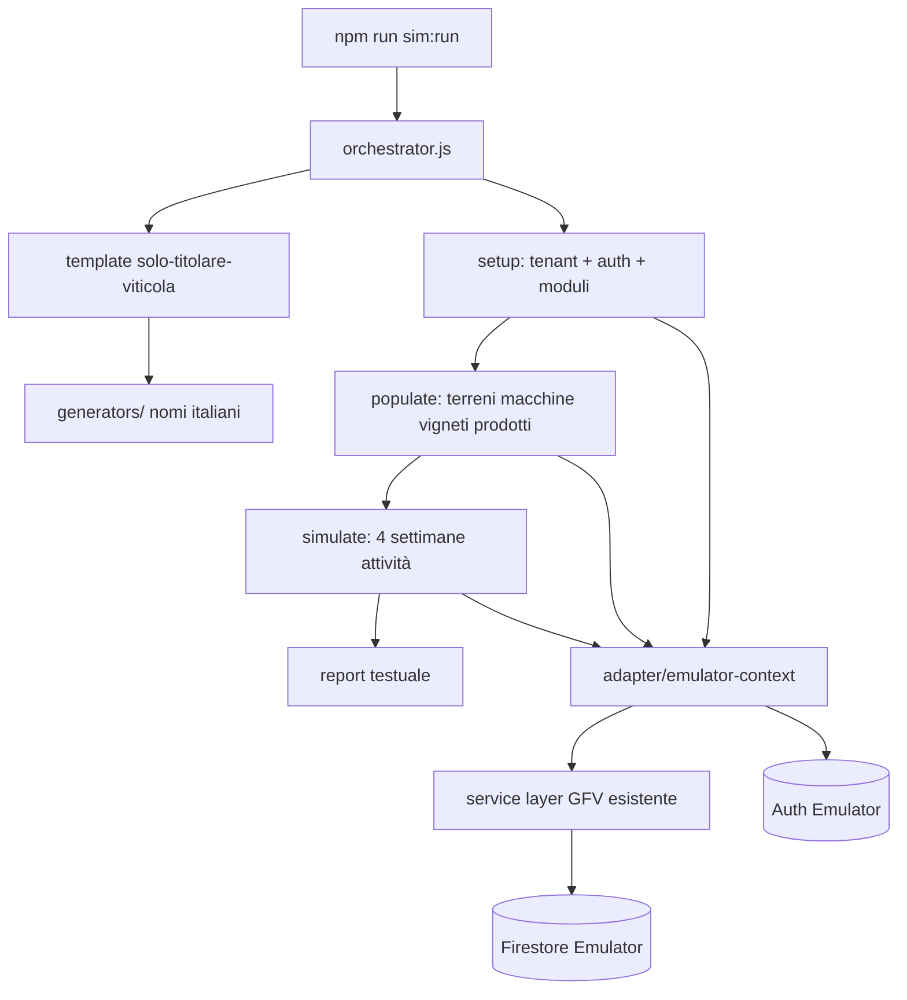

# GFV Farm Simulator — Guida sviluppo per agenti

**Versione:** 1.4  
**Data:** 2026-06-24  
**Stato:** v1.4 — batch multi-azienda + backfill + auto-login UI + magazzino/tracciabilità verificati  
**Codename:** `gfv-farm-simulator`

---

## 1. Scopo

Il **GFV Farm Simulator** genera in autonomia aziende agricole di test, le popola con dati realistici (terreni, macchine, vigneti, magazzino…) e simula **l’uso operativo dell’app** — in v1 registrando **attività nel diario** per **4 settimane** — senza intervento umano.

Obiettivo prodotto:

- Validare flussi end-to-end su stack reale (Firestore + Auth + service layer)
- Produrre **tenant riutilizzabili** in locale per demo e debug
- Base scalabile per scenari futuri (multi-utente, errori, concorrenza, altri moduli)

**Non è:** un test E2E browser (Playwright) né un load test di produzione.

---

## 2. Decisioni v1 (bloccate)


| Aspetto                  | Decisione                                                                    |
| ------------------------ | ---------------------------------------------------------------------------- |
| **Ambiente**             | Locale — Firebase Emulator Suite (Auth + Firestore)                          |
| **Scenario iniziale**    | **Solo titolare** — un utente, ruolo amministratore, nessun operaio/squadra  |
| **Moduli v1**            | Core + terreni + **parcoMacchine** + **vigneto** + **magazzino**             |
| **Durata simulazione**   | Setup completo + **4 settimane** di attività registrate                      |
| **Concorrenza**          | **1 scenario alla volta** (estensione futura)                                |
| **Esclusi v1**           | Tony, meteo, Stripe, manodopera (operai/squadre/lavori strutturati)          |
| **Comportamento utente** | Utente **perfetto** — nessun errore di battitura o concetto                  |
| **Nomi**                 | Solo **italiani**                                                            |
| **Persistenza**          | Aziende **restano** dopo il run (riutilizzabili); niente teardown automatico |
| **Report**               | Resoconto testuale a fine run (stdout + file opzionale)                      |
| **Budget**               | Non vincolante per v1                                                        |


### Criterio di successo v1

> L’utente simulato completa **setup azienda + popolamento + registrazione attività per 4 settimane** **senza eccezioni** (exit code 0).

Dettaglio misurabile:

- Tenant + utente Auth creati
- Moduli attivi: `vigneto`, `parcoMacchine`, `magazzino`
- Almeno **N terreni**, **N trattori**, **N attrezzi**, **N vigneti**, **N prodotti** creati (numeri dal template, §6)
- Almeno **20 attività** create (4 settimane × ~5 giorni lavorativi × 1 attività/giorno), date **non future**, distribuite su terreni diversi
- Ogni attività passa `Attivita.validate()` e `createAttivita()` senza errori
- Report finale con conteggi e ID tenant/utente

---

## 3. Non obiettivi v1

- Simulazione UI (click, modali, responsive)
- Tony, meteo, billing Stripe
- Manodopera (operai, squadre, validazione ore, lavori manodopera)
- Conto terzi, frutteto, report avanzati
- Errori intenzionali / fuzzing
- Run paralleli multi-scenario
- CI obbligatoria (opzionale in v2)
- Pulizia automatica dati (solo comando manuale `sim:cleanup` in v2)

---

## 4. Architettura

### 4.1 Principio guida

**Riutilizzare la logica business esistente** (modelli + service), non duplicare regole di validazione in script ad hoc.

I service GFV (`core/services/`*, `modules/*/services/*`) sono pensati per **browser** (Firebase CDN + `sessionStorage` per tenant). Il simulatore gira in **Node** sull’emulator: serve un **adapter** che:

1. Inizializza Firebase Admin / client verso emulator
2. Imposta il **contesto tenant** (`setCurrentTenantId`) equivalente al browser
3. Autentica l’utente simulato (Auth emulator) o bypass controllato documentato
4. Invoca i **service esistenti** dove possibile




### 4.2 Vincolo tecnico critico (leggere prima di codificare)

`core/services/firebase-service.js` importa Firebase **da CDN** (`https://www.gstatic.com/...`). In Node **non funziona** out of the box.

**Strategia approvata per v1:**


| Componente                                   | Approccio                                                                                                                                                                 |
| -------------------------------------------- | ------------------------------------------------------------------------------------------------------------------------------------------------------------------------- |
| Setup tenant / utente / documenti root       | **firebase-admin** diretto su emulator                                                                                                                                    |
| CRUD business (terreni, attività, macchine…) | Adapter Node che **replica il contratto** di `firebase-service` (stessi path `tenants/{id}/...`) **oppure** bridge verso modelli + admin write con stessa shape Firestore |
| Validazione                                  | **Sempre** via modelli (`Terreno`, `Attivita`, `Macchina`, …) e, dove possibile, chiamate a `createTerreno`, `createAttivita`, ecc. dopo inject contesto                  |


**Prima milestone tecnica (Fase 0):** dimostrare una sola `createAttivita()` da Node sull’emulator. Solo dopo, costruire il resto.

### 4.3 Firebase Emulator

`firebase.json` include la sezione emulator (Auth 9099, Firestore 8080, UI). **Prerequisito:** Java JRE/JDK su PATH.

```json
"emulators": {
  "auth": { "port": 9099 },
  "firestore": { "port": 8080 },
  "ui": { "enabled": true }
}
```

Variabili per Admin SDK:

- `FIRESTORE_EMULATOR_HOST=127.0.0.1:8080`
- `FIREBASE_AUTH_EMULATOR_HOST=127.0.0.1:9099`

Project ID: usare lo stesso di `core/firebase-config.js` (es. `gfv-platform`) **o** un project ID fisso `gfv-simulator` documentato in `simulator/config/emulator.json`.

**Importante:** il simulatore **non** deve mai puntare a Firestore/Auth di produzione. Aggiungere guard in `simulator/lib/guard-production.js` che abortisce se mancano le env emulator.

### 4.4 Verifica UI su emulator (browser)

Il simulatore v1 scrive dati via **Admin SDK**; la verifica manuale in browser usa pagine standalone collegate all’emulator.

| Componente | Ruolo |
| ---------- | ----- |
| `core/js/firebase-emulator-dev.js` | Connessione **sincrona** Auth/Firestore emulator (`?emulator=1` o `localStorage gfv_firebase_emulator=1`) |
| `core/services/firebase-service.js` | `awaitFirebaseEmulatorConnect()` + `awaitAuthStateReady()` prima del controllo auth |
| `core/js/simulator-browser-auth.js` | Auto-login cross-page da pagina dev (`storeSimPendingLogin` / `ensureSimulatorSession`) |
| `core/dev/simulator-dev-standalone.html` | Lista `manifest.json`, **Entra**, link Terreni / Attività / Movimenti |
| `npm start` | `http-server` porta **8000** (richiesto per servire HTML + manifest) |

**URL pagina dev:**

`http://127.0.0.1:8000/core/dev/simulator-dev-standalone.html?emulator=1`

**Flusso operatore (3 terminali):**

1. `npm run sim:emulators`
2. `npm start`
3. Aprire URL dev → **Entra** su azienda con badge **Seed completo**
4. Verificare **Magazzino → Movimenti** (link rapido in pagina dev): uscite collegate ad attività, tracciabilità OK

**Auto-login (v1.4):** la pagina dev salva credenziali in `sessionStorage`; le pagine target rifanno login sull’emulator se la sessione non persiste al cambio URL. Connessione emulator avviene **subito** dopo `getAuth()` (no race con Auth produzione).

**Limiti noti UI locale:**

- Mappa Google su Terreni: badge «mappa» ok se `polygonCoords` presenti; tile/interattivo dipende da API key Maps in `firebase-config`.
- Tony, meteo, Stripe: esclusi v1.

**Aziende create prima del seed v2:** non si aggiornano da sole. Usare `npm run sim:migrate-terreni` (patch terreni/poderi/colture su tutte le entry del manifest) oppure `npm run sim:run` per una nuova azienda.

---

## 5. Struttura repository (target)

```
simulator/
  README.md                          # Quick start (comandi, emulator)
  config/
    emulator.json                    # porte, projectId
    defaults.json                    # seed RNG, prefissi ID
  templates/
    solo-titolare-viticola.json      # template v1
  generators/
    nomi-italiani.js                 # persone, aziende, terreni, macchine
    date-calendario.js               # 4 settimane lavorative (no weekend opz.)
  lib/
    guard-production.js
    emulator-context.js              # init admin + auth + setCurrentTenantId
    firestore-write.js               # write Admin SDK + path tenant
    seed-reference-data.js           # categorie colture, colture, poderi (seed v2)
    report.js                        # resoconto testuale
    manifest.js                      # append manifest + seedVersion
    tenant-inspect.js                # inspectTenantSeed (seed v2)
    cleanup-tenant.js                # deleteSimulatedTenant
    run-simulation.js                # runFullSimulation
    emulator-available.js            # isEmulatorAvailable
  phases/
    01-setup-tenant.js               # tenant, utente, moduli, piano
    02-populate-assets.js            # ref data + terreni, macchine, vigneti, prodotti
    03-simulate-attivita.js          # 4 settimane diario attività
    04-simulate-magazzino.js         # scarichi magazzino su trattamenti/concimazioni
  orchestrator.js                    # entry point
  smoke-test.js                      # Fase 0
  inspect-tenant.js                  # ispezione terreni su emulator
  integration-test.js                # test integrazione CLI (sim:test)
  run-batch.js                     # N aziende in sequenza (sim:run:batch)
  backfill-existing.js             # aggiorna manifest senza nuovo tenant
  cleanup.js                         # rimuove tenant sim_* da manifest/emulator
  refresh-dates.js                   # ricalcolo date attività/movimenti
  manifest.json                      # elenco run/tenant creati (append)

core/dev/
  simulator-dev-standalone.html      # UI: elenco aziende + Entra (emulator)

core/js/
  firebase-emulator-dev.js           # connessione sync emulator
  simulator-browser-auth.js          # auto-login da pagina dev

docs-sviluppo/simulator/
  GFV_FARM_SIMULATOR.md              # questo file
```

Script npm (root `package.json`):

```json
"sim:emulators": "firebase emulators:start --only auth,firestore",
"sim:smoke": "node simulator/smoke-test.js",
"sim:run": "node simulator/orchestrator.js",
"sim:run:batch": "node simulator/run-batch.js [--count=N] [--verbose]",
"sim:run:verbose": "node simulator/orchestrator.js --verbose",
"sim:setup": "node simulator/orchestrator.js --setup-only",
"sim:backfill": "node simulator/backfill-existing.js",
"sim:inspect": "node simulator/inspect-tenant.js [tenantId]",
"sim:refresh-dates": "node simulator/refresh-dates.js [tenantId] | --all",
"sim:migrate-terreni": "node simulator/migrate-terreni-seed.js",
"sim:cleanup": "node simulator/cleanup.js [--keep N] [--dry-run]",
"sim:test": "node simulator/integration-test.js",
"sim:test:vitest": "vitest run tests/simulator/solo-titolare-viticola.test.js"
```

---

## 6. Template v1: `solo-titolare-viticola`

File: `simulator/templates/solo-titolare-viticola.json`

### 6.1 Profilo


| Campo         | Valore default                                                           |
| ------------- | ------------------------------------------------------------------------ |
| `templateId`  | `solo-titolare-viticola`                                                 |
| `descrizione` | Titolare unico, azienda viticola, moduli core+vigneto+macchine+magazzino |
| `utenti`      | 1 — ruolo `amministratore`                                               |
| `piano`       | `base` (terreni/attività illimitati — evita limiti Free)                 |
| `moduli`      | `vigneto`, `parcoMacchine`, `magazzino`                                  |


### 6.2 Quantità asset (default v1 — modificabili solo nel template)


| Risorsa                         | Quantità                 |
| ------------------------------- | ------------------------ |
| Terreni aziendali               | 4                        |
| Trattori                        | 1                        |
| Attrezzi                        | 3                        |
| Vigneti (1+ per terreno vitato) | 4                        |
| Prodotti magazzino              | 5                        |
| Attività (4 settimane)          | 20 (1/giorno lavorativo) |


### 6.3 Dati italiani (generator)

- **Titolare:** nome/cognome da liste IT (es. Marco Bianchi, Lucia Verdi…)
- **Azienda:** es. «Az. Agr. Bianchi», «Tenuta San Rocco»
- **Terreni:** es. «Podere Le Coste», «Ronco del Sole»
- **Trattori/attrezzi:** marche plausibili (Same, John Deere, Maschio, Kuhn…)
- **Vigneti:** varietà da catalogo app (es. Sangiovese, Glera, Merlot)
- **Email sim:** `sim+{slug}@gfv.local` (dominio fittizio, Auth emulator)

### 6.4 Tenant document (shape Firestore)

Allineare a registrazione reale (`core/auth/registrazione-standalone.html`) **e** `tenant-service`:

```javascript
{
  name: 'Az. Agr. …',
  plan: 'base',
  piano: 'base',           // retrocompatibilità
  modules: ['vigneto', 'parcoMacchine', 'magazzino'],
  moduli: ['vigneto', 'parcoMacchine', 'magazzino'],
  status: 'active',
  createdBy: '<uid>',
  simRunId: '<uuid>',
  simTemplate: 'solo-titolare-viticola'
}
```

**ID tenant:** prefisso obbligatorio `sim_` + slug azienda + suffisso breve (es. `sim_tenuta_san_rocco_a1b2c3`).

### 6.5 Utente Firestore (`users/{uid}`)

```javascript
{
  email: 'sim+…@gfv.local',
  nome: '…',
  cognome: '…',
  ruoli: ['amministratore'],
  tenantId: '<tenantId>',
  tenantMemberships: {
    '<tenantId>': {
      ruoli: ['amministratore'],
      stato: 'attivo',
      tenantIdPredefinito: true
    }
  },
  stato: 'attivo'
}
```

---

## 7. Flusso run (fasi)

### Fase 1 — Setup (`01-setup-tenant.js`)

1. Genera profilo da template + generator nomi IT
2. Crea utente in **Auth emulator** (email/password fissa per debug: documentare in README)
3. Crea documento `tenants/{id}`
4. Crea documento `users/{uid}`
5. Imposta contesto simulatore: `setCurrentTenantId(tenantId)`
6. Append a `simulator/manifest.json` con `seedVersion: 2`

**Manifest:** ogni entry include `runId`, `tenantId`, `email`, `aziendaNome`, `createdAt`, `seedVersion`. Le entry **senza** `seedVersion >= 2` hanno terreni incompleti (vedi §13.1).

### Fase 2 — Populate (`02-populate-assets.js`)

Ordine consigliato (rispetta dipendenze):

0. **Dati di riferimento tenant** (`lib/seed-reference-data.js`) — **seed v2**
  - Categorie colture (`tenants/.../categorie`, `applicabileA: 'colture'`)
  - Colture catalogo viticola (`Vite`, `Vite da Tavola`, `Vite da Vino`, … — nomi **identici** a `terreni-controller.js`)
  - Un podere (`tenants/.../poderi`, nome = `aziendaNome` del profilo simulato)
1. **Terreni** — write Admin con shape allineata UI
  - `coltura`: coerente con catalogo GFV (es. «Vite da Vino» — maiuscole come in `terreni-controller.js`)
  - `podere`: nome podere in `tenants/.../poderi` (es. nome azienda)
  - `tipoCampo`: morfologia (`pianura` | `collina` | `montagna`)
  - `polygonCoords`: poligono semplice opzionale (badge «Mappa» in lista; Google Maps resta opzionale in locale)  
  - Riferimento: `core/services/terreni-service.js`, `core/models/Terreno.js`
2. **Macchine** — trattori poi attrezzi
  - `tipoMacchina`: `trattore` | `attrezzo`  
  - Attrezzi: `categoriaId` / `cavalliMinimiRichiesti` se richiesti da validazione  
  - Riferimento: `modules/parco-macchine/services/macchine-service.js`, `Macchina.js`
3. **Vigneti** — uno per terreno (o subset), `terrenoId` valorizzato
  - Riferimento: `modules/vigneto/services/vigneti-service.js`, `Vigneto.js`
4. **Prodotti magazzino** — fitosanitari, concimi, materiali vigneto
  - Riferimento: `modules/magazzino/services/prodotti-service.js`, `Prodotto.js`

**v1:** popolamento anagrafiche + **fase 4 magazzino** (12 uscite collegate alle attività fitosanitarie/concimazione). Potature/trattamenti vigneto modulo restano fuori scope v1.

### Fase 3 — Simula 4 settimane (`03-simulate-attivita.js`)

- **Finestra temporale:** ultimi **28 giorni** da «oggi» del run, **solo giorni lavorativi** (lun–ven), oppure 20 giorni espliciti
- **Regola critica:** `Attivita.validate()` rifiuta date **future** — usare solo passato/presente (gg 00:00 local)
- Per ogni giorno lavorativo, creare **1 attività** via `createAttivita()`:

Campi minimi (`core/models/Attivita.js`):

```javascript
{
  data: 'YYYY-MM-DD',
  terrenoId, terrenoNome,
  tipoLavoro: '…',      // da catalogo tipi lavoro plausibile vigneto
  coltura: 'Vite',      // coerente con terreno
  orarioInizio: '08:00',
  orarioFine: '12:30',
  pauseMinuti: 30,
  note: '…',
  macchinaId,           // opzionale — trattore del tenant
  attrezzoId,           // opzionale — rotazione attrezzi
  oreMacchina: …        // opzionale
}
```

**Tipi lavoro suggeriti v1** (rotazione): Potatura, Trattamento, Erpicatura, Concimazione, Controllo fitosanitario — verificare valori accettati dall’app (liste/categorie in `core/services/categorie-service.js`, `tipi-lavoro-service.js`).

### Fase 4 — Magazzino (`04-simulate-magazzino.js`)

- Scarichi **uscita** in `movimentiMagazzino` per attività **Trattamento**, **Concimazione**, **Controllo fitosanitario**
- Collegamento `attivitaId`, data allineata all’attività
- Aggiornamento `giacenza` su `prodotti` (campo canonico app, non `quantitaDisponibile`)
- Obiettivo demo: almeno un prodotto **sotto scorta minima** dopo i run

### Fase 5 — Report (`lib/report.js`)

Output esempio:

```
=== GFV Farm Simulator — Run completato ===
Template: solo-titolare-viticola
Run ID: …
Esito: SUCCESS

Azienda: Az. Agr. Bianchi
Tenant ID: sim_tenuta_…
Utente: sim+…@gfv.local (uid: …)
Password (emulator): *** (vedi simulator/README)

Creati:
  terreni: 4
  trattori: 1
  attrezzi: 3
  vigneti: 4
  prodotti: 5
  attività: 20 (2026-05-26 → 2026-06-20)

Durata: 12.4s
Manifest: simulator/manifest.json
```

In caso di errore: **prima eccezione**, fase, entità, messaggio; exit code 1.

---

## 8. File sorgente di riferimento (GFV)


| Area                 | Path                                                                        |
| -------------------- | --------------------------------------------------------------------------- |
| Registrazione tenant | `core/auth/registrazione-standalone.html`                                   |
| Tenant / moduli      | `core/services/tenant-service.js`, `core/utils/module-access-resolver.js`   |
| Piani / limiti       | `core/config/subscription-plans.js`, `core/services/plan-limits-service.js` |
| Terreni              | `core/services/terreni-service.js`, `core/models/Terreno.js`                |
| Attività (core v1)   | `core/services/attivita-service.js`, `core/models/Attivita.js`              |
| Conflitti macchine (solo UI) | `core/js/attivita-controller.js`, `core/js/attivita-events.js` |
| Macchine             | `modules/parco-macchine/services/macchine-service.js`                       |
| Vigneti              | `modules/vigneto/services/vigneti-service.js`                               |
| Prodotti             | `modules/magazzino/services/prodotti-service.js`                            |
| Test unitari modelli | `tests/models/Attivita.test.js`, `tests/models/Terreno.test.js`             |
| Security rules       | `firestore.rules` (emulator usa le stesse)                                  |
| Codice simulatore    | `simulator/` (README, orchestrator, phases, inspect, migrate)               |
| Pagina dev emulator  | `core/dev/simulator-dev-standalone.html`                                      |
| Auto-login emulator    | `core/js/simulator-browser-auth.js`                                           |
| Connessione emulator | `core/js/firebase-emulator-dev.js`, `firebase-service.js`                     |


**ID modulo macchine in config:** `parcoMacchine` (non `macchine`).

---

## 9. Piano di implementazione per agenti

Ogni agente che lavora sul simulatore **legge questo file per intero** prima di modificare codice.

### Fase 0 — Infrastruttura emulator ✅

- [x] Aggiungere sezione `emulators` a `firebase.json`
- [x] Creare `simulator/config/emulator.json`
- [x] Creare `simulator/lib/guard-production.js`
- [x] Creare `simulator/lib/emulator-context.js` (admin init + guard)
- [x] Creare `simulator/lib/firestore-write.js` (normalizzazione Timestamp, path tenant)
- [x] `simulator/smoke-test.js` + `npm run sim:smoke`
- [x] Smoke eseguito con successo (Java + `npm run sim:emulators`)
- [x] Documentare avvio in `simulator/README.md`

**Done quando:** `npm run sim:emulators` + `npm run sim:smoke` passano.

### Fase 1 — Setup tenant ✅

- [x] Template JSON `solo-titolare-viticola.json`
- [x] Generator nomi italiani
- [x] `01-setup-tenant.js` + manifest (`seedVersion: 2`)
- [x] Verifica su Emulator UI: tenant + user presenti

**Done quando:** run ferma dopo setup con report parziale OK.

### Fase 2 — Populate ✅

- [x] `02-populate-assets.js` con conteggi template
- [x] `lib/seed-reference-data.js` (colture, categorie, poderi — seed v2)
- [x] Terreni con `coltura`, `podere`, `tipoCampo`, `polygonCoords`
- [x] Payload allineati a shape Firestore (write Admin — v. §4.2)
- [x] Report include conteggi asset

**Done quando:** tutti gli asset creati senza errori.

### Fase 3 — Simulazione attività ✅

- [x] `generators/date-calendario.js` (20 giorni lavorativi, no future)
- [x] `03-simulate-attivita.js`
- [x] `orchestrator.js` + `npm run sim:run`
- [x] `lib/report.js`

**Done quando:** criterio successo §2 soddisfatto.

### Fase 4 — Consolidamento ✅

- [x] Pagina dev browser + connessione emulator (`simulator-dev-standalone.html`, connessione sync + `awaitAuthStateReady`)
- [x] Auto-login cross-page (`simulator-browser-auth.js`) su dashboard, terreni, attività, movimenti, bootstrap
- [x] `sim:inspect`, `sim:migrate-terreni`, `sim:cleanup`, `sim:test`, `sim:refresh-dates`, **`sim:backfill`**, **`sim:run:batch`**
- [x] Fase magazzino (movimenti + giacenza + sotto scorta + tracciabilità attività)
- [x] Test integrazione `tests/simulator/solo-titolare-viticola.test.js` (+ `npm run sim:test:vitest`)
- [x] Verifica UI manuale: login dev → dashboard → terreni → attività → magazzino (anagrafica, uscite, tracciabilità)
- [x] Batch **10 aziende** su emulator: 10/10 OK (4 terreni, 20 attività, 12 movimenti ciascuna)
- [x] Voce in `docs-sviluppo/COSA_ABBIAMO_FATTO.md`

---

## 10. Regole per agenti

1. **Scope:** non modificare logica app in `core/` o `modules/` se non strettamente necessario per esporre un hook testabile — preferire adapter in `simulator/`.
2. **No produzione:** ogni PR che tocchi `simulator/` deve passare `guard-production`.
3. **No Tony/meteo/Stripe** in v1 — non importare `tony-service`, `meteo-service`, `stripe-billing`.
4. **Nomi italiani** — solo generator, nessun placeholder inglese tipo «John Doe».
5. **Persistenza:** non cancellare dati a fine run; prefix `sim_` per riconoscimento.
6. **Documentazione:** aggiornare **solo** `docs-sviluppo/COSA_ABBIAMO_FATTO.md` quando una fase è completata e verificata — **non** duplicare spec altrove.
7. **Commit:** solo se richiesto dall’utente.
8. **Estensioni future** (v2+): nuovi file in `simulator/templates/`, mai `if (scenario === '…')` sparsi — un template = un JSON + eventuale handler modulare.

---

## 11. Roadmap post-v1 (non implementare senza richiesta)


| Versione | Contenuto                                                     |
| -------- | ------------------------------------------------------------- |
| **v1.1** | ~~Movimenti magazzino~~ (implementato v1.3); potature/trattamenti vigneto |
| **v1.4** | ~~Batch multi-azienda (`sim:run:batch`)~~; ~~backfill manifest (`sim:backfill`)~~ |
| **v2**   | Scenario «Mario Rossi» con operai/squadre (modulo manodopera) |
| **v2**   | Template conto terzi, frutteto, mista, solo titolare oliveto… |
| **v3**   | Errori battitura/concetto + recovery                          |
| **v3**   | Run paralleli N tenant                                        |
| **v4**   | E2E Playwright su 3 flussi critici                            |
| **v4**   | CI notturna + `sim:cleanup` selettivo                         |


---

## 12. Domande aperte / chiarimenti futuri


| #   | Domanda                            | Default proposto                                                 |
| --- | ---------------------------------- | ---------------------------------------------------------------- |
| 1   | Password utenti sim in emulator    | Fissa `SimGFV2026!` documentata in README locale (solo emulator) |
| 2   | Weekend nelle 4 settimane          | Esclusi — solo lun–ven                                           |
| 3   | Movimenti magazzino in v1          | **Sì** — fase 4: 12 uscite + tracciabilità attività (v1.3+) |
| 4   | Potature/trattamenti vigneto in v1 | No — solo attività diario core                                   |
| 5   | Uso CI                             | Posticipato — run manuale locale                                 |
| 6   | `sim:cleanup`                      | **Implementato** v1.2 — `--keep N`, `--dry-run`                  |
| 7   | Run batch N aziende                | **Implementato** v1.4 — `sim:run:batch --count=N`                |


L’utente ha indicato che il punto 8 (uso test vs demo vs CI) non è ancora deciso; **persistenza per riuso** è confermata — il manifest traccia le aziende create.

---

## 13. Checklist rapida pre-run (operatore umano)

### 13.1 Generazione dati (CLI)

```bash
# Terminale 1 — emulator (resta in esecuzione)
npm run sim:emulators

# Terminale 2
npm run sim:smoke          # opzionale — sanity check
npm run sim:run            # nuova azienda completa (1)
npm run sim:run:batch -- --count=10   # 10 aziende in sequenza
npm run sim:backfill       # aggiorna tutte le entry del manifest (no nuovo tenant)
npm run sim:inspect        # ultima azienda in manifest — verifica terreni
npm run sim:migrate-terreni  # patch terreni vecchi nel manifest (seed pre-v2)
npm run sim:refresh-dates    # ricalcola date attività/movimenti (ultima azienda)
npm run sim:refresh-dates -- --all
npm run sim:cleanup        # rimuove tutte le aziende del manifest
npm run sim:cleanup -- --keep 10  # mantiene le ultime 10
npm run sim:cleanup -- --dry-run
npm run sim:test           # test integrazione (richiede emulator)
npm run sim:test:vitest    # stesso test via vitest
```

**Audit rapido manifest (tutte le aziende):** loop `sim:inspect` su ogni `tenantId` in `manifest.json`, oppure ispezionare conteggi attesi — 4 terreni, 20 attività, 12 movimenti, seed terreni v2 OK.

Verificare su Emulator UI (`http://127.0.0.1:4000`): Auth user, tenant `sim_*`, collections terreni/macchine/vigneti/prodotti/attivita/movimentiMagazzino.

**Ispezione terreno (seed v2 OK):** ogni terreno deve avere `coltura: "Vite da Vino"`, `podere`, `tipoCampo`, `polygonCoords` (≥3 vertici).

### 13.2 Verifica UI (browser)

```bash
# Terminale 3 — static server (resta in esecuzione)
npm start
```

Apri: `http://127.0.0.1:8000/core/dev/simulator-dev-standalone.html?emulator=1`

- Scegli azienda con badge **Seed completo** (o esegui migrate/backfill prima)
- **Entra (dashboard)** → resta loggato (auto-login emulator)
- **Terreni** → coltura, podere, morfologia valorizzati
- **Attività** → ~20 record
- **Movimenti** (link dev o modulo magazzino) → 12 uscite, tracciabilità prodotto↔attività; prodotti con eventuale sotto scorta

Password emulator: **`SimGFV2026!`**

---

*Fine guida v1.4 — prossimo agente: nuovi template (§11) o CI opzionale.*