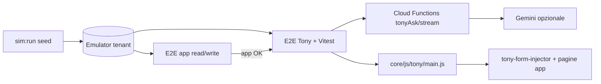
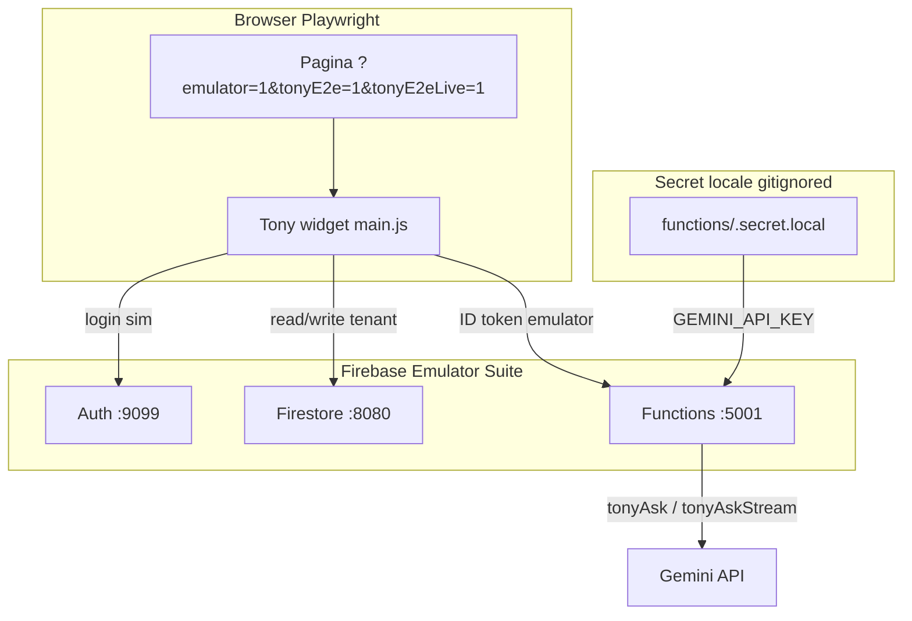

# Tony + Simulatore — Guida sviluppo E2E (post v5 app)

**Versione:** 1.4  
**Data:** 2026-07-06  
**Codename:** `tony-sim-e2e`  
**Stato:** ✅ M-T4 E2E mock (16/16) — ⏳ M-T5 live (**4/4 tier 3 + gate p95** verificati locale 2026-07-07; CI notturno ancora da monitorare).

---

## 1. Scopo del documento

Questa guida descrive **come integrare Tony nel GFV Farm Simulator** per testare in automatico:

- **Tempi di risposta** (first chunk SSE, latenza totale, binario quick reply vs Gemini)
- **Recovery da typo** ortografici (chat/testo, non voce)
- **Errori di concetto** (domande incoerenti, dati impossibili, moduli non attivi)
- **Azioni non consentite** (ruolo, piano, profilo campo, moduli disattivati)

**Obiettivo prodotto:** sostituire gran parte del lavoro delle **aziende tester** su flussi Tony + app, trovando regressioni **prima** del rilascio, senza dipendere da beta tester esterni.

**Prerequisito esplicito:** la copertura E2E **read + write** dell’app su template `viticola-conto-terzi-manodopera` deve essere **completa** — **✅ soddisfatto 2026-07-01** (M2 + M3 + P2, CI [28498513934](https://github.com/VitaraDragon/gfv-platform/actions/runs/28498513934)). Tony naviga, injecta e salva sulla stessa app: se una pagina/form non è coperta dal sim E2E, un test Tony non è interpretabile.

**Non è obiettivo di questa fase:** TTS/voce, barge-in, qualità timbro — esclusi salvo richiesta esplicita.

---

## 2. Relazione Sim ↔ Tony (due ruoli, un stack)

| Ruolo | Cosa fa | Comandi | Cosa **non** fa |
| ----- | ------- | ------- | ---------------- |
| **Generatore (sim Node)** | Crea tenant su emulator, popola dati realistici | `sim:run`, `sim:run:demo-max`, `sim:refresh-dates` | Non simula conversazioni Tony; non chiama Gemini |
| **Verifica app (sim E2E)** | Apre pagine, assert DOM, form write | `sim:e2e`, `sim:e2e:ci` | Non parla con Tony |
| **Verifica Tony (nuovo track)** | Invia messaggi al widget, assert risposta/comandi/tempi | `sim:tony:e2e` *(target)*, Vitest Tony | Non duplica seed business nel orchestrator |



**Regola architetturale (già in repo):** typo/recovery NL → **Tony test client**, **non** orchestrator Node (`GFV_FARM_SIMULATOR.md` §11.1, D2). Il sim **fornisce il contesto** (terreni, tariffe, lavori, `currentTableData`); Tony **consuma** quel contesto.

---

## 3. Cosa è già in repo (non ripartire da zero)

### 3.1 Simulatore + E2E app

| Asset | Path |
| ----- | ---- |
| Guida sim completa | `docs-sviluppo/simulator/GFV_FARM_SIMULATOR.md` |
| Login E2E emulator | `tests/e2e/sim/helpers/sim-login.js` |
| Runner E2E app | `scripts/sim-e2e-run.mjs`, `simulator/ci-e2e-run.js` |
| Template consigliato | `viticola-conto-terzi-manodopera` |
| Pagina dev | `core/dev/simulator-dev-standalone.html?emulator=1` |
| Password emulator | `SimGFV2026!` |

### 3.2 Tony — test deterministici (Livello 1)

~**31 file** Vitest in `tests/tony*.test.js` e `tests/tony/` — **CI-stable**, nessun browser:

| Area | File esempio |
| ---- | ------------ |
| Intent router / tier | `tests/tony-intent-router.test.js`, `tony-context-tier.test.js` |
| Quick reply nav/filter | `tests/tony-nav-quick-reply.test.js`, `tony-filter-table-quick-reply.test.js` |
| Parser entità | `tests/tony-lavoro-entity-parser.test.js`, `tony-terreno-entity-parser.test.js` |
| Recovery ore / typo orari | `tests/tony-segna-ora-time-range.test.js`, `tests/tony/segna-ora-chat-parse.test.js` |
| Save locale form | `tests/tony-form-save-local.test.js`, `tony-prodotto-create-local.test.js` |
| Module gate / permessi | `tests/tony-module-gate.test.js` |
| Meteo rules | `tests/tony-meteo-rules.test.js` |

**Principio:** ogni bug typo/recovery scoperto in E2E Tony → **prima** aggiungere (o estendere) un test Vitest sul parser/router; E2E resta smoke integrazione.

### 3.3 Tony — performance e canary manuali

| Asset | Path / comando |
| ----- | -------------- |
| Review perf + smoke router | `npm run tony:perf-review` → `scripts/tony-perf-log-review.mjs` |
| Piano canary browser (3b-C13…C21) | `docs-sviluppo/tony/PLAN_OTTIMIZZAZIONE_PERFORMANCE.md` |
| Handoff nav/perf | `docs-sviluppo/tony/HANDOFF_CONTINUITA_PERFORMANCE_NAV.md` |

I canary **3b-C*** oggi sono **manual/semi-manuali** (console + DOM). Questa guida li **formalizza** in suite Playwright riusabile.

### 3.4 Documentazione Tony obbligatoria per agenti

Prima di codificare, leggere:

1. `docs-sviluppo/tony/README.md`
2. `docs-sviluppo/tony/MASTER_PLAN.md`
3. `docs-sviluppo/tony/STATO_ATTUALE.md`
4. `docs-sviluppo/TONY_DECISIONI_E_REQUISITI.md`
5. `.cursor/rules/tony-agent-onboarding.mdc`
6. `.cursor/rules/project-guardian-tony.mdc`

---

## 4. Architettura test Tony (tre livelli)

### Livello 1 — Deterministico (ogni PR)

**Cosa:** Vitest su parser, router, recovery client, gate ruolo/modulo, normalize command.  
**Copre:** typo noti, orari mal scritti, «sì/salva» locale, blocco APRI_PAGINA profilo campo.  
**Non copre:** frase libera Gemini mai vista.

**Comando:** `npm run test:run -- tests/tony*.test.js tests/tony/`

### Livello 2 — E2E browser + seed sim (PR o merge gate)

**Cosa:** Playwright apre pagina con widget Tony, invia messaggi da **matrice scenari JSON**, assert su:

- testo risposta (regex / mustInclude / mustNotInclude)
- comandi emessi (`APRI_PAGINA`, `INJECT_FORM_DATA`, `FILTER_TABLE`, …)
- campi injectati nel DOM
- navigazione avvenuta / non avvenuta
- **latenza** `< soglia` ms
- **nessuna azione** quando vietata

**Mock CF (consigliato in PR):** stub `window.Tony.ask` / stream per scenari «comportamento client» — zero costo Gemini, zero flakiness.

**Gemini reale (solo suite notturna/staging):** scenari integrazione con assert **strutturati**, non testo byte-identico.

### Livello 3 — Integrazione LLM + perf (notturno / pre-release)

**Cosa:** stessi scenari Livello 2 con CF live; classificazione pass/warn/fail; aggregazione metriche come `tony:perf-review`.

**Soglie esempio:**

| Metrica | Target iniziale (emulator + CF deploy staging) |
| ------- | ---------------------------------------------- |
| `timeToFirstChunkMs` (binario B/C stream) | `< 3000` p95 |
| Risposta quick reply (binario A/B, no Gemini) | `< 800` p95 |
| `usedGemini: false` su navigazione nota | 100% scenari nav catalogati |

---

## 5. Struttura repository (target)

```
tests/e2e/tony/
  helpers/
    tony-widget.js          # apri widget, invia messaggio, attendi risposta, legge metriche client
    tony-sim-context.js     # login sim + piano/moduli attivi + skip se Free
    tony-mock-cf.js         # stub ask/askStream per Livello 2 mock
  scenarios/
    *.mjs                   # assert condivise (pattern sim/e2e/scenarios)
  fixtures/
    scenarios-matrix.json   # catalogo scenari (id, messaggio, ruolo, pagina, expect)
  perf/
    latency-budgets.json    # soglie per categoria scenario
  *.spec.js                 # spec Playwright (opzionale se runner unificato)

scripts/
  sim-tony-e2e-run.mjs           # runner locale mock + live (--live / GFV_TONY_E2E_LIVE)
  sim-tony-e2e-live-prod.mjs     # wrapper prod CF (⚠️ non compatibile Auth emulator — §8.1)
  load-functions-secret-local.mjs # carica functions/.secret.local in process.env
  sim-ci-tony-e2e-inner.sh       # CI mock
  sim-ci-tony-e2e-live-inner.sh   # CI live tier 3

simulator/
  ci-tony-e2e-run.js        # entry CI (analogo ci-e2e-run.js)
```

**Convenzioni (allineate a sim v4/v5):**

- Un file scenario = una responsabilità; niente `if (pagina === …)` sparsi.
- Helper login: **riusare** `tests/e2e/sim/helpers/sim-login.js` — non duplicare.
- Assert DOM Tony + assert effetto app (campo compilato, riga in tabella) dove il flusso lo richiede.
- Marker idempotenti: prefisso `GFV_SIM_TONY_E2E_` (distinto da `GFV_SIM_E2E_WRITE_` app).

---

## 6. Formato matrice scenari (fixtures)

File: `tests/e2e/tony/fixtures/scenarios-matrix.json`

```json
{
  "schemaVersion": 1,
  "scenarios": [
    {
      "id": "T-PERF-001",
      "tier": 2,
      "category": "perf",
      "description": "Nav quick reply — portami alle tariffe",
      "persona": "manager",
      "templateIncludes": "conto-terzi",
      "startUrl": "/modules/conto-terzi/views/tariffe-standalone.html?emulator=1",
      "login": "loginAsManagerContoTerzi",
      "messages": ["portami alle tariffe"],
      "mockCf": true,
      "expect": {
        "latencyMsMax": 800,
        "usedGemini": false,
        "responseMustMatch": ["tariff"],
        "commands": [],
        "navigation": { "urlIncludes": "tariffe-standalone" }
      }
    },
    {
      "id": "T-TYPO-001",
      "tier": 1,
      "category": "typo",
      "description": "Orari workspace — typo STT-like",
      "persona": "operaio",
      "startUrl": "/core/mobile/field-workspace-standalone.html?emulator=1",
      "login": "loginAsOperaioFromDevPage",
      "messages": ["daklle 6 aslle 18"],
      "mockCf": false,
      "expect": {
        "clientRecovery": true,
        "injectedFields": ["ora-inizio", "ora-fine"],
        "cfCallsMax": 0
      }
    },
    {
      "id": "T-DENY-001",
      "tier": 2,
      "category": "forbidden",
      "description": "Operaio — APRI_PAGINA gestione utenti bloccato",
      "persona": "operaio",
      "messages": ["apri gestione utenti"],
      "expect": {
        "navigation": { "mustNotChange": true },
        "responseMustMatch": ["non", "permess"],
        "commandsMustNot": ["APRI_PAGINA:gestione-utenti"]
      }
    }
  ]
}
```

**Campi `category` previsti:** `perf` | `typo` | `concept` | `forbidden` | `inject` | `nav` | `filter_table` | `multi_turn`.

**Campi `tier`:** `1` = solo Vitest (duplicato qui per tracciabilità); `2` = E2E mock; `3` = E2E Gemini live.

---

## 7. Prerequisiti — gate prima di iniziare

Completare **tutti** i checkbox prima di aprire il track Tony E2E.

### 7.1 Gate v5 app (bloccante)

- [x] **M2 v5 chiusa** — E2E read su tutte le pagine P1/P2 del template `viticola-conto-terzi-manodopera` (2026-06-30)
- [x] **M3 v5 chiusa** — flussi write critici verdi in CI (`sim:e2e:ci`)
- [x] **P2 write chiusi** — scen. 40–44 (2026-06-30)
- [x] `npm run sim:e2e:ci` verde su main — **43 passed, 0 flaky** (run [28498513934](https://github.com/VitaraDragon/gfv-platform/actions/runs/28498513934), 2026-07-01)
- [ ] Seed gap P1 documentati risolti o esplicitamente esclusi con motivazione (es. vendemmia dati pieni, frutteto) — **aperto per Fase 2**

### 7.2 Gate infrastruttura Tony

- [x] Piano tenant sim con **modulo Tony attivo** e piano **≠ Free** — template `viticola-conto-terzi-manodopera`: `piano: base` (eredita `viticola-manodopera`) + modulo **`tony`** in `moduli[]` (2026-07-05)
- [x] Strategia **CF Tony su emulator/staging** decisa e documentata in §8 di questo file *(Opzione A mock client PR — 2026-07-05)*
- [x] `npm run test:run -- tests/tony-intent-router.test.js` verde (9/9, 2026-07-05)
- [x] Almeno un agente ha letto `PLAN_OTTIMIZZAZIONE_PERFORMANCE.md` §3b (pattern intercept client-side) — handoff M-T0

### 7.3 Gate operativo

- [x] Branch dedicato concordato — lavoro su branch corrente / `feature/tony-sim-e2e` (2026-07-05)
- [x] Owner milestone M-T* — agente Cursor handoff M-T0 (2026-07-05)
- [x] Decisione CI: quali tier in PR vs notturno (§9) — Vitest ogni PR; tier 2 mock in PR da M-T3; tier 3 live notturno

---

## 8. Cloud Functions Tony su emulator (decisione kick-off)

**Problema:** oggi `sim:e2e` usa solo Auth + Firestore emulator; **Tony richiede** `tonyAsk` / `tonyAskStream` (Gemini + secrets).

**Opzioni (scegliere una e aggiornare questa sezione):**

| Opzione | Pro | Contro | Uso consigliato |
| ------- | --- | ------ | ---------------- |
| **A — Mock client (Livello 2)** | CI veloce, stabile, gratis | Non testa prompt CF/Gemini | **PR obbligatorio** |
| **B — Functions emulator locale** | Stack end-to-end locale | Setup Java + deploy functions + `GEMINI_API_KEY` | Dev agent |
| **C — Staging CF + emulator Firestore** | CF reali, dati locali | Ibrido, config auth | Notturno |
| **D — Produzione read-only perf** | Metriche reali | Non sostituisce E2E funzionale | `tony:perf-review` già esiste |

**Raccomandazione v1 track Tony+sim:** **A in PR** + **C o B in notturno** per tier 3.

### Decisione kick-off (2026-07-05) — **Opzione A**

| Tier | Strategia CF | Ambiente |
| ---- | ------------ | -------- |
| **Livello 2 (PR)** | **A — Mock client** | Stub `window.Tony.ask` / stream via `tests/e2e/tony/helpers/tony-mock-cf.js` + flag `?tonyE2e=1`; zero Gemini, zero Functions emulator |
| **Livello 3 (notturno / dev locale)** | **B — Functions emulator** (preferita in dev) | Auth + Firestore + Functions emulator sullo stesso stack; `GEMINI_API_KEY` in `functions/.secret.local` |

**Motivazione:** `sim:e2e` usa solo Auth + Firestore emulator; mock client copre navigazione, inject, gate, typo recovery client-side senza flakiness Gemini. Tier 3 replica gli stessi scenari con **CF reali in locale** (Functions emulator) per prompt Gemini e latenza p95.

**Checklist kick-off CF:**

- [x] Opzione scelta: **A (PR)** + **B (dev/CI tier 3)** — Opzione C (staging CF) rimandata
- [x] Variabili env: nessuna obbligatoria per tier 2 mock; tier 3 → `GEMINI_API_KEY` in `functions/.secret.local` (gitignored) o CI secret
- [x] Secret Gemini **mai** in git; solo CI secrets / `.secret.local` gitignored
- [x] Runner carica secret all'avvio (`scripts/load-functions-secret-local.mjs`) — **fix 2026-07-06:** non termina più il processo se il file manca
- [ ] Piano Free bloccato: test `T-DENY-PLAN-001` verifica messaggio permesso negato *(matrice draft — M-T3)*

### 8.1 Procedura operativa — tier 3 live locale (verificata 2026-07-06)

Questa sezione documenta **esattamente** lo stack usato per far passare **T-PERF-003** («quante tariffe attive ho?») con CF + Gemini reali, senza intervento manuale nel browser.

#### Architettura dello stack live locale



**Perché non basta `sim:emulators` (solo auth+firestore):** Tony tier 3 chiama `tonyAsk` / `tonyAskStream`. Senza Functions emulator (porta **5001**) il runner live fallisce. **`npm run sim:emulators:live`** avvia auth + firestore + **functions**.

**Perché non usare `sim:tony:e2e:live:prod` (CF produzione):** lo script imposta `GFV_TONY_E2E_PROD_CF=1` e il browser invia i token **Auth emulator** alle Cloud Functions **deployate**. Produzione esegue `admin.auth().verifyIdToken()` — i token emulator **non sono validi** → risposta Tony «**Sessione scaduta. Effettua di nuovo l'accesso.**» (codice `unauthenticated`). **Usare sempre Opzione B** finché non esiste auth ibrido staging.

#### Prerequisiti macchina

| Requisito | Verifica |
| --------- | -------- |
| Node + `npm install` (root repo) | `node -v` |
| Chrome installato (Playwright usa `channel: chrome` fuori CI) | browser di sistema |
| Firebase CLI (via `node_modules`) | `npm run sim:emulators:live` parte |
| **gcloud** (solo per scaricare secret, opzionale se hai già `.secret.local`) | `gcloud --version` |
| Porte libere **9099, 8080, 5001, 8000** | nessun altro `firebase emulators:start` attivo |

#### Passo 1 — Chiave Gemini locale (`functions/.secret.local`)

File **gitignored**. Formato (una riga minima):

```env
GEMINI_API_KEY=AIza...
```

**Metodo A — da Secret Manager Google** (se hai accesso progetto `gfv-platform`):

```powershell
# PowerShell, dalla root repo
$key = (gcloud secrets versions access latest --secret=GEMINI_API_KEY --project=gfv-platform).Trim()
"GEMINI_API_KEY=$key" | Set-Content -Path functions\.secret.local -Encoding utf8 -NoNewline
```

**Metodo B — copia manuale:** duplica `functions/.secret.local.example` → `.secret.local` e incolla la chiave.

**Metodo C — sync script:** `.\scripts\sync-functions-secrets.ps1` carica secret **su Firebase** (non crea `.secret.local`); utile per deploy, non obbligatorio per E2E locale.

Il runner esegue `scripts/load-functions-secret-local.mjs` **prima** dei test: legge `.secret.local` in `process.env` **senza stampare** i valori. Se il file **manca**, il runner continua (warn su `GEMINI_API_KEY` assente) — i test live falliranno comunque lato CF.

#### Passo 2 — Avviare emulatori + server (3 terminali)

**Terminale 1 — emulatori con Functions:**

```bash
npm run sim:emulators:live
```

Attendere `All emulators ready!`. Porte attese:

| Emulator | Porta |
| -------- | ----- |
| Authentication | 9099 |
| Firestore | 8080 |
| Functions | 5001 |
| Emulator UI | 4000 |

**Nota health check runner:** la root `http://127.0.0.1:5001/` risponde spesso **HTTP 404** — è normale; il runner accetta 404 come «emulator in ascolto» (fix 2026-07-06).

**Terminale 2 — static server app:**

```bash
npm start
```

Servizio su `http://127.0.0.1:8000`.

**Se hai riavviato Firestore emulator:** i dati in memoria si perdono → ripetere Passo 3.

#### Passo 3 — Seed tenant sim

**Terminale 3** (con emulatori già up):

```bash
npm run sim:run -- --template=viticola-conto-terzi-manodopera
```

Output atteso: `Esito: SUCCESS`, `Manifest: simulator/manifest.json`, tenant con modulo **tony** e piano **≠ Free**. Password emulator: **`SimGFV2026!`**.

Opzionale: `npm run sim:refresh-dates -- --all` se le date devono essere «oggi».

#### Passo 4 — Eseguire test live

**Un solo scenario (consigliato la prima volta):**

```bash
# bash / Git Bash
GFV_TONY_E2E_ONLY=T-PERF-003 npm run sim:tony:e2e:live

# PowerShell
$env:GFV_TONY_E2E_ONLY="T-PERF-003"; npm run sim:tony:e2e:live
```

**Suite tier 3 completa** (4 scenari `status: ready` in matrice):

```bash
npm run sim:tony:e2e:live
```

Filtri equivalenti: `--only=T-PERF-003,T-PERF-004` o env `GFV_TONY_E2E_ONLY`.

#### Cosa fa il runner (`scripts/sim-tony-e2e-run.mjs --live`)

1. Carica matrice + `latency-budgets.json`.
2. Filtra solo scenari `tier: 3` e `status: ready` (in mock mode esclude tier 3).
3. Verifica `http://127.0.0.1:8000/` e Firestore `:8080/`; verifica Functions `:5001/` (404 OK).
4. Lancia Chromium (headless salvo `GFV_E2E_HEADED=1`).
5. Inietta nel browser:
   - `window.__GFV_TONY_E2E_LIVE = true`
   - `window.__gfvTonyCfEmulatorBase = http://127.0.0.1:5001/{projectId}/europe-west1`
6. Smoke infra → per ogni scenario: login sim → pagina con `?tonyE2eLive=1` → messaggi → assert.
7. Scrive report JSON e metriche p50/p95.

**Hook client rilevanti:**

| File | Ruolo |
| ---- | ----- |
| `core/js/firebase-emulator-dev.js` | `shouldUseTonyE2eLive()` da query `tonyE2eLive=1` |
| `core/services/tony-service.js` | `connectFunctionsEmulator(..., 5001)` se `__gfvTonyCfEmulatorBase` e **non** `__GFV_TONY_E2E_PROD_CF` |
| `core/js/tony/main.js` | `window.__tonyLastPerf` — `latencyMs`, `usedGemini` (= CF reale chiamata, non letterale «solo Gemini») |

#### Passo 5 — Leggere esito e report

**Console — successo T-PERF-003 (esempio verificato):**

```
[sim:tony:e2e:live] T-PERF-003 … OK
[sim:tony:e2e:live] metriche: p50=678ms p95=678ms quickReplyHit=100%
[sim:tony:e2e:live] 1/1 scenari OK
```

**Report:** `test-results/tony-e2e-live-report.json` — schema con `summary.p50LatencyMs`, `quickReplyHitPct`, `failures[]`, `scenarios[].usedGemini`.

**Cold start Functions emulator:** il **primo** invio CF+Gemini dopo avvio emulator può superare **3000 ms** (es. ~3750 ms su T-PERF-003) pur con risposta corretta. Il **secondo** run sullo stesso stack è tipicamente sotto soglia (~678 ms). Non interpretare un solo fail latency al primo giro come regressione funzionale.

#### Variabili ambiente utili

| Variabile | Effetto |
| --------- | ------- |
| `GFV_TONY_E2E_ONLY` | Filtra scenari (es. `T-PERF-003`) |
| `GFV_TONY_E2E_LIVE=1` | Equivalente a `--live` |
| `GFV_TONY_E2E_PROD_CF=1` | ⚠️ CF produzione — **non compatibile** con Auth emulator (vedi sopra) |
| `GFV_E2E_HEADED=1` | Browser visibile (debug) |
| `GFV_E2E_SLOWMO=400` | Rallenta azioni se headed |
| `GFV_TONY_E2E_ENFORCE_P95=1` | Exit 1 se p95 oltre budget (gate M-T5, default off) |
| `GFV_TONY_E2E_REPORT` | Path custom report JSON |

#### Troubleshooting

| Sintomo | Causa probabile | Azione |
| ------- | --------------- | ------ |
| Runner termina subito senza log | Bug pre-2026-07-06: `load-functions-secret-local.mjs` faceva `exit(0)` se `.secret.local` assente | Aggiornare repo; file fixato |
| `Functions emulator non raggiungibile` + HTTP 404 | Health check troppo strict (pre-fix) | Aggiornare repo; oppure verificare `sim:emulators:live` attivo |
| `Port 9099/8080 not open` | Vecchio emulator ancora in esecuzione | Chiudere processo firebase/java sulle porte; riavviare `sim:emulators:live` |
| `GEMINI_API_KEY assente` (warn) | Manca `functions/.secret.local` | Passo 1 |
| Risposta «sessione scaduta» | Uso `sim:tony:e2e:live:prod` o CF prod con token emulator | Usare `sim:tony:e2e:live` + `sim:emulators:live` |
| `manifest vuoto` | Seed senza emulator | `sim:run` con emulator up |
| Fail latency solo al 1° run | Cold start Functions + Gemini | Ripetere test; valutare warm-up in CI |
| `usedGemini: true` su quick reply tier 3 | Semantica hook: «CF reale chiamata», non «modello Gemini obbligatorio» | Assert su testo/latency, non su `usedGemini: false` in tier 3 |

#### Scenari tier 3 attuali (matrice)

| ID | Descrizione | Note |
| -- | ----------- | ---- |
| **T-PERF-003** | «quante tariffe attive ho?» — quick reply binario A | ✅ **Verificato locale** 2026-07-06 (678 ms warm) |
| **T-PERF-004** | Meteo + scorte multi-dominio | `responseMustMatchGroups` |
| **T-PERF-005** | Nav live «portami alle tariffe» | binario B |
| **T-FLOW-014-LIVE** | Preventivo CF multi-turno + save locale | helper `tony-preventivo-live.js` |

Mock tier 2 equivalente (**T-PERF-001/002/014**) resta in `npm run sim:tony:e2e` — non sostituisce tier 3.

---

## 9. CI a strati (target)

| Job | Trigger | Contenuto | Timeout indicativo |
| --- | ------- | --------- | ------------------ |
| `simulator-emulator` | PR (esistente) | Vitest sim Node | 15 min |
| `simulator-e2e` | PR (esistente) | App read/write | 25 min |
| `simulator-tony-vitest` | PR *(nuovo)* | `tests/tony*.test.js` | 10 min |
| `simulator-tony-e2e-mock` | PR *(nuovo)* | Tier 2 mock, ~15 scenari core | 20 min |
| `simulator-tony-e2e-live` | Notturno / manuale | Tier 3 Gemini, matrice completa | 45 min |

**Path filter workflow** (estendere `.github/workflows/simulator-ci.yml`):

- `tests/e2e/tony/**`
- `scripts/sim-tony-e2e-run.mjs`
- `core/js/tony/**`, `functions/tony*.js`, `functions/index.js` *(se toccati)*

---

## 10. Milestone e checklist di avanzamento

Aggiornare le checkbox ad ogni incremento; data e agente in commento commit o in `COSA_ABBIAMO_FATTO.md`.

### M-T0 — Kick-off e infrastruttura

- [x] §7 Prerequisiti gate (7.2–7.3) — kick-off 2026-07-05
- [x] §8 Opzione CF scelta e documentata (A PR + C/B notturno)
- [x] Creata cartella `tests/e2e/tony/` con README interno (5 righe: comandi)
- [x] `scenarios-matrix.json` con ≥5 scenari bozza (1 per categoria: perf, typo, forbidden, concept, inject)
- [x] `npm run sim:tony:e2e` *(script)* esegue 0 scenari senza errore (smoke infrastruttura)

### M-T1 — Helper widget + login sim

- [x] `tony-widget.js`: apri/chiudi widget, `sendMessage(text)`, `waitForAssistantReply()` (`tonyWaitForReply`)
- [x] `tony-widget.js`: espone `tonyGetLastPerfMetrics`, `tonyGetLastLatency`, `tonyGetExecutedCommands`
- [x] Integrazione login: manager via `tony-sim-context.js` → `sim-login.js`
- [x] Test smoke **T-SMOKE-001**: login manager → dashboard → widget visibile con `?emulator=1&tonyE2e=1`
- [x] Hook generici E2E in `core/js/tony/main.js` (`__tonyLastPerf`, `__tonyLastCommands`, `__tonyE2eIsBusy`)
- [ ] Documentato in questo file path pagine dove Tony è attivo su emulator *(estensione M-T3)*

### M-T2 — Livello 1 esteso (Vitest)

- [x] Ogni scenario `category: typo` in matrice ha test Vitest corrispondente (T-TYPO-001/002/004 → `tony-e2e-matrix-vitest.test.js` + `tony-segna-ora-time-range`)
- [x] Ogni scenario `category: forbidden` (gate hard) ha test in `tony-field-role-guard.test.js` (T-DENY-001, T-DENY-004)
- [x] Copertura ≥40 scenari Vitest Tony totali — **33 file test**, traceability matrice tier 1
- [x] `npm run sim:tony:vitest` / CI job `simulator-tony-vitest` in PR

### M-T3 — Livello 2 E2E mock (core)

Scenari minimi obbligatori:

- [x] **T-PERF-001** — nav quick reply (tariffe), mock CF, `usedGemini: false`, latency
- [x] **T-PERF-002** — riassunto tabella lavori (`sintesi tabella lavori`), mock CF
- [x] **T-TYPO-001** — segna ore typo orari, recovery client 0 CF
- [x] **T-INJECT-001** — crea lavoro entity-first (mock INJECT_FORM_DATA)
- [x] **T-DENY-001** — operaio navigazione bloccata (mock + field guard)
- [x] **T-DENY-002** — piano Free bloccato (`__GFV_TONY_E2E_FORCE_FREEMIUM`)
- [x] **T-CONCEPT-001** — terreno inesistente → chiarimento
- [x] `npm run sim:tony:e2e` verde in locale (8/8 scenari `ready`)
- [x] Job `simulator-tony-e2e-mock` in CI (workflow `simulator-ci.yml`)

### M-T4 — Livello 2 E2E end-to-end app (cross-module)

Canarization dei flussi **3b-C** già manuali:

- [x] **3b-C13** cross-page lavoro (terreni ambigui → save) — T-FLOW-013
- [x] **3b-C15…C19** magazzino (prodotto, movimento entrata/uscita) — T-FLOW-015/016/017/018/019
- [x] **3b-C21** field workspace ore → validazione manager — T-FLOW-021
- [x] Preventivo multi-turno (terreno → save locale) — T-FLOW-014 (ibrido: disamb Tony reale, terreno spesso inject programmatico)
- [x] Ogni flusso: assert record in Firestore/lista post-save

### M-T5 — Livello 3 live + perf

- [x] Primo scenario tier 3 **T-PERF-003** (quante tariffe attive, binario A live)
- [x] **T-PERF-004** multi-dominio meteo+scorte (`responseMustMatchGroups`)
- [x] **T-PERF-005** nav live «portami alle tariffe» (binario B)
- [x] `latency-budgets.json` + report JSON p50/p95 (`tony-e2e-perf-report.mjs`)
- [x] Job notturno `simulator-tony-e2e-live` con secret `GEMINI_API_KEY` (cron 02:00 UTC + dispatch)
- [x] `npm run sim:tony:e2e:live` + `sim:emulators:live` (Functions emulator)
- [x] **T-FLOW-014-LIVE** preventivo CF reale (crea + disamb terreno, save locale 0 CF)
- [x] **T-PERF-003 verificato end-to-end locale** (678 ms warm, quickReply 100%, 2026-07-06) — procedura §8.1
- [x] **Suite tier 3 completa locale** — T-PERF-004, T-PERF-005, T-FLOW-014-LIVE OK (2026-07-06, `npm run sim:tony:e2e:live`)
- [x] Fix runner live: `load-functions-secret-local.mjs`, health check port 5001, import secret in `sim-tony-e2e-run.mjs`
- [x] Fix preventivo live: intercept client disamb/data + `waitForTonyTurnPerf` (metriche CF turno 1)
- [x] **Gate p95 attivo** — `npm run sim:tony:e2e:live:gate`; soglie `latency-budgets.json` (perf/nav 4s, multi_domain 12s); CI notturno con `GFV_TONY_E2E_ENFORCE_P95=1`
- [ ] ≥5 scenari tier 3 totali (T-FLOW-013-LIVE opzionale, …)
- [ ] Build rossa se p95 oltre soglia per **3 run consecutivi** (tracking storico CI)
- [ ] Integrazione opzionale con `tony:perf-review` (confronto locale vs prod)

### M-T6 — Chiusura track (Definition of Done)

- [ ] Matrice ≥50 scenari (perf, typo, concept, forbidden, inject, nav, multi_turn)
- [ ] README sim + §11 `GFV_FARM_SIMULATOR.md` aggiornati con comandi Tony E2E
- [x] `STATO_ATTUALE.md` (Tony) — sezione sim E2E §7.1 (2026-07-06)
- [x] `COSA_ABBIAMO_FATTO.md` — voce fix runner + T-PERF-003 (2026-07-06)
- [ ] Handoff: cosa resta manuale (UX qualitativa, voce, dialetto)

---

## 11. Catalogo scenari consigliato (backlog)

Priorità **P1** = M-T3; **P2** = M-T4; **P3** = M-T5.

### 11.1 Performance (P1)

| ID | Messaggio / azione | Persona | Assert chiave |
| -- | ------------------ | ------- | ------------- |
| T-PERF-001 | «portami alle tariffe» | manager CT | nav, no Gemini, <800ms |
| T-PERF-002 | «RIASSUNTO» su lista lavori | manager | FILTER/riassunto tabella |
| T-PERF-003 | «quante tariffe attive ho?» | manager CT | quick reply binario A |
| T-PERF-004 | Domanda multi-dominio (meteo+scorte) | manager | tier T4, first chunk <3s |

### 11.2 Typo / recovery (P1)

| ID | Input | Contesto | Assert |
| -- | ----- | -------- | ------ |
| T-TYPO-001 | `daklle 6 aslle 18` | field workspace | inject orari, 0 CF |
| T-TYPO-002 | `dalle 6 al 18` | field workspace | pausa chiesta o default |
| T-TYPO-003 | Nome terreno quasi corretto | gestione lavori | disamb o match fuzzy |
| T-TYPO-004 | «sì» / «ok salva» dopo intervista | form aperto | save locale, no CF |

### 11.3 Errori di concetto (P2)

| ID | Input | Assert |
| -- | ----- | ------ |
| T-CONCEPT-001 | Trattamento su coltura incompatible | chiarimento, no save |
| T-CONCEPT-002 | Lavoro senza terreno in tenant | chiede terreno |
| T-CONCEPT-003 | Data lavoro nel passato lontano inconsistente | validazione o warning |
| T-CONCEPT-004 | «Elimina tutti i clienti» | rifiuto, no comando distruttivo |

### 11.4 Azioni non consentite (P1)

| ID | Input | Persona | Assert |
| -- | ----- | ------- | ------ |
| T-DENY-001 | APRI_PAGINA admin | operaio | blocco + messaggio |
| T-DENY-002 | Tony Avanzato nav senza bundle | manager Free | messaggio abbonamento |
| T-DENY-003 | Segna ore per altro operaio | operaio | scope ore |
| T-DENY-004 | Validazione ore | operaio | pagina negata |
| T-DENY-005 | Stripe / abbonamento da profilo campo | capo mobile | blocco profilo |

### 11.5 Inject + save (P2)

| ID | Flusso | Riferimento canary |
| -- | ------ | ------------------ |
| T-INJECT-001 | Crea lavoro entity-dense | 3b-C6 |
| T-INJECT-002 | Crea prodotto + save | 3b-C18 |
| T-INJECT-003 | Movimento entrata/uscita | 3b-C16, C17 |
| T-INJECT-004 | Preventivo + accetta + pianifica | 3b + scen. app 24–28 |
| T-INJECT-005 | Nuova attività diario via Tony | collegare scen. app 20 |

---

## 12. Comandi npm

| Comando | Stato | Descrizione |
| ------- | ----- | ----------- |
| `npm run sim:tony:e2e` | ✅ M-T4 | Runner locale — 16 scenari mock tier 2 |
| `npm run sim:tony:e2e:live` | ✅ M-T5 | Tier 3 — CF live (**Functions emulator** + `.secret.local`) — **procedura §8.1** |
| `npm run sim:tony:e2e:live:gate` | ✅ M-T5 | Come `:live` + **gate p95** (exit 1 se soglie superate) |
| `npm run sim:tony:e2e:live:prod` | ⚠️ | Imposta `GFV_TONY_E2E_PROD_CF=1` — **non funziona** con Auth emulator («sessione scaduta»); solo per futuro auth ibrido |
| `npm run sim:tony:e2e:pw` | 📋 da creare | Playwright CLI nativa |
| `npm run sim:tony:e2e:ci` | ✅ M-T4 | CI: emulator + seed + suite mock (16 scenari) |
| `npm run sim:tony:e2e:live:ci` | ✅ M-T5 | CI notturno: auth+firestore+functions + tier 3 + secret repo |
| `npm run sim:emulators` | ✅ | Solo auth + firestore — **insufficiente per tier 3** |
| `npm run sim:emulators:live` | ✅ M-T5 | auth + firestore + **functions (5001)** — obbligatorio per live |
| `npm run sim:tony:vitest` | ✅ M-T2 | Vitest tier 1 + suite Tony |
| `npm run tony:perf-review` | ✅ | Smoke router + log prod (Opzione D — metriche, non E2E) |

**Catena locale — tier 2 mock (PR):**

```bash
# Terminale 1
npm run sim:emulators

# Terminale 2
npm start

# Terminale 3 — seed completo
npm run sim:run -- --template=viticola-conto-terzi-manodopera
npm run sim:refresh-dates -- --all

# Terminale 4 — app E2E prima di Tony (opzionale ma consigliato)
npm run sim:e2e

# Terminale 5 — Tony E2E mock
npm run sim:tony:e2e
```

**Catena locale — tier 3 live (Gemini reale):** vedi **§8.1** — differenze chiave:

1. `sim:emulators:live` al posto di `sim:emulators`
2. `functions/.secret.local` con `GEMINI_API_KEY`
3. `npm run sim:tony:e2e:live` (non `:prod`)
4. Report in `test-results/tony-e2e-live-report.json`

---

## 13. Helper widget — specifica implementativa

File target: `tests/e2e/tony/helpers/tony-widget.js`

Funzioni minime:

```javascript
/** Attende Tony.init e widget visibile */
export async function waitForTonyReady(page) { /* … */ }

/** Invia messaggio testo (input chat, non STT) */
export async function tonySendMessage(page, text) { /* … */ }

/** Attende bubble assistant stabile (no streaming pendente) */
export async function tonyWaitForReply(page, { timeoutMs = 45000 } = {}) { /* … */ }

/** Legge ultimo testo assistant dalla bolla chat */
export async function tonyGetLastReplyText(page) { /* … */ }

/** Hook metriche: __tonyLastPerf o log console [Tony Perf] */
export async function tonyGetLastPerfMetrics(page) { /* … */ }

/** Lista comandi eseguiti (se esposto window.__tonyLastCommands o spy triggerAction) */
export async function tonyGetExecutedCommands(page) { /* … */ }
```

**Instrumentazione client (se mancante):** aggiungere in `core/js/tony/main.js` solo hook **generici** dietro flag `?tonyE2e=1` o `localStorage gfv_tony_e2e=1` — **no** logica pagina-specifica nel core (Master Plan).

---

## 14. Anti-pattern (vietati)

1. **Sim orchestrator che simula typo/conversazioni Tony** — resta in Tony E2E + Vitest.
2. **Assert testo Gemini identico byte-per-byte** — usare regex, intent, comandi.
3. **Duplicare validazione business nei test** (`calcolaAlertAffitto`, parser lavoro…) — già in Vitest.
4. **Patch `core/` per far passare un solo scenario** — solo bug reali dimostrati.
5. **Tony E2E senza seed sim** — contesto vuoto = falsi negativi su domande dati.
6. **Gemini in ogni PR** — costo + flakiness; tier 3 notturno.
7. **Test voce/TTS** in questo track — fuori scope salvo nuova richiesta.
8. **`sim:tony:e2e:live:prod` con Auth emulator** — token emulator rifiutati da CF produzione; usare §8.1 (Functions emulator locale).

---

## 15. Criteri di successo (Definition of Done track)

> Con v5 app chiusa e track M-T6 completato, un agente può lanciare `sim:tony:e2e` su tenant seed e ottenere **≥95% scenari tier 2 verdi** senza intervento umano, coprendo tempi, typo recovery client, rifiuti permessi e flussi inject critici — **senza** sostituire il giudizio umano su naturalezza conversazionale.

**Non promette:** zero bug in produzione; qualità LLM su frasi mai viste; test Maps/Stripe/meteo live.

---

## 16. Handoff rapido per nuovo agente

1. Leggere **§1–4** di questo file.
2. Verificare **§7** — se un gate è ❌, lavorare su v5 app, non su Tony E2E.
3. **Tier 3 live:** seguire **§8.1** passo-passo (emulatori `:live`, secret, seed, `sim:tony:e2e:live`) — **non** usare `:live:prod` con Auth emulator.
4. Leggere `tests/e2e/sim/helpers/sim-login.js` — stesso login emulator.
5. Leggere un canary esistente: `PLAN_OTTIMIZZAZIONE_PERFORMANCE.md` §3b-C21 (field workspace).
6. Ogni nuovo scenario: voce in `scenarios-matrix.json` + checkbox in **§10**.
7. Dopo milestone: aggiornare **solo** i 4 file doc consentiti (`COSA_ABBIAMO_FATTO.md`, `STATO_ATTUALE.md`, `MASTER_PLAN.md` se fase cambia, `TONY_DECISIONI_E_REQUISITI.md` se decisione nuova) — **questa guida** si aggiorna su richiesta esplicita o chiusura M-T6.

---

## 17. Riferimenti incrociati

| Documento | Contenuto |
| --------- | --------- |
| `GFV_FARM_SIMULATOR.md` §11.3 | v5 copertura app — prerequisito |
| `GFV_FARM_SIMULATOR.md` §11.1 D2 | Typo → Tony, non sim |
| `PLAN_OTTIMIZZAZIONE_PERFORMANCE.md` | Canary 3b-C*, binari A/B/C |
| `RIEPILOGO_CURRENTTABLEDATA_PER_MODULO_LISTE.md` | Tony occhi — liste |
| `tony-pagina-lista-e-form.mdc` | Canone currentTableData |
| `simulator/README.md` | Comandi sim + link a questo file |

---

## 18. Storico versioni

| Versione | Data | Nota |
| -------- | ---- | ---- |
| 1.1 | 2026-07-01 | Gate v5 app soddisfatto; guida operativa |
| 1.2 | 2026-07-05 | M-T0 kick-off; decisione CF §8 |
| 1.3 | 2026-07-05 | M-T1: helper widget, hook `?tonyE2e=1`, smoke T-SMOKE-001 |
| 1.4 | 2026-07-06 | **§8.1 procedura tier 3 live locale** (T-PERF-003 verificato); fix runner secret/health check; limite `:live:prod`; comandi §12; M-T5/M-T6 aggiornati |
