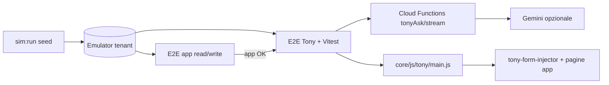

# Tony + Simulatore — Guida sviluppo E2E (post v5 app)

**Versione:** 1.1  
**Data:** 2026-07-01  
**Codename:** `tony-sim-e2e`  
**Stato:** 📋 Pianificato — **gate v5 app soddisfatto (2026-07-01)** — M2 + M3 + P2 + CI 43/43 stabile. Implementazione `tests/e2e/tony/` dopo gate §7.2–7.3 (infrastruttura CF Tony + owner milestone).

---

## 1. Scopo del documento

Questa guida descrive **come integrare Tony nel GFV Farm Simulator** per testare in automatico:

- **Tempi di risposta** (first chunk SSE, latenza totale, binario quick reply vs Gemini)
- **Recovery da typo** ortografici (chat/testo, non voce)
- **Errori di concetto** (domande incoerenti, dati impossibili, moduli non attivi)
- **Azioni non consentite** (ruolo, piano, profilo campo, moduli disattivati)

**Obiettivo prodotto:** sostituire gran parte del lavoro delle **aziende tester** su flussi Tony + app, trovando regressioni **prima** del rilascio, senza dipendere da beta tester esterni.

**Prerequisito esplicito:** la copertura E2E **read + write** dell’app su template `viticola-conto-terzi-manodopera` deve essere **completa** — **✅ soddisfatto 2026-07-01** (M2 + M3 + P2, CI [28498513934](https://github.com/VitaraDragon/gfv-platform/actions/runs/28498513934)). Tony naviga, injecta e salva sulla stessa app: se una pagina/form non è coperta dal sim E2E, un test Tony non è interpretabile.

**Non è obiettivo di questa fase:** TTS/voce, barge-in, qualità timbro — esclusi salvo richiesta esplicita.

---

## 2. Relazione Sim ↔ Tony (due ruoli, un stack)

| Ruolo | Cosa fa | Comandi | Cosa **non** fa |
| ----- | ------- | ------- | ---------------- |
| **Generatore (sim Node)** | Crea tenant su emulator, popola dati realistici | `sim:run`, `sim:run:demo-max`, `sim:refresh-dates` | Non simula conversazioni Tony; non chiama Gemini |
| **Verifica app (sim E2E)** | Apre pagine, assert DOM, form write | `sim:e2e`, `sim:e2e:ci` | Non parla con Tony |
| **Verifica Tony (nuovo track)** | Invia messaggi al widget, assert risposta/comandi/tempi | `sim:tony:e2e` *(target)*, Vitest Tony | Non duplica seed business nel orchestrator |



**Regola architetturale (già in repo):** typo/recovery NL → **Tony test client**, **non** orchestrator Node (`GFV_FARM_SIMULATOR.md` §11.1, D2). Il sim **fornisce il contesto** (terreni, tariffe, lavori, `currentTableData`); Tony **consuma** quel contesto.

---

## 3. Cosa è già in repo (non ripartire da zero)

### 3.1 Simulatore + E2E app

| Asset | Path |
| ----- | ---- |
| Guida sim completa | `docs-sviluppo/simulator/GFV_FARM_SIMULATOR.md` |
| Login E2E emulator | `tests/e2e/sim/helpers/sim-login.js` |
| Runner E2E app | `scripts/sim-e2e-run.mjs`, `simulator/ci-e2e-run.js` |
| Template consigliato | `viticola-conto-terzi-manodopera` |
| Pagina dev | `core/dev/simulator-dev-standalone.html?emulator=1` |
| Password emulator | `SimGFV2026!` |

### 3.2 Tony — test deterministici (Livello 1)

~**31 file** Vitest in `tests/tony*.test.js` e `tests/tony/` — **CI-stable**, nessun browser:

| Area | File esempio |
| ---- | ------------ |
| Intent router / tier | `tests/tony-intent-router.test.js`, `tony-context-tier.test.js` |
| Quick reply nav/filter | `tests/tony-nav-quick-reply.test.js`, `tony-filter-table-quick-reply.test.js` |
| Parser entità | `tests/tony-lavoro-entity-parser.test.js`, `tony-terreno-entity-parser.test.js` |
| Recovery ore / typo orari | `tests/tony-segna-ora-time-range.test.js`, `tests/tony/segna-ora-chat-parse.test.js` |
| Save locale form | `tests/tony-form-save-local.test.js`, `tony-prodotto-create-local.test.js` |
| Module gate / permessi | `tests/tony-module-gate.test.js` |
| Meteo rules | `tests/tony-meteo-rules.test.js` |

**Principio:** ogni bug typo/recovery scoperto in E2E Tony → **prima** aggiungere (o estendere) un test Vitest sul parser/router; E2E resta smoke integrazione.

### 3.3 Tony — performance e canary manuali

| Asset | Path / comando |
| ----- | -------------- |
| Review perf + smoke router | `npm run tony:perf-review` → `scripts/tony-perf-log-review.mjs` |
| Piano canary browser (3b-C13…C21) | `docs-sviluppo/tony/PLAN_OTTIMIZZAZIONE_PERFORMANCE.md` |
| Handoff nav/perf | `docs-sviluppo/tony/HANDOFF_CONTINUITA_PERFORMANCE_NAV.md` |

I canary **3b-C*** oggi sono **manual/semi-manuali** (console + DOM). Questa guida li **formalizza** in suite Playwright riusabile.

### 3.4 Documentazione Tony obbligatoria per agenti

Prima di codificare, leggere:

1. `docs-sviluppo/tony/README.md`
2. `docs-sviluppo/tony/MASTER_PLAN.md`
3. `docs-sviluppo/tony/STATO_ATTUALE.md`
4. `docs-sviluppo/TONY_DECISIONI_E_REQUISITI.md`
5. `.cursor/rules/tony-agent-onboarding.mdc`
6. `.cursor/rules/project-guardian-tony.mdc`

---

## 4. Architettura test Tony (tre livelli)

### Livello 1 — Deterministico (ogni PR)

**Cosa:** Vitest su parser, router, recovery client, gate ruolo/modulo, normalize command.  
**Copre:** typo noti, orari mal scritti, «sì/salva» locale, blocco APRI_PAGINA profilo campo.  
**Non copre:** frase libera Gemini mai vista.

**Comando:** `npm run test:run -- tests/tony*.test.js tests/tony/`

### Livello 2 — E2E browser + seed sim (PR o merge gate)

**Cosa:** Playwright apre pagina con widget Tony, invia messaggi da **matrice scenari JSON**, assert su:

- testo risposta (regex / mustInclude / mustNotInclude)
- comandi emessi (`APRI_PAGINA`, `INJECT_FORM_DATA`, `FILTER_TABLE`, …)
- campi injectati nel DOM
- navigazione avvenuta / non avvenuta
- **latenza** `< soglia` ms
- **nessuna azione** quando vietata

**Mock CF (consigliato in PR):** stub `window.Tony.ask` / stream per scenari «comportamento client» — zero costo Gemini, zero flakiness.

**Gemini reale (solo suite notturna/staging):** scenari integrazione con assert **strutturati**, non testo byte-identico.

### Livello 3 — Integrazione LLM + perf (notturno / pre-release)

**Cosa:** stessi scenari Livello 2 con CF live; classificazione pass/warn/fail; aggregazione metriche come `tony:perf-review`.

**Soglie esempio:**

| Metrica | Target iniziale (emulator + CF deploy staging) |
| ------- | ---------------------------------------------- |
| `timeToFirstChunkMs` (binario B/C stream) | `< 3000` p95 |
| Risposta quick reply (binario A/B, no Gemini) | `< 800` p95 |
| `usedGemini: false` su navigazione nota | 100% scenari nav catalogati |

---

## 5. Struttura repository (target)

```
tests/e2e/tony/
  helpers/
    tony-widget.js          # apri widget, invia messaggio, attendi risposta, legge metriche client
    tony-sim-context.js     # login sim + piano/moduli attivi + skip se Free
    tony-mock-cf.js         # stub ask/askStream per Livello 2 mock
  scenarios/
    *.mjs                   # assert condivise (pattern sim/e2e/scenarios)
  fixtures/
    scenarios-matrix.json   # catalogo scenari (id, messaggio, ruolo, pagina, expect)
  perf/
    latency-budgets.json    # soglie per categoria scenario
  *.spec.js                 # spec Playwright (opzionale se runner unificato)

scripts/
  sim-tony-e2e-run.mjs      # runner locale (analogo sim-e2e-run.mjs)
  sim-ci-tony-e2e-inner.sh  # CI: emulator + seed + tony e2e

simulator/
  ci-tony-e2e-run.js        # entry CI (analogo ci-e2e-run.js)
```

**Convenzioni (allineate a sim v4/v5):**

- Un file scenario = una responsabilità; niente `if (pagina === …)` sparsi.
- Helper login: **riusare** `tests/e2e/sim/helpers/sim-login.js` — non duplicare.
- Assert DOM Tony + assert effetto app (campo compilato, riga in tabella) dove il flusso lo richiede.
- Marker idempotenti: prefisso `GFV_SIM_TONY_E2E_` (distinto da `GFV_SIM_E2E_WRITE_` app).

---

## 6. Formato matrice scenari (fixtures)

File: `tests/e2e/tony/fixtures/scenarios-matrix.json`

```json
{
  "schemaVersion": 1,
  "scenarios": [
    {
      "id": "T-PERF-001",
      "tier": 2,
      "category": "perf",
      "description": "Nav quick reply — portami alle tariffe",
      "persona": "manager",
      "templateIncludes": "conto-terzi",
      "startUrl": "/modules/conto-terzi/views/tariffe-standalone.html?emulator=1",
      "login": "loginAsManagerContoTerzi",
      "messages": ["portami alle tariffe"],
      "mockCf": true,
      "expect": {
        "latencyMsMax": 800,
        "usedGemini": false,
        "responseMustMatch": ["tariff"],
        "commands": [],
        "navigation": { "urlIncludes": "tariffe-standalone" }
      }
    },
    {
      "id": "T-TYPO-001",
      "tier": 1,
      "category": "typo",
      "description": "Orari workspace — typo STT-like",
      "persona": "operaio",
      "startUrl": "/core/mobile/field-workspace-standalone.html?emulator=1",
      "login": "loginAsOperaioFromDevPage",
      "messages": ["daklle 6 aslle 18"],
      "mockCf": false,
      "expect": {
        "clientRecovery": true,
        "injectedFields": ["ora-inizio", "ora-fine"],
        "cfCallsMax": 0
      }
    },
    {
      "id": "T-DENY-001",
      "tier": 2,
      "category": "forbidden",
      "description": "Operaio — APRI_PAGINA gestione utenti bloccato",
      "persona": "operaio",
      "messages": ["apri gestione utenti"],
      "expect": {
        "navigation": { "mustNotChange": true },
        "responseMustMatch": ["non", "permess"],
        "commandsMustNot": ["APRI_PAGINA:gestione-utenti"]
      }
    }
  ]
}
```

**Campi `category` previsti:** `perf` | `typo` | `concept` | `forbidden` | `inject` | `nav` | `filter_table` | `multi_turn`.

**Campi `tier`:** `1` = solo Vitest (duplicato qui per tracciabilità); `2` = E2E mock; `3` = E2E Gemini live.

---

## 7. Prerequisiti — gate prima di iniziare

Completare **tutti** i checkbox prima di aprire il track Tony E2E.

### 7.1 Gate v5 app (bloccante)

- [x] **M2 v5 chiusa** — E2E read su tutte le pagine P1/P2 del template `viticola-conto-terzi-manodopera` (2026-06-30)
- [x] **M3 v5 chiusa** — flussi write critici verdi in CI (`sim:e2e:ci`)
- [x] **P2 write chiusi** — scen. 40–44 (2026-06-30)
- [x] `npm run sim:e2e:ci` verde su main — **43 passed, 0 flaky** (run [28498513934](https://github.com/VitaraDragon/gfv-platform/actions/runs/28498513934), 2026-07-01)
- [ ] Seed gap P1 documentati risolti o esplicitamente esclusi con motivazione (es. vendemmia dati pieni, frutteto) — **aperto per Fase 2**

### 7.2 Gate infrastruttura Tony

- [ ] Piano tenant sim con **modulo Tony attivo** e piano **≠ Free** (template seed deve includere subscription Base+ o flag emulator documentato)
- [ ] Strategia **CF Tony su emulator/staging** decisa e documentata in §8 di questo file *(compilare al kick-off)*
- [ ] `npm run test:run -- tests/tony-intent-router.test.js` verde
- [ ] Almeno un agente ha letto `PLAN_OTTIMIZZAZIONE_PERFORMANCE.md` §3b (pattern intercept client-side)

### 7.3 Gate operativo

- [ ] Branch dedicato concordato (es. `feature/tony-sim-e2e`)
- [ ] Owner milestone M-T* assegnato in checklist §10
- [ ] Decisione CI: quali tier in PR vs notturno (§9)

---

## 8. Cloud Functions Tony su emulator (decisione kick-off)

**Problema:** oggi `sim:e2e` usa solo Auth + Firestore emulator; **Tony richiede** `tonyAsk` / `tonyAskStream` (Gemini + secrets).

**Opzioni (scegliere una e aggiornare questa sezione):**

| Opzione | Pro | Contro | Uso consigliato |
| ------- | --- | ------ | ---------------- |
| **A — Mock client (Livello 2)** | CI veloce, stabile, gratis | Non testa prompt CF/Gemini | **PR obbligatorio** |
| **B — Functions emulator locale** | Stack end-to-end locale | Setup Java + deploy functions + `GEMINI_API_KEY` | Dev agent |
| **C — Staging CF + emulator Firestore** | CF reali, dati locali | Ibrido, config auth | Notturno |
| **D — Produzione read-only perf** | Metriche reali | Non sostituisce E2E funzionale | `tony:perf-review` già esiste |

**Raccomandazione v1 track Tony+sim:** **A in PR** + **C o B in notturno** per tier 3.

**Checklist kick-off CF:**

- [ ] Opzione scelta: ___ (A / B / C / D combo)
- [ ] Variabili env documentate in `simulator/README.md` (sezione Tony)
- [ ] Secret Gemini **mai** in git; solo CI secrets / `.env.local` gitignored
- [ ] Piano Free bloccato: test `T-DENY-PLAN-001` verifica messaggio permesso negato

---

## 9. CI a strati (target)

| Job | Trigger | Contenuto | Timeout indicativo |
| --- | ------- | --------- | ------------------ |
| `simulator-emulator` | PR (esistente) | Vitest sim Node | 15 min |
| `simulator-e2e` | PR (esistente) | App read/write | 25 min |
| `simulator-tony-vitest` | PR *(nuovo)* | `tests/tony*.test.js` | 10 min |
| `simulator-tony-e2e-mock` | PR *(nuovo)* | Tier 2 mock, ~15 scenari core | 20 min |
| `simulator-tony-e2e-live` | Notturno / manuale | Tier 3 Gemini, matrice completa | 45 min |

**Path filter workflow** (estendere `.github/workflows/simulator-ci.yml`):

- `tests/e2e/tony/**`
- `scripts/sim-tony-e2e-run.mjs`
- `core/js/tony/**`, `functions/tony*.js`, `functions/index.js` *(se toccati)*

---

## 10. Milestone e checklist di avanzamento

Aggiornare le checkbox ad ogni incremento; data e agente in commento commit o in `COSA_ABBIAMO_FATTO.md`.

### M-T0 — Kick-off e infrastruttura

- [ ] §7 Prerequisiti gate tutti ✅
- [ ] §8 Opzione CF scelta e documentata
- [ ] Creata cartella `tests/e2e/tony/` con README interno (5 righe: comandi)
- [ ] `scenarios-matrix.json` con ≥5 scenari bozza (1 per categoria)
- [ ] `npm run sim:tony:e2e` *(script)* esegue 0 scenari senza errore (smoke infrastruttura)

### M-T1 — Helper widget + login sim

- [ ] `tony-widget.js`: apri/chiudi widget, `sendMessage(text)`, `waitForAssistantReply()`
- [ ] `tony-widget.js`: espone `lastLatencyMs`, `lastUsedGemini` da log client / hook metriche
- [ ] Integrazione login: manager, capo, operaio via `sim-login.js`
- [ ] Test smoke: login manager → dashboard → widget visibile con `?emulator=1`
- [ ] Documentato in questo file path pagine dove Tony è attivo su emulator

### M-T2 — Livello 1 esteso (Vitest)

- [ ] Ogni scenario `category: typo` in matrice ha test Vitest corrispondente
- [ ] Ogni scenario `category: forbidden` (gate hard) ha test in `tony-module-gate` o nuovo file
- [ ] Copertura ≥40 scenari Vitest Tony totali (baseline ~31 + incremento)
- [ ] `npm run test:run -- tests/tony*.test.js` in CI PR

### M-T3 — Livello 2 E2E mock (core)

Scenari minimi obbligatori:

- [ ] **T-PERF-001** — nav quick reply (tariffe o attività), `usedGemini: false`, latency
- [ ] **T-PERF-002** — FILTER_TABLE su lista con seed (lavori o prodotti)
- [ ] **T-TYPO-001** — segna ore typo orari, recovery client 0 CF
- [ ] **T-INJECT-001** — crea lavoro entity-first (pattern 3b-C6, mock o 1 CF)
- [ ] **T-DENY-001** — operaio navigazione bloccata
- [ ] **T-DENY-002** — modulo disattivato / piano Free
- [ ] **T-CONCEPT-001** — domanda impossibile (es. trattamento su terreno inesistente) → chiarimento o rifiuto
- [ ] `npm run sim:tony:e2e` verde in locale (≥8 scenari)
- [ ] Job `simulator-tony-e2e-mock` in CI verde

### M-T4 — Livello 2 E2E end-to-end app (cross-module)

Canarization dei flussi **3b-C** gi già manuali:

- [ ] **3b-C13** cross-page lavoro (terreni ambigui → save)
- [ ] **3b-C15…C19** magazzino (prodotto, movimento entrata/uscita)
- [ ] **3b-C21** field workspace ore → validazione manager
- [ ] Preventivo multi-turno (terreno → meteo data → conferma) — mock meteo se necessario
- [ ] Ogni flusso: assert **record in Firestore/lista** post-save (riuso assert write app dove possibile)

### M-T5 — Livello 3 live + perf

- [ ] ≥20 scenari tier 3 in matrice
- [ ] Job notturno `simulator-tony-e2e-live` con secret Gemini
- [ ] Report JSON artifact: p50/p95 latency, `% quickReplyHit`, fallimenti per categoria
- [ ] Soglie in `latency-budgets.json`; build rossa se p95 oltre soglia per 3 run consecutivi
- [ ] Integrazione opzionale con `tony:perf-review` (confronto locale vs prod)

### M-T6 — Chiusura track (Definition of Done)

- [ ] Matrice ≥50 scenari (perf, typo, concept, forbidden, inject, nav, multi_turn)
- [ ] README sim + §11 `GFV_FARM_SIMULATOR.md` aggiornati con comandi Tony E2E
- [ ] `STATO_ATTUALE.md` (Tony) — sezione sim E2E
- [ ] `COSA_ABBIAMO_FATTO.md` — voce chiusura M-T6
- [ ] Handoff: cosa resta manuale (UX qualitativa, voce, dialetto)

---

## 11. Catalogo scenari consigliato (backlog)

Priorità **P1** = M-T3; **P2** = M-T4; **P3** = M-T5.

### 11.1 Performance (P1)

| ID | Messaggio / azione | Persona | Assert chiave |
| -- | ------------------ | ------- | ------------- |
| T-PERF-001 | «portami alle tariffe» | manager CT | nav, no Gemini, <800ms |
| T-PERF-002 | «RIASSUNTO» su lista lavori | manager | FILTER/riassunto tabella |
| T-PERF-003 | «quante tariffe attive ho?» | manager CT | quick reply binario A |
| T-PERF-004 | Domanda multi-dominio (meteo+scorte) | manager | tier T4, first chunk <3s |

### 11.2 Typo / recovery (P1)

| ID | Input | Contesto | Assert |
| -- | ----- | -------- | ------ |
| T-TYPO-001 | `daklle 6 aslle 18` | field workspace | inject orari, 0 CF |
| T-TYPO-002 | `dalle 6 al 18` | field workspace | pausa chiesta o default |
| T-TYPO-003 | Nome terreno quasi corretto | gestione lavori | disamb o match fuzzy |
| T-TYPO-004 | «sì» / «ok salva» dopo intervista | form aperto | save locale, no CF |

### 11.3 Errori di concetto (P2)

| ID | Input | Assert |
| -- | ----- | ------ |
| T-CONCEPT-001 | Trattamento su coltura incompatible | chiarimento, no save |
| T-CONCEPT-002 | Lavoro senza terreno in tenant | chiede terreno |
| T-CONCEPT-003 | Data lavoro nel passato lontano inconsistente | validazione o warning |
| T-CONCEPT-004 | «Elimina tutti i clienti» | rifiuto, no comando distruttivo |

### 11.4 Azioni non consentite (P1)

| ID | Input | Persona | Assert |
| -- | ----- | ------- | ------ |
| T-DENY-001 | APRI_PAGINA admin | operaio | blocco + messaggio |
| T-DENY-002 | Tony Avanzato nav senza bundle | manager Free | messaggio abbonamento |
| T-DENY-003 | Segna ore per altro operaio | operaio | scope ore |
| T-DENY-004 | Validazione ore | operaio | pagina negata |
| T-DENY-005 | Stripe / abbonamento da profilo campo | capo mobile | blocco profilo |

### 11.5 Inject + save (P2)

| ID | Flusso | Riferimento canary |
| -- | ------ | ------------------ |
| T-INJECT-001 | Crea lavoro entity-dense | 3b-C6 |
| T-INJECT-002 | Crea prodotto + save | 3b-C18 |
| T-INJECT-003 | Movimento entrata/uscita | 3b-C16, C17 |
| T-INJECT-004 | Preventivo + accetta + pianifica | 3b + scen. app 24–28 |
| T-INJECT-005 | Nuova attività diario via Tony | collegare scen. app 20 |

---

## 12. Comandi npm (target)

| Comando | Stato | Descrizione |
| ------- | ----- | ----------- |
| `npm run sim:tony:e2e` | 📋 da creare | Runner locale — mock tier 2, Chrome sistema |
| `npm run sim:tony:e2e:live` | 📋 da creare | Tier 3 — CF + Gemini |
| `npm run sim:tony:e2e:pw` | 📋 da creare | Playwright CLI nativa |
| `npm run sim:tony:e2e:ci` | 📋 da creare | CI: emulator + seed + suite mock |
| `npm run tony:perf-review` | ✅ esiste | Smoke router + log prod |

**Catena locale consigliata (post M-T3):**

```bash
# Terminale 1
npm run sim:emulators

# Terminale 2
npm start

# Terminale 3 — seed completo
npm run sim:run -- --template=viticola-conto-terzi-manodopera
npm run sim:refresh-dates -- --all

# Terminale 4 — app E2E prima di Tony
npm run sim:e2e

# Terminale 5 — Tony E2E
npm run sim:tony:e2e
```

---

## 13. Helper widget — specifica implementativa

File target: `tests/e2e/tony/helpers/tony-widget.js`

Funzioni minime:

```javascript
/** Attende Tony.init e widget visibile */
export async function waitForTonyReady(page) { /* … */ }

/** Invia messaggio testo (input chat, non STT) */
export async function tonySendMessage(page, text) { /* … */ }

/** Attende bubble assistant stabile (no streaming pendente) */
export async function tonyWaitForReply(page, { timeoutMs = 45000 } = {}) { /* … */ }

/** Legge ultimo testo assistant dalla bolla chat */
export async function tonyGetLastReplyText(page) { /* … */ }

/** Hook metriche: __tonyLastPerf o log console [Tony Perf] */
export async function tonyGetLastPerfMetrics(page) { /* … */ }

/** Lista comandi eseguiti (se esposto window.__tonyLastCommands o spy triggerAction) */
export async function tonyGetExecutedCommands(page) { /* … */ }
```

**Instrumentazione client (se mancante):** aggiungere in `core/js/tony/main.js` solo hook **generici** dietro flag `?tonyE2e=1` o `localStorage gfv_tony_e2e=1` — **no** logica pagina-specifica nel core (Master Plan).

---

## 14. Anti-pattern (vietati)

1. **Sim orchestrator che simula typo/conversazioni Tony** — resta in Tony E2E + Vitest.
2. **Assert testo Gemini identico byte-per-byte** — usare regex, intent, comandi.
3. **Duplicare validazione business nei test** (`calcolaAlertAffitto`, parser lavoro…) — già in Vitest.
4. **Patch `core/` per far passare un solo scenario** — solo bug reali dimostrati.
5. **Tony E2E senza seed sim** — contesto vuoto = falsi negativi su domande dati.
6. **Gemini in ogni PR** — costo + flakiness; tier 3 notturno.
7. **Test voce/TTS** in questo track — fuori scope salvo nuova richiesta.

---

## 15. Criteri di successo (Definition of Done track)

> Con v5 app chiusa e track M-T6 completato, un agente può lanciare `sim:tony:e2e` su tenant seed e ottenere **≥95% scenari tier 2 verdi** senza intervento umano, coprendo tempi, typo recovery client, rifiuti permessi e flussi inject critici — **senza** sostituire il giudizio umano su naturalezza conversazionale.

**Non promette:** zero bug in produzione; qualità LLM su frasi mai viste; test Maps/Stripe/meteo live.

---

## 16. Handoff rapido per nuovo agente

1. Leggere **§1–4** di questo file.
2. Verificare **§7** — se un gate è ❌, lavorare su v5 app, non su Tony E2E.
3. Leggere `tests/e2e/sim/helpers/sim-login.js` — stesso login emulator.
4. Leggere un canary esistente: `PLAN_OTTIMIZZAZIONE_PERFORMANCE.md` §3b-C21 (field workspace).
5. Implementare **M-T0 → M-T1** prima di qualsiasi scenario complesso.
6. Ogni nuovo scenario: voce in `scenarios-matrix.json` + checkbox in **§10**.
7. Dopo milestone: aggiornare **solo** i 4 file doc consentiti (`COSA_ABBIAMO_FATTO.md`, `STATO_ATTUALE.md`, `MASTER_PLAN.md` se fase cambia, `TONY_DECISIONI_E_REQUISITI.md` se decisione nuova).

---

## 17. Riferimenti incrociati

| Documento | Contenuto |
| --------- | --------- |
| `GFV_FARM_SIMULATOR.md` §11.3 | v5 copertura app — prerequisito |
| `GFV_FARM_SIMULATOR.md` §11.1 D2 | Typo → Tony, non sim |
| `PLAN_OTTIMIZZAZIONE_PERFORMANCE.md` | Canary 3b-C*, binari A/B/C |
| `RIEPILOGO_CURRENTTABLEDATA_PER_MODULO_LISTE.md` | Tony occhi — liste |
| `tony-pagina-lista-e-form.mdc` | Canone currentTableData |
| `simulator/README.md` | Comandi sim + link a questo file |

---

## 18. Storico versioni

| Versione | Data | Nota |
| -------- | ---- | ---- |
| 1.0 | 2026-06-30 | Creazione guida post conversazione prod/sim/Tony E2E |
