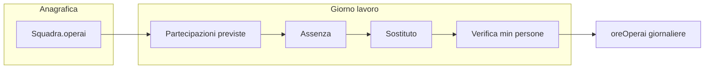

# Piano (design): sostituzione manodopera / equipaggio squadre

**Stato:** design — da implementare.  
**Per chi:** ogni agente o sviluppatore che lavora su **manodopera, squadre, assenze, shortlist sostituti, equipaggio minimo, policy tenant**, integrazione Tony sul flusso.

**Percorsi:** la copia **canonica nel repository** è questo file (`docs-sviluppo/tony/PIANO_SOSTITUZIONE_MANODOPERA_SQUADRE.md`), così resta disponibile dopo `git clone`. In Cursor può esistere anche un piano omonimo sotto la cartella piani dell’utente (es. `.cursor/plans/`); in caso di dubbio, **prevalere il contenuto in repo** se è stato aggiornato lì.

Riferimento rapido onboarding: [`README.md`](README.md) (tabella documenti) e [`.cursor/rules/tony-agent-onboarding.mdc`](../../.cursor/rules/tony-agent-onboarding.mdc).

---

# Sostituzione operai in squadra e lavori assegnati

**Analisi coerenza Master Plan (Fase 2–3)** — La modifica è scalabile se modelliamo **sostituzione e equipaggio** come dati strutturati (config + eventuali sotto-collezioni), non come eccezioni per pagina: così Tony e il manager usano gli stessi fatti (chi è previsto, chi è assente, chi sostituisce) senza logica duplicata.

---

## Situazione attuale nel codice

- **Lavoro** (`core/models/Lavoro.js`): assegnazione **o** `caposquadraId` (lavoro di squadra) **o** `operaioId` (autonomo). Non c’è elenco di operai “sul lavoro” nel documento lavoro.
- **Squadra** (documentazione in `docs-sviluppo/GESTIONE_SQUADRE_PROCESSO.md`): `operai: [userId, ...]` in Firestore. Modificare la squadra qui cambia la composizione **globale**, non una copertura solo per oggi o per un singolo lavoro.
- **Ore** (`core/services/ore-service.js`): sotto-collezione `tenants/.../lavori/{lavoroId}/oreOperai` con `operaioId` — utile per **chi ha effettivamente lavorato** e per costi, ma non risolve da solo la pianificazione “mancano 4 persone sul carro” prima che le ore vengano registrate.

**Gap di prodotto:** assenza = problema operativo **giornaliero**; il modello attuale ottimizza **chi è responsabile** (caposquadra/squadra), non **chi copre il turno** con vincolo di numero di persone.

---

## App + database vs solo Tony

- **Solo Tony (suggerimenti senza persistenza):** prototipo rapido, ma nessuna fonte di verità condivisa: caposquadra e manager non vedono lo stesso stato nell’UI, niente audit (previsto vs sostituto), niente validazione equipaggio minimo lato app, rischio di proposte incoerenti con i vincoli reali se i dati non sono strutturati.
- **App + database (modello dati + UI + regole):** più lavoro iniziale, ma comportamento ripetibile: stesso dato in lista lavori, dettaglio, ore e (dopo) Tony; Firestore rules e validazioni possono regolare chi registra assenze o sostituzioni.

**Raccomandazione:** usare Tony come **conversazione e ranking** sopra dati già salvati (partecipazioni, assenze, soglie minime), non come unico posto in cui “esiste” la sostituzione. Allinea al Master Plan: contesto strutturato lato cloud, configurazione centralizzata, evitare eccezioni per singola pagina nel core.

**Ordine di lavoro:** (1) modello + UI manager, (2) regole minimo equipaggio se servono, (3) esporre i fatti al Context Builder e comandi Tony generici.

---

## Flusso UX target (shortlist + decisione manager + Tony)

Allineato a quanto concordato: **il manager decide sempre se e chi integrare**; il sistema **non** sostituisce da solo. Il ruolo dell’app è **ridurre l’elenco** (es. da 30 operai a **3–4 candidati**) con motivazione leggibile; **Tony** riusa gli stessi risultati strutturati (voice/chat assist), non una logica parallela.

**Passi logici (calcolabili lato backend/app, stessi dati per UI e Tony):**

1. **Contesto lavoro:** tipo lavoro, attrezzo/macchina se presente, equipaggio minimo, data (o turno).
2. **Filtro “può fare il lavoro”:** competenze / `tipoOperaio` / abilitazioni / storico attività simili — configurabile per tenant (evitare magia non spiegabile).
3. **Classificazione disponibilità (stessa giornata) — sempre automatica:** il manager **non** deve selezionare a mano “impegnato / libero”. Il sistema deriva lo stato da dati già in piattaforma: lavori a cui la persona risulta assegnata (operaio autonomo o membro di squadra con lavoro attivo quel giorno), stati **`assegnato` / `in_corso`** (e altri stati che contano come impegno a definire), più eventuale **equipaggio giornaliero** quando presente. Output: etichette **Libero** / **Impegnato (lavoro X)** / **Spostabile con conferma** secondo policy.
   - **Liberi:** nessun impegno che copre quella data (o finestra oraria, se un giorno avete granularità oraria).
   - **Impegnati ma potenzialmente spostabili:** impegno presente, ma il lavoro corrente ha **priorità inferiore** alla policy, oppure la squadra di provenienza resta **sopra soglia** dopo il prestito — sempre con **etichetta esplicita** (“già su lavoro X, spostabile solo con conferma”).
   - **Esclusi o in fondo lista:** non qualificati, o conflitto non risolvibile senza override.
4. **Shortlist:** ordinare (es. prima liberi qualificati, poi spostabili secondo policy) e **tagliare a 3–4** per non sommergere il manager; opzionale: mostrare “vedi tutti i qualificati” se serve.
5. **Scelta manager** su uno della shortlist (o ricerca manuale con gli stessi badge di stato).
6. **Conferma e persistenza:** registrazione assenza/sostituzione + eventuale **secondo movimento** se si è prelevato da un altro lavoro (tracciabilità).

**Tony:** propone la stessa shortlist con motivazioni brevi (“libero”, “su lavoro Y a priorità bassa”) e può guidare i passi, ma **non** inventa candidati fuori dai dati.

### Disponibilità: nessun passaggio manuale “è libero?”

Requisito di prodotto: **zero toggle** del tipo “segna come libero” da parte del manager per alimentare la shortlist. Se il calcolo è incompleto (dati mancanti), meglio mostrare **“disponibilità non determinabile”** o assenza di quell’operaio dal grafo impegni, piuttosto che scaricare la responsabilità sul manager. Eccezioni eventuali solo dove serve davvero (es. **ferie/permessi** se un giorno li modellate: possono restare flussi dedicati o integrazione esterna).

### Competenze in anagrafica (operaio e caposquadra)

Per filtrare “chi può fare questo lavoro” in modo ripetibile e utile a Tony:

- Estendere il **profilo utente** (`users` / maschera gestione utenti) con campi strutturati riusabili: es. **lista competenze o tag** (allineati ai tipi lavoro o attrezzi dell’azienda), oltre a quanto già esiste (es. `tipoOperaio` dove presente).
- **Caposquadra:** stesso principio se serve profilo completo (es. competenze da coordinare, non solo da eseguire) — utile anche ad altre funzioni future (formazione, deleghe).
- Le regole di matching “lavoro richiede competenza K” vs “utente ha K” vivono in **config tenant** (mapping tipo lavoro/attrezzo → competenze richieste), non in `if` per pagina.

---

## Punti ancora da chiarire (prossime sessioni)

- **Granularità tempo:** solo **giornata intera** al primo MVP, oppure subito **fasce orarie** (due lavori nello stesso giorno ma non sovrapposti).
- **Stati lavoro** che contano come “impegno” oltre `assegnato` / `in_corso` (es. `da_pianificare`?).
- **Ferie/permessi/malattia:** solo in anagrafica esterna, oppure modulo assenze in app.
- **Priorità lavori:** chi la imposta (default tenant vs per singolo lavoro) e chi può modificarla.
- **Caposquadra** può proporre sostituzioni o solo il manager (permessi).

---

## Idee di soluzione (dal più leggero al più strutturato)

### 1) MVP “Sostituzione rapida” (impatto alto, complessità contenuta)

- **Concetto:** separare **roster organizzativo** (squadra anagrafica) da **equipaggio effettivo per data** (o per intervallo date del lavoro).
- **UI:** dalla scheda lavoro (o dalla vista giornaliera manager): “Segna assente” su un operaio previsto → shortlist con **impegno calcolato automaticamente** da lavori (non selezione manuale libero/impegnato); ricerca estesa opzionale con stessi badge di stato.
- **Dati minimi:** una struttura tipo `partecipazioni` (sotto-collezione del lavoro o mappa per data) con: `data`, `operaioId`, `ruoloSlot` opzionale (es. lato sinistro carro), `stato` (previsto / assente / sostituito), `sostitutoDaOperaioId` per tracciabilità.
- **Perché funziona:** non obbliga a cambiare la squadra permanente; il caposquadra vede chi va in campo quel giorno.

### 2) Regole di **equipaggio minimo** (il caso “4 fissi sul carro”)

- **Concetto:** vincolo numerico (e opzionale per ruolo/slot) legato a **tipo di lavoro** e/o **attrezzo/macchina** (es. carro raccolta collegato a `Lavoro` tramite `attrezzoId` / `macchinaId` dove già presenti).
- **Comportamento:** se i partecipanti previsti attivi < soglia → banner **bloccante o warning** in UI (“manca 1 operaio: equipaggio incompleto”) finché non si assegna un sostituto o si riduce lo scope (con conferma esplicita).
- **Configurazione centralizzata:** tabella o config tenant (es. “tipo lavoro / attrezzo → `minPersone`, opzionale `slots`”) per evitare `if` sparsi nel codice, in linea con l’architettura “config > codice hardcoded” del progetto.

### 3) Supporto “intelligente” al manager (non solo AI generica)

Ordine consigliato di **ranking** dei sostituti (tutti calcolabili lato app + regole, Tony solo presenta/ordina):

1. Operai della **stessa squadra** non già segnati assenti e (se avete il dato) **senza altro impegno** sulla stessa data.
2. **Pool riserve** (lista tenant di operai “disponibili a chiamata” se introdurrete il concetto).
3. Operai con **stesso `tipoOperaio`/skill** se già in anagrafica utente.
4. Chi ha già fatto **ore su lavori simili** (stesso tipo o stesso attrezzo) negli ultimi N giorni.

Tony può, in una seconda fase, **guidare** il flusso (“Segna Marco assente e proponi i primi 3 candidati”) usando **contesto strutturato** (allineato a `docs-sviluppo/CONTEXT_BUILDER_SPECIFICHE_SVILUPPO.md` quando i dati saranno esposti lato cloud), senza inventare nomi se i dati mancano.

### 3b) Caso realistico: tutti già assegnati (Squadra A, B, Marco/Gaia/Fabio autonomi)

**Problema:** se serve un sostituto per la Squadra A (carro, 4 persone fisse) ma **tutti** gli operai risultano già assegnati ad altri lavori, **nessun algoritmo** può scegliere “il giusto” senza **regole aziendali** e **dati di impegno** sulla giornata (o sul turno). Altrimenti la scelta tra Fabio, Gaia o un membro della B sarebbe arbitraria o sbagliata.

**Cosa serve prima del ranking:**

- **Vista unica degli impegni** per data (e idealmente fascia oraria): chi è coperto da quale lavoro (squadra o autonomo). Senza questo, l’app non sa che Fabio e Gaia sono “occupati” e non può segnalare **conflitti**.
- **Policy configurabile dal tenant** (non hardcoded), esempi tipici:
  - **Priorità del lavoro** (es. raccolta carro = critica; altri lavori scalabili o rinviabili): consente di proporre solo candidati il cui lavoro attuale ha priorità **inferiore**, oppure di mostrare “spostabile solo con conferma manager”.
  - **Regole di prestito tra squadre** (es. “non toccare Squadra B se sotto minimo”; “prestito ammesso solo se B sopra soglia”).
  - **Pool riserve / personale non assegnato** a lavori full-day (turnazione, magazzino, manutenzione leggera): spesso l’unico modo realistico per avere **sempre** una leva senza rubare ad altri lavori.
  - **Override esplicito**: il manager sceglie di **sottrarre** qualcuno da un altro lavoro; il sistema registra **due movimenti** (sostituzione su A + riassegnazione o buco su B/Gaia/Fabio), così resta tracciabilità.

**Perché non “Fabio invece di Gaia” senza policy:** la differenza può essere solo:

- **skill/attrezzo** (compatibilità carro);
- **priorità** del lavoro da cui si “preleva”;
- **prossimità** (stesso terreno, meno spostamento) se avete il dato;
- **regola interna** (es. rotazione, anzianità) che voi definite.

In assenza di priorità e impegni strutturati, il sistema può al massimo elencare **tutti** gli operai con **avviso di conflitto** (“già su lavoro X”) e lasciare la **decisione al manager** — che è comunque un MVP onesto.

**Raccomandazione di prodotto:** non promettere auto-assegnazione ottimale al primo rilascio; promettere **trasparenza** (chi è libero, chi è occupato e dove), **vincoli** (minimo equipaggio), **suggerimenti ordinati** secondo policy, **conferma** prima di “rubare” qualcuno a un altro lavoro.

### 4) Processi e audit

- Log evento: `assenza` + `sostituzione` con timestamp e utente manager (utile in contesti sindacali/contabili).
- Collegamento alle **ore**: il sostituto è quello che apparirà nelle registrazioni ore del giorno (coerenza con `oreOperai` esistente).

---

## Todo di design (tracking)

- Definire se il roster è per data o per durata lavoro e dove persistere (sub-coll. lavoro vs altro).
- Scegliere ancoraggio regole min persone: tipo lavoro, attrezzo o entrambi + UI warning.
- Flusso UI: assenza → shortlist 3–4 candidati → scelta manager → verifica minimo equipaggio → ore.
- Post-MVP: Context Builder e comandi Tony generici per suggerimenti.
- Policy tenant (priorità lavori, prestito tra squadre, pool riserve) e conflitti quando tutti assegnati.
- Anagrafica competenze; calcolo automatico impegnato/libero da lavori + roster.

---

## Flusso concettuale

---

## Cosa **non** fare come unica soluzione

- **Solo** modificare la squadra in “Gestione squadre” per coprire un’assenza: sposta persone in modo permanente e non documenta il “perché oggi”.

---

## Prossimi passi se vorrete implementare

1. Decidere se il roster giornaliero è **per data** (turni) o **per intero lavoro** (più semplice).
2. Definire dove vivono i vincoli **min persone** (tipo lavoro vs attrezzo).
3. Allineare **impegni giornalieri** (chi è su quale lavoro) per poter calcolare conflitti e classificare i candidati; definire **policy** (priorità lavori, prestiti tra squadre, riserve).
4. Disegnare la UI nel punto dove il manager già opera (es. `core/admin/gestione-lavori-standalone.html` / dettaglio lavoro) e le regole Firestore in `firestore.rules`.
5. Solo dopo: estendere Tony (`functions/index.js`), senza eccezioni per singola pagina, come da regole progetto.

Spezzare il lavoro in milestone suggerite: dati roster + assenze → vista impegni/conflitti → policy tenant → UI sostituzione con conferma → assistente.
